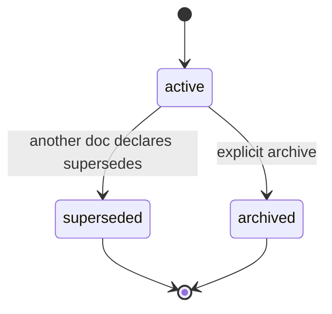

# Requirements: Drift-Tested Catalog Stack for docs/solutions/

## Summary

Turn `docs/solutions/` from a folder of free-form markdown into a drift-tested, code-owned, statefully-tracked catalog. Land it in two PRs: PR1 introduces a Vitest validator, a `KNOWN_TAGS` / `KNOWN_PROBLEM_TYPES` registry, and stable-ID + status + supersedes frontmatter — with all 10 existing docs backfilled in the same PR so it ships green. PR2 adds a server-rendered faceted browse page at `/super-admin/docs-solutions` on top of the now-stable data, reading frontmatter live (no embeddings, no client search index).

---

## Problem Frame

`docs/solutions/` exists today as 10 markdown files across 6 category directories, dated 2026-05-29, with rich frontmatter (`title`, `date`, `category`, `module`, `problem_type`, `component`, `severity`, `tags`, plus track-specific fields). The frontmatter is consistent because the files were written within a single session — but there is no machine enforcement, no canonical tag list, no stable identity per doc, no lifecycle, and no browse surface. None of those gaps bite at 10 docs. All of them bite at 100, and the cost of fixing them is dramatically higher then than now.

Schema consistency is the precondition for every higher-leverage move in the broader ideation (push-discovery, auto-drafted capture, recommendation registries, freshness signals, weekly digest). Each of those moves depends on knowing what fields exist, which problem_type and tag values are legal, and how to refer to a learning by a stable identifier. Doing the schema work first — when the corpus is small, malleable, and freshly written — is what makes the rest tractable.

The catalog stack is also the natural moment to fix two latent footguns: `wrong_paths_considered` (the medical-CPC pattern of preserving rejected hypotheses) is currently unrepresented in the schema, and superseding a doc has no machine-recognized representation, so a future "actually, we changed our minds" can't be expressed without informal prose drift.

---

## Key Decisions

- **Land in two PRs, not one.** PR1 covers the irreversible schema + identity work (validator, catalog, status lifecycle, backfill); PR2 adds the browse page once the data shape is stable. IDs are permanent once assigned, so they get decided atomically with the schema; the UI iterates on stable ground.
- **All 10 existing docs are backfilled in PR1, and the new fields are required from day one.** The alternative considered was fields-optional-with-later-cleanup. Rejected because it leaves the catalog half-populated at merge for a ~10-mechanical-edit savings.
- **ID format `SOL-YYYY-NNN`, year of capture, sequence within year, zero-padded NNN.** Year-at-a-glance scannable, sequence resets each year, deterministic. The 10 backfilled docs are numbered `SOL-2026-001`..`SOL-2026-010` in alphabetical order by repo-relative file path — no tiebreaker needed since the existing docs share a date.
- **Catalog includes the full schema enum from day one.** `KNOWN_PROBLEM_TYPES` covers all 17 documented enum values (architecture_pattern, design_pattern, tooling_decision, convention, best_practice, workflow_issue, developer_experience, documentation_gap, build_error, test_failure, runtime_error, performance_issue, database_issue, security_issue, ui_bug, integration_issue, logic_error), not just the seven currently used in the corpus — future captures should never have to extend the registry alongside their normal frontmatter.
- **`KNOWN_TAGS` is seeded from the corpus and canonicalized in-PR.** Sweep the existing 10 docs, dedupe synonyms (collapse `next-app-router` / `nextjs-route-handler` / similar to one canonical form), commit the result. New tags get added in PRs as they come up — no infinite-discussion taxonomy exercise.
- **Validator severity is tiered.** Schema violations (missing required field, unknown enum, broken supersedes ref, supersedes cycle, category-vs-directory mismatch) fail CI. Tags present in a doc but missing from `KNOWN_TAGS` only warn on existing docs; on new docs they fail and require the same PR to update the registry. Unrelated PRs should not turn red because someone wrote a new tag elsewhere.
- **`wrong_paths_considered:` is schema-defined, optional, and not backfilled.** The 10 existing docs were captured from session transcripts that did not preserve strong dead-end records; retro-inventing them is worse than leaving the field empty. New and re-captured docs can populate it when there is real material to put there.
- **Stay file-backed and frontmatter-only.** No DB sync of the catalog, no embeddings, no client-side search index. PR2's browse page reads frontmatter live, mirroring `src/lib/translations.ts`'s server-cached read pattern. The corpus is under 100 docs; RAG-scale infrastructure is explicitly out.

### Status lifecycle

A doc enters `active` when first written. `superseded` is reached when a newer doc declares it in its `supersedes:` array (and CI then enforces the back-pointer). `archived` is an explicit terminal state for docs that are no longer relevant but were not replaced. Neither terminal state deletes the file — the lifecycle is append-only at the corpus level; lineage stays traceable.

---

## Requirements

### Validator (`tests/unit/docs-solutions-coverage.test.ts`)

- R1. The repo includes a Vitest test at `tests/unit/docs-solutions-coverage.test.ts` that walks every markdown file under `docs/solutions/`, parses YAML frontmatter, and asserts conformance with the catalog (R5–R7) and the status-lifecycle schema (R8–R9).
- R2. The validator fails CI when any of the following are true: a required frontmatter field is missing; `problem_type` is not in `KNOWN_PROBLEM_TYPES`; the `category:` frontmatter value does not match the file's containing directory; a `supersedes` or `superseded_by` reference cites an ID not present in the corpus; the supersedes graph contains a cycle; a `superseded_by: X` value on one doc is not mirrored by `X` listing this doc in its `supersedes:` array.
- R3. The validator emits non-failing warnings (printed to stdout, CI green) for tags present in an existing doc that are missing from `KNOWN_TAGS`. On a *new* doc (i.e., a `docs/solutions/**/*.md` file introduced or modified in the same PR), an unknown tag fails CI with a message indicating the offending tag, the file, and that `KNOWN_TAGS` must be updated in the same PR.
- R4. A `pnpm docs:fix` command writes missing required-field skeletons in place — adds the missing keys with blank or commented placeholder values, never invents content the author must decide. The autofix is opt-in (invoked on demand), not a CI side effect.

### Catalog (`src/lib/docs-solutions-catalog.ts`)

- R5. `src/lib/docs-solutions-catalog.ts` exports `KNOWN_TAGS` (readonly string array) and `KNOWN_PROBLEM_TYPES` (readonly string array) as the single source of truth for the validator. The module's shape mirrors `src/lib/translations.ts`'s `KNOWN_TRANSLATIONS` — plain TypeScript exports with no DB dependency, no boot-time sync (left optional for future), and a short module-level comment naming the validator as the primary consumer.
- R6. `KNOWN_PROBLEM_TYPES` contains all 17 enum values documented in the underlying problem-type schema (architecture_pattern, design_pattern, tooling_decision, convention, best_practice, workflow_issue, developer_experience, documentation_gap, build_error, test_failure, runtime_error, performance_issue, database_issue, security_issue, ui_bug, integration_issue, logic_error). Not only the values currently used in the corpus.
- R7. `KNOWN_TAGS` is seeded from the existing corpus by sweep + canonicalization in PR1. Where synonyms exist across the 10 docs (e.g., `next-app-router` vs `nextjs-route-handler`), the PR commits the canonical form and updates the offending docs in the same change. The committed list is alphabetically sorted to make future additions diff-clean.

### Status lifecycle frontmatter

- R8. Every doc in `docs/solutions/` carries these frontmatter fields after PR1 merges:
  - `id: SOL-YYYY-NNN` — required, stable, immutable. `YYYY` matches the doc's existing `date:` field year. `NNN` is zero-padded sequence within that year.
  - `status: active | superseded | archived` — required. Default `active` on creation.
  - `supersedes: [SOL-..., SOL-...]` — optional array of IDs this doc replaces.
  - `superseded_by: SOL-...` — optional single ID. Mutually consistent with the target's `supersedes:` array (R2).
- R9. The frontmatter schema additionally permits an optional `wrong_paths_considered:` block (free-form prose under that key — list, paragraphs, or a mixture). The field is never required by the validator and is not backfilled into existing docs as part of this stack.

### Backfill (PR1, applied to the existing 10 docs)

- R10. All 10 docs receive `id` and `status` values in PR1. IDs are assigned in alphabetical order by repo-relative file path, so the assignment is deterministic: `docs/solutions/architecture-patterns/avatar-storage-sqlite-blob-with-client-side-crop.md` = `SOL-2026-001`, ..., `docs/solutions/workflow-issues/github-push-protection-secret-test-fixtures.md` = `SOL-2026-010`. All ten receive `status: active`.
- R11. The backfill commit introduces no `supersedes` / `superseded_by` relationships among the 10 docs — none of the current docs supersede one another.
- R12. PR1 ships with CI green. The validator running against the post-backfill corpus produces zero errors and zero new warnings beyond any tag-canonicalization-driven ones, which the same PR also resolves.

### Browse page (PR2 — `/super-admin/docs-solutions`)

- R13. A server-rendered page at `/super-admin/docs-solutions` (handler at `src/app/super-admin/docs-solutions/page.tsx`) lists every doc in `docs/solutions/`. The list shows, per row: `id`, `title`, `category`, `problem_type`, `status`, `tags`, and the doc's `date:` field.
- R14. Filter controls bind to the closed-catalog values: a `problem_type` dropdown over `KNOWN_PROBLEM_TYPES`, a `tags` multi-select over `KNOWN_TAGS`, and a `status` filter (active / superseded / archived). Filters apply server-side.
- R15. The page is admin-gated by the existing `/super-admin/*` layout guard and the server-side data fetch additionally calls `requireSuperAdmin()` from `src/lib/super-admin.ts`. There is no client search index and no embedding lookup.
- R16. Each entry links to its source `.md` file via a GitHub blob URL on the current branch (or the file's repo-relative path when running without remote info). The page is read-only — no in-page editing of frontmatter or body.
- R17. Supersedes relationships render inline: a `status: superseded` doc shows "Superseded by [id] — [title]"; a doc whose `supersedes:` array is non-empty shows "Supersedes [id, id]". Both are linked to the referenced docs' rows.

---

## Key Flows

- F1. CI validates a new or edited solution doc.
  - **Trigger:** a PR opens or updates with changes anywhere under `docs/solutions/**`.
  - **Steps:**
    1. `pnpm test` runs Vitest including `tests/unit/docs-solutions-coverage.test.ts`.
    2. The validator walks every `.md` under `docs/solutions/`, parses frontmatter, applies R2's schema checks and R3's severity rules.
    3. Schema failures cause `pnpm test` to exit non-zero; CI marks the PR red. Tag-warning rules emit warnings to stdout but exit zero.
  - **Outcome:** PR is mergeable iff CI is green. Authors of new docs see an explicit message when they introduce an unknown tag and must either add it to `KNOWN_TAGS` in the same PR or use an existing tag.
  - **Covers:** R1, R2, R3, R4.

- F2. A new doc supersedes an older one.
  - **Trigger:** an author writes a new doc that replaces the guidance in an older one (e.g., a refactor invalidates a prior decision).
  - **Steps:**
    1. The new doc's frontmatter carries `supersedes: [SOL-2026-NNN]` listing the older doc's ID.
    2. In the same PR, the older doc's frontmatter is updated to `status: superseded` and `superseded_by: SOL-YYYY-NNN` of the new doc.
    3. The validator (R2) confirms the mutual reference and that no cycle exists.
  - **Outcome:** Both docs remain on disk; the lineage is queryable via frontmatter; the browse page (R17) renders the relationship.
  - **Covers:** R2, R8, R17.

---

## Acceptance Examples

- AE1. **Covers R3.** **Given** an existing doc carries a tag `next-router` that is not in `KNOWN_TAGS`. **When** CI runs without modifying that doc. **Then** the validator prints a warning naming the doc and the tag; the test passes.
- AE2. **Covers R3.** **Given** a new doc introduced in the same PR carries a tag `webhook-retry` not in `KNOWN_TAGS`, and `src/lib/docs-solutions-catalog.ts` is not also updated in that PR. **When** CI runs. **Then** the validator fails with a message naming the doc, the tag, and the requirement to add it to `KNOWN_TAGS`.
- AE3. **Covers R2.** **Given** `SOL-2026-005` declares `superseded_by: SOL-2026-008` and `SOL-2026-008` declares `superseded_by: SOL-2026-005`. **When** CI runs. **Then** the validator fails naming the cycle and the involved IDs.
- AE4. **Covers R2.** **Given** a new doc declares `supersedes: [SOL-2026-999]` and no doc with that ID exists. **When** CI runs. **Then** the validator fails naming the broken reference.
- AE5. **Covers R10, R11, R12.** **Given** PR1 has merged with the backfill applied. **When** any subsequent PR runs `pnpm test` without touching `docs/solutions/`. **Then** the validator passes with zero errors and no new warnings — no preexisting violations remain.

---

## Scope Boundaries

### Deferred for later

The other six surviving ideas from the ideation depend on this catalog stack but are explicitly out of scope here:

- Push-Discovery Triad (agent retrieval pre-step, per-module CLAUDE.md auto-backlinks, session-start system-reminder injection).
- Auto-Draft Capture Pipeline (post-commit / PR-merge headless ce-compound, `_inbox/`, weekly triage skill).
- Tiered Recommendation Lifecycle (`recommendations.yaml` registry, promotion to lint rules, FRACAS-style corrective-actions tracking).
- Cross-Repo Engineering Memory (migrate to a sibling shared repo across the 6 active workspace repos).
- Code-Churn-Triggered Freshness (PR diff intersected with each doc's code refs; auto-clear `last_verified`).
- Recurring Solutions Digest (weekly broadcast to PR / Slack / admin widget).

Additionally deferred from this stack specifically:

- A `stale_score` column on the PR2 browse page — that's Idea 6's job; PR2 ships without it and Idea 6 adds it later.
- In-page editing of frontmatter — PR2 is strictly read-only.
- Backfilling `wrong_paths_considered:` into the 10 existing docs.
- Auto-canonicalization of new tags (Idea 1's edit-distance suggestion at PR review) — PR1 only commits the initial sweep; smart suggestion comes later.

### Outside this product's identity

- A standalone external API on top of `docs/solutions/` for consumers outside this repo. The browse page is internal admin-only.
- Treating learning capture as a non-engineering activity (onboarding journal, customer-feedback collection). The catalog stack is engineering knowledge.

---

## Dependencies and Assumptions

- Vitest and the existing `tests/unit/` test config run in CI. Verified — `tests/unit/openapi-coverage.test.ts` already runs in the same harness and is the structural template for `docs-solutions-coverage.test.ts`.
- The `/super-admin/*` layout guard (`src/app/super-admin/layout.tsx`) and the `requireSuperAdmin()` helper (`src/lib/super-admin.ts`) work as documented in `CLAUDE.md`'s "Routing: `/super-admin/*`" section. PR2 builds on both.
- The `docs/solutions/` corpus is in the state at the time PR1 opens — 10 docs, IDs not yet assigned. If new docs land between this brainstorm and PR1 opening, the backfill list and `SOL-2026-NNN` sequence will need re-running against the actual state.
- `pnpm` is the canonical CI test entrypoint. `pnpm test` runs Vitest.
- The repo's CLAUDE.md remains the primary instruction file for agents (no AGENTS.md / STRATEGY.md present today). PR1 does not add backlinks from CLAUDE.md sections to specific solution docs — that is Idea 2's job, kept out of this stack.

---

## Sources and Research

### In-repo precedents

- `tests/unit/openapi-coverage.test.ts` — the drift-detection test pattern (walks an on-disk surface, asserts coverage, fails CI on drift). Direct structural template for the new validator.
- `src/lib/translations.ts` plus `instrumentation.ts` — code-owned registry with optional boot-time sync and visible-fallback semantics. Template for `KNOWN_TAGS` / `KNOWN_PROBLEM_TYPES`.
- `src/lib/openapi/register-validators.ts` and `src/lib/openapi/routes/*.ts` — registry composition shape (per-area files calling a central registry). Useful precedent for how the validator's checks might be organized if they grow.
- `src/app/super-admin/layout.tsx` and `src/lib/super-admin.ts` — the defence-in-depth admin gate (`CLAUDE.md` "Routing: `/super-admin/*`"). PR2 uses both.
- `docs/ideation/2026-05-31-docs-solutions-recommendations-ideation.md` — the ideation that produced this seed (Survivor 1, marked Explored), including the six other survivors deferred above.

### External

- MADR (Markdown Architectural Decision Records) — status lifecycle (`active | superseded | archived`) and bidirectional supersedes graph as the durable shape for decision-style write-ups.
- MITRE CVE program — stable, immutable, year-keyed ID format as a model for `SOL-YYYY-NNN`.
- Google SRE "Postmortem Culture" — the finding that schema consistency is the prerequisite for cross-record queryability; informs why the validator and catalog land first.
- Medical Clinicopathological Conference (CPC) narrative pattern — preserving rejected hypotheses; basis for the optional `wrong_paths_considered:` field.
