# Tasks and in-app notifications

## Summary

A configurable task system tied to user lifecycle. Super admin defines tasks, picks an optional auto-complete predicate from a fixed engineering-maintained catalog, and chooses one or more triggers — signup, manual admin assignment, recurring schedule, or specific date. Users see their tasks on a dedicated `/tasks` page and a header notification bell; new tasks generate both an in-app notification and an email (subject to a user-level opt-out).

---

## Problem Frame

This is a paying SaaS product. Today there is no built-in surface for the business to ask end users to do something — finish onboarding, confirm details, check in on a cadence — and no in-product channel to nudge them when those asks exist. The team's only options are out-of-band (manual email, hoping users notice). The driver here is forward-looking: a generic capability the business expects to need rather than a specific incident already costing time. The primary v1 use case is onboarding completion (e.g., new users uploading a profile picture), but the engine is general so recurring check-ins and one-off admin asks fit the same model.

---

## Key Decisions

- **Admin-configurable task catalog, surveys-style.** Super admin creates and edits task definitions in `/super-admin/tasks`. Shipping a new task does not require code unless it needs a new auto-complete predicate. Mirrors the existing Survey/EmailTemplate pattern of global, admin-managed resources.
- **Auto-completion via a fixed engineering catalog of predicates.** Each predicate is a named check the system can re-evaluate against a user (e.g., "avatar present", "email verified", "language set"). The admin editor surfaces the catalog as a dropdown plus a "manual / trust user" option. Adding a new predicate is an engineering change so we keep tight control over what claims auto-completion.
- **General task engine in v1, not an onboarding-only checklist.** The model supports the full trigger surface (signup, backfill-on-enable, manual admin assignment, recurring, specific date) from day one. Picked over the leaner onboarding-only cut to avoid a v2 rebuild of the trigger machinery.
- **Notifications are a separate entity with read/unread state plus email.** Not a thin "your incomplete tasks" view. Carries a model cost and a user-level opt-out preference, in exchange for read/unread independence from task status and headroom for non-task alerts later.
- **Backfill-on-enable asks the admin per event whether to notify.** Default is silent; admin can opt in to fire in-app + email when enabling a task that will create instances for existing users. Loud-by-default would risk a 10k-email blast on the first big rollout.
- **Notification dispatch is asymmetric by trigger.** Backfill prompts the admin; manual admin assignment and signup-triggered creation always notify; recurring and specific-date triggers always notify. Auto-completed instances never notify (the user's action is the affordance, no need to message back).
- **Per-language emails, single canonical task title.** Notification email uses the existing per-language `EmailTemplate` flow (`task_created` key, fallback chain `(key, user.language) → (key, default) → hardcoded`). The task title and description rendered on `/tasks` are a single canonical string in v1 — translating those is deferred.

---

## Actors

- A1. **Super admin** — defines and manages task templates, manually assigns instances, oversees the global instance list, can mark instances complete on behalf of users.
- A2. **End user** — sees their own tasks on `/tasks`, marks them complete, opens the bell dropdown for notifications, manages task-email opt-out from `/profile`.
- A3. **System** — creates instances on triggers, evaluates predicates when users perform actions, dispatches notifications, sends emails, runs the scheduler for recurring and specific-date triggers.

---

## Requirements

### Task definitions (admin)

- R1. Super admin can create, edit, enable/disable, and delete task definitions in `/super-admin/tasks`. CRUD UI follows the surveys/email-templates pattern (list page, editor page).
- R2. A task definition has: title, description, optional auto-complete predicate (drawn from a fixed engineering catalog), one or more triggers, and an `enabled` boolean.
- R3. Triggers come in four shapes: `signup` (fires when a new user is created), `manual_assign` (admin picks a user from the instance overview), `recurring` (interval in days/weeks/months), `specific_date` (one or more calendar dates). A definition may carry any combination.
- R4. When admin toggles a definition from disabled to enabled, the system performs a backfill — creating a pending instance for every existing user who has no open instance of that definition. Before the backfill runs, the admin chooses per event whether the affected users will be notified (in-app + email) or backfilled silently. Default selection in the dialog is silent.
- R5. The catalog of available auto-complete predicates is maintained in code. Adding a new predicate is an engineering change. The admin editor renders the catalog as a dropdown plus a "manual / trust user" option.

### Task instances (per user)

- R6. A task instance belongs to a single user and references a task definition. Status is `pending` or `completed`. Completed instances record the source (`predicate`, `user`, `admin`) and a timestamp.
- R7. On user signup, the system creates a pending instance for every enabled definition whose triggers include `signup`. For each created instance, the auto-complete predicate is evaluated immediately; matches are marked completed silently and produce no notification.
- R8. Super admin can manually create an instance of any definition for any user from the admin instance overview. Manual assignment always notifies the user (in-app + email).
- R9. Recurring triggers create the next instance for a user after the previous one completes, spaced by the configured interval. Specific-date triggers create at most one instance per (definition, user, date). In v1 both apply to all users.
- R10. A user can mark any pending instance complete on `/tasks` with a single click. No confirmation dialog.
- R11. When a user performs an action that satisfies a pending instance's auto-complete predicate (e.g., uploads an avatar while a "Set your profile picture" instance is pending), the system marks that instance completed and records `predicate` as the source. No notification is sent for the auto-completion.
- R12. Super admin can mark any instance complete on behalf of the user from the admin overview; the instance records `admin` as the source.

### Notifications

- R13. A notification belongs to a single user, carries a `type` (v1: only `task_created`), a reference to the source task instance, and an `unread` boolean. Read/unread state is independent of task `pending`/`completed` state.
- R14. A `task_created` notification fires when an instance is created via signup-trigger (and predicate did not immediately match), manual admin assignment, recurring trigger, specific-date trigger, or backfill-on-enable when the admin opted to notify. Auto-completed instances never produce a notification.
- R15. Notifications are surfaced in two places: a header bell with an unread-count badge visible app-wide, and a dropdown on the bell listing recent notifications, each linking to its task. The dropdown also links to `/tasks` for the full task list.
- R16. Notifications are marked read when the user opens the dropdown or visits `/tasks`. Read notifications remain visible in the dropdown list (not deleted on read).
- R17. When a `task_created` notification fires AND the user has not opted out of task emails, the system sends an email using the existing per-language `EmailTemplate` resolver. The template key is `task_created`; resolution falls through `(task_created, user.language) → (task_created, default) → hardcoded fallback`. The hardcoded fallback is registered in `KNOWN_TEMPLATES`.
- R18. Users opt out of task notification emails from `/profile`. In-app notifications cannot be disabled. The opt-out is global (covers every `task_created` event; no per-task-type granularity in v1).

### User-facing UI

- R19. `/tasks` is a top-level page in the main nav for authenticated users. It lists pending instances at the top and completed instances in a collapsed section below. Each pending row shows title, description, and a "mark complete" control.
- R20. Where a predicate has a natural deep-link target (e.g., avatar predicate → `/profile`), the task row exposes that link so the user can go straight to the action. The mapping lives alongside the predicate registry in code.
- R21. The bell dropdown is rendered in the app header on every authenticated page. Clicking a notification navigates to its task (typically `/tasks` scrolled or linked to the instance; the deep-link from R20 may apply).

### Super admin views

- R22. `/super-admin/tasks` lists task definitions with create / edit / enable-toggle / delete controls and a link into each definition's editor.
- R23. Super admin has access to a global instance overview (either as a separate page under `/super-admin/tasks` or a tab) listing every instance across users. Required filters: user (typeahead search), task definition (dropdown of all definitions = the "type" filter), status (`pending` / `completed`). Default ordering is most recently created first.
- R24. From the instance overview, super admin can mark any pending instance complete on behalf of its user (R12) and can manually assign new instances (R8).

---

## Visualizations

### Task instance lifecycle

```mermaid
flowchart TB
  Create["Instance created<br/>(signup / backfill / manual-assign / recurring / dated)"] --> Eval{"Auto-complete<br/>predicate matches?"}
  Eval -->|yes| AutoOnCreate["Completed (source: predicate)<br/>silent, no notification"]
  Eval -->|no| Pending["Pending<br/>notification fires per R14"]
  Pending -->|user does the action later| PredLater["Completed (source: predicate)<br/>silent"]
  Pending -->|user clicks complete on /tasks| UserDone["Completed (source: user)"]
  Pending -->|admin marks complete in overview| AdminDone["Completed (source: admin)"]
```

### Trigger → notification matrix

| Trigger | Creates instance | Predicate matches on creation | Notification fires |
|---|---|---|---|
| `signup` | always | yes → completed silently | no |
| `signup` | always | no → stays pending | yes |
| `manual_assign` | per admin action | (rare; admin chose the task knowing it applies) | yes — always |
| `recurring` | on schedule | yes → completed silently | no |
| `recurring` | on schedule | no → stays pending | yes |
| `specific_date` | on date | yes → completed silently | no |
| `specific_date` | on date | no → stays pending | yes |
| `backfill-on-enable` (silent) | per existing user | regardless of match | no |
| `backfill-on-enable` (notify) | per existing user | yes → completed silently → no notif | no for matched, yes for pending |
| auto-complete on later user action | n/a (no new instance) | n/a | no |

---

## Key Flows

- F1. **Admin enables a task with backfill**
  - **Trigger:** Admin toggles a previously-disabled definition `enabled = true` in `/super-admin/tasks`.
  - **Actors:** A1 (admin), A3 (system).
  - **Steps:**
    - System counts existing users with no open instance of this definition (the backfill set).
    - Dialog confirms: "Enable this task. N users will get an instance. Notify them (in-app + email) or backfill silently?" Default selection: silent.
    - Admin chooses; system creates pending instances for the backfill set, immediately evaluates the predicate against each user, marks matches completed silently.
    - For pending instances created when admin chose notify, system fires `task_created` notifications and dispatches emails (R17, modulo opt-outs).
  - **Covers:** R4, R7, R11, R14, R17.

- F2. **New user signup**
  - **Trigger:** A new `User` row is persisted.
  - **Actors:** A2 (end user), A3 (system).
  - **Steps:**
    - System looks up enabled definitions whose triggers include `signup`.
    - For each, creates a pending instance for the new user.
    - Evaluates each instance's predicate against the new user; matches → completed silently; non-matches stay pending and fire `task_created` notification + email (modulo opt-out).
  - **Covers:** R7, R14, R17.

- F3. **User completes a tracked action**
  - **Trigger:** User performs an action covered by some predicate (e.g., uploads an avatar).
  - **Actors:** A2, A3.
  - **Steps:**
    - The action's handler invokes a "re-evaluate pending instances" hook for that user.
    - For every pending instance whose predicate now matches, system marks it completed (source: `predicate`).
    - No notification fires for auto-completion; bell badge unchanged.
  - **Covers:** R11.

- F4. **Recurring trigger fires**
  - **Trigger:** Scheduler reaches the next due time for a (user, recurring-definition) pair.
  - **Actors:** A3.
  - **Steps:**
    - System creates a pending instance.
    - Predicate is evaluated; match → completed silently; non-match → notification fires + email (modulo opt-out).
    - Next due time scheduled after this instance completes.
  - **Covers:** R9, R14, R17.

- F5. **User marks task complete**
  - **Trigger:** User clicks the complete control on a pending row in `/tasks`.
  - **Actors:** A2.
  - **Steps:**
    - Instance status flips to `completed`, source `user`, timestamp now.
    - Row moves from open to completed section on next render.
  - **Covers:** R6, R10, R19.

- F6. **Admin manually assigns a task**
  - **Trigger:** Admin picks a user and a definition in the instance overview and submits.
  - **Actors:** A1, A3.
  - **Steps:**
    - System creates a pending instance for the chosen (user, definition).
    - Predicate is evaluated; match → completed silently (rare for an intentional admin assignment); non-match → `task_created` notification + email (modulo opt-out).
  - **Covers:** R8, R14, R17.

---

## Acceptance Examples

- AE1. **Backfill silent.**
  - **Covers:** R4, R7, R11, R14.
  - **Given:** 200 existing users; "Upload avatar" definition currently disabled; predicate `avatar_present`; 50 users already have an avatar.
  - **When:** Admin enables the definition and chooses silent backfill.
  - **Then:** 200 pending instances created; the 50 with avatars are marked completed (source: predicate) silently; the remaining 150 stay pending; 0 notifications fire; 0 emails sent.

- AE2. **Backfill notify.**
  - **Covers:** R4, R11, R14, R17.
  - **Given:** Same population as AE1.
  - **When:** Admin enables the definition and chooses notify.
  - **Then:** 200 instances created; the 50 with avatars are auto-completed silently (no notification); the remaining 150 fire `task_created` notifications; ~150 emails dispatched (minus opt-outs).

- AE3. **Signup-triggered with pre-matching predicate.**
  - **Covers:** R7, R14.
  - **Given:** 5 enabled signup-triggered tasks; one is "Pick your language" with predicate `language_set`; user picks a language during signup.
  - **When:** New user signs up.
  - **Then:** 5 pending instances are created; the language task is immediately marked completed (source: predicate, silent); the other 4 stay pending; 4 `task_created` notifications fire; 4 emails dispatched (modulo opt-out).

- AE4. **Auto-complete on later user action.**
  - **Covers:** R11, R13, R16.
  - **Given:** User has a pending "Upload avatar" instance and a corresponding unread `task_created` notification.
  - **When:** User uploads an avatar from `/profile`.
  - **Then:** Instance marked completed (source: predicate); no new notification; bell badge unchanged (existing unread notification still counts); on the next render of `/tasks` the task has moved from the pending section to the completed section.

- AE5. **Manual admin assignment.**
  - **Covers:** R8, R14, R17.
  - **Given:** Admin picks user `U` and definition `"Confirm your billing address"` from the admin instance overview.
  - **When:** Admin submits the assignment.
  - **Then:** A pending instance is created for `U`; a `task_created` notification fires; an email is dispatched to `U` unless `U` has opted out of task emails.

- AE6. **User opts out of task emails mid-flight.**
  - **Covers:** R17, R18.
  - **Given:** User `U` has opted out of task notification emails on `/profile`.
  - **When:** A new signup-triggered task instance is created for `U` (or any future `task_created` event fires).
  - **Then:** In-app `task_created` notification fires for `U` (badge increments); no email is sent.

- AE7. **Recurring fires while previous still pending.**
  - **Covers:** R9.
  - **Given:** Definition has 30-day recurring trigger; user `U`'s last instance is still pending after 30 days.
  - **When:** The scheduler reaches the next due time.
  - **Then:** No new instance is created — recurring schedules the *next* instance after the previous one completes, so a still-pending instance blocks the cycle. (See Outstanding Questions for an alternative model.)

---

## Scope Boundaries

- Dependencies between tasks, priorities, and reminders / overdue escalation are deferred. v1 is a flat list ordered by creation time; nothing nudges the user a second time about the same task.
- Per-task-type email opt-out and notification batching/digest are deferred. v1 has one global opt-out for task emails and fires one notification per event.
- Per-cohort or per-segment task targeting is deferred — recurring and specific-date triggers apply to all users; manual-assign covers one-off targeting.
- Push notifications (web push, mobile, OS-level) are not in v1.
- User-created tasks are not in v1 — only super admin defines and assigns. The `/tasks` page is read-and-complete only.
- Audit log of admin task assignments (who assigned what to whom and when) is not specified in v1. The `source: admin` marker on a completed instance is the only trace.
- Localization of task titles/descriptions on `/tasks` is deferred — the canonical string is shown to all users regardless of language. Notification email content is per-language via the existing template flow.

---

## Dependencies / Assumptions

- **Scheduler infrastructure.** Recurring and specific-date triggers require something to fire on a cadence. The codebase has no scheduler today. Candidate shapes (decided in planning): Vercel Cron, an external cron hitting an admin endpoint, or a lazy-evaluation pattern (every authenticated request opportunistically processes due triggers for the active user). Reliability and ops shape differ across these.
- **Email pipeline.** Reuses the existing per-language template resolver (`renderTemplateByKey` in `src/lib/templates.server.ts`), the `KNOWN_TEMPLATES` registry in `src/lib/templates.ts`, and the helpers in `src/lib/email.ts`. A new `task_created` template key + hardcoded fallback must be registered.
- **Language preference.** Reuses `User.languageId` (see `prisma/schema.prisma:32`) for email locale resolution via the existing `resolveLanguageId` path.
- **Action handlers.** Every action that satisfies a predicate (avatar upload, language change, email verification, etc.) must call a "re-evaluate pending instances" hook for that user. Each predicate in the catalog maps to a known invocation point.
- **Super admin gating.** New `/super-admin/tasks` pages and `/api/super-admin/tasks/**` endpoints inherit the existing two-layer gate (`src/middleware.ts` PROTECTED + SUPER_ADMIN_ONLY plus `src/app/super-admin/layout.tsx` re-check + `requireSuperAdmin()` on API routes per `CLAUDE.md`).
- **Forward-looking driver.** No concrete past incident motivated this; treating it as a new product capability rather than a reaction to a measured problem. Success will be evaluated qualitatively from rollout rather than against a prior baseline.

---

## Outstanding Questions

### Deferred to Planning

- **Scheduler choice.** Vercel Cron, external cron, or lazy-evaluation. Determines whether triggers fire on time when no user is active and what ops the team takes on.
- **Initial predicate catalog.** Which auto-completable actions ship in v1? Suggested floor: `avatar_present`, `email_verified`, `language_set`, `name_set`. Each one also implies wiring the corresponding action handler to call the re-evaluation hook.
- **Default state for `User.taskEmailsOptOut`.** Opt-in default (everyone gets emails until they turn it off) or opt-out default (no emails until they turn it on). Opt-in matches "tell users about their tasks"; opt-out is gentler on inbox.
- **Disabling a definition with open instances.** When admin disables a previously-enabled definition, existing pending instances should be kept (current assumption), hidden from `/tasks`, or auto-dismissed. The current AEs assume kept.
- **Recurring + still-pending interaction.** AE7 documents one model (block next instance until previous completes). Alternative: skip the cycle entirely, or create a duplicate. Planning should pick one and update AE7.
- **Notification batching at signup.** If 5 signup-triggered tasks all create pending instances at once, that's 5 notifications and 5 emails. Bundling into one "Welcome — you have 5 tasks to do" notification would be lighter on the user but adds dispatcher logic.
- **Storage shape for `triggers`.** Separate booleans, a JSON column, or a child table. Affects admin editor and query patterns.
- **Predicate evaluation atomicity during backfill.** Backfilling 10k instances has to handle concurrent user activity (e.g., a user uploads an avatar while the backfill is mid-run). Sequencing and idempotency keys are a planning call.

---

## Sources / Research

- **Global admin-managed resource pattern.** `src/app/super-admin/surveys/page.tsx`, `src/app/super-admin/surveys/[id]/page.tsx`, and the `Survey` / `SurveyStep` / `SurveyResponse` models in `prisma/schema.prisma`. Mirror this shape for `Task` (definition) + `TaskInstance` (per-user).
- **Per-language email templates.** `src/lib/templates.ts` (KNOWN_TEMPLATES registry), `src/lib/templates.server.ts` (`renderTemplateByKey` resolver with the `(key, lang) → (key, default) → fallback` chain), `src/lib/email.ts` (`resolveLanguageId`, helper functions). The `task_created` notification email plugs in here.
- **User language preference.** `prisma/schema.prisma:32` (`User.languageId`) and the `Language` model — already wired through the email resolver.
- **DB write normalization.** `src/lib/db.ts` Prisma extension auto-trims string fields and lowercases known email fields. Task titles, descriptions, predicate identifiers all inherit this. See the `CLAUDE.md` "DB normalisation" section.
- **Super admin gating contract.** `src/middleware.ts` (edge), `src/app/super-admin/layout.tsx` (server-side re-check), `src/lib/super-admin.ts` (`requireSuperAdmin` for API routes). Every new admin route follows the two-layer gate per `CLAUDE.md` "Routing: /super-admin/*".
- **OpenAPI registration.** Every `/api/**` route must be registered in `src/lib/openapi/routes/<area>.ts` and covered by `tests/unit/openapi-coverage.test.ts`. New task and notification endpoints follow this contract per `CLAUDE.md` "OpenAPI / Swagger docs".
