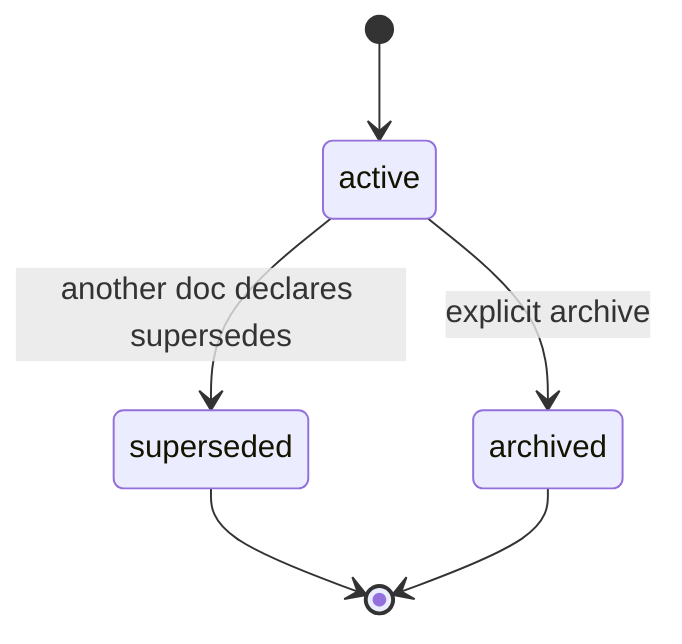
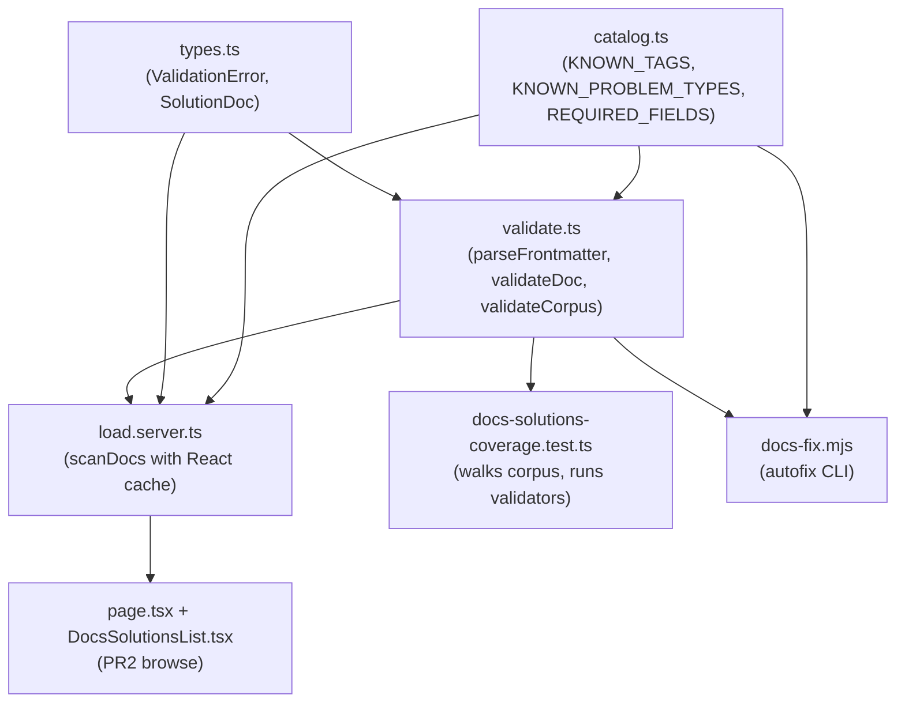

# feat: Drift-tested catalog stack for docs/solutions/

## Summary

Turn `docs/solutions/` into a drift-tested, code-owned, statefully-tracked catalog. PR1 lands a Vitest validator, a pure `KNOWN_TAGS` / `KNOWN_PROBLEM_TYPES` / `REQUIRED_FIELDS` registry, MADR-style status lifecycle frontmatter (stable `id`, `status`, bidirectional `supersedes`), backfills all 10 existing docs in the same PR so CI ships green, and adds a `pnpm docs:fix` autofix script. PR2 adds a server-rendered faceted browse page at `/super-admin/docs-solutions` that reads frontmatter live — no embeddings, no client search index, no API route.

---

## Problem Frame

`docs/solutions/` exists today as 10 markdown files across 6 category directories, all dated 2026-05-29, with rich but unenforced frontmatter (`title`, `date`, `category`, `module`, `problem_type`, `component`, `severity`, `tags`, plus track-specific fields). The frontmatter is consistent because the files were written in a single session — but there is no machine validation, no canonical tag list, no stable per-doc identity, and no lifecycle. None of those gaps bite at 10 docs. All of them bite at 100, and the cost of fixing them is dramatically higher then than now. This plan executes the brainstorm-confirmed shape (see origin: `docs/brainstorms/2026-05-31-docs-solutions-catalog-stack-requirements.md`).

---

## High-Level Technical Design

### Status lifecycle



A doc enters `active` when first written. `superseded` is reached when a newer doc declares it in its `supersedes:` array (CI enforces the back-pointer via R2). `archived` is an explicit terminal state for docs no longer relevant but not replaced. Neither terminal state deletes the file — lineage stays traceable. See origin's Key Decisions for the rationale.

### Module dependency



The validator and the browse page share `catalog.ts` and `validate.ts`. The autofix CLI reuses the same field list but parses `catalog.ts` via the `sync-translations.mjs`-style manual-TS-parse approach (no tsx/ts-node in devDependencies). PR2 adds `load.server.ts` and the page; everything else lands in PR1.

---

## Key Technical Decisions

- **KTD1. YAML parser is `yaml` (eemeli), added as a runtime dependency.** No YAML library is present in `package.json` today. PR2's server-side page parses frontmatter at request time, so the dep must be in `dependencies` not `devDependencies`. The eemeli `yaml` package is YAML 1.2-compliant, TypeScript-native, and actively maintained. Frontmatter splitting uses a 5-line regex over the `---\n...\n---\n` boundary — no `gray-matter` wrapper needed.
- **KTD2. Validation logic lives in `src/lib/docs-solutions/`; the Vitest test is thin.** Mirrors `src/lib/openapi/*`'s composition: a registry module, a small types module, a validate module, and (PR2) a server-only loader. The test imports and orchestrates rather than embedding logic. This makes the same validators reusable from `pnpm docs:fix` and from PR2's page.
- **KTD3. `REQUIRED_FIELDS` lives in `catalog.ts` alongside the enum lists.** Single source of truth consumed by the validator, the test, and the autofix script. Adding or removing a required field is one edit, not three.
- **KTD4. Tag-severity policy is strict-binary, not the origin's tiered scheme (deviation from origin R3).** Any tag not in `KNOWN_TAGS` is an error, on every doc, on every PR. Matches the existing `tests/unit/openapi-coverage.test.ts` pattern exactly (bidirectional strict). After PR1's canonicalization sweep, every existing tag is in `KNOWN_TAGS` so no "warn on existing" branch ever fires at launch. The tiered scheme would require git-diff awareness inside Vitest (`git diff --name-only $(git merge-base HEAD <base>)..HEAD`), which is meaningful complexity for an anticipatory drift guard. The tier can land as a follow-up if catalog drift starts hurting unrelated PRs. The corresponding origin requirement R3 is recorded below in its tiered form for traceability; the implementation realizes the strict-binary variant per this decision.
- **KTD5. ID assignment for backfill is alphabetical by repo-relative path** (see origin Key Decision 3). Deterministic, reproducible, no tiebreaker needed since all 10 docs share `date: 2026-05-29`.
- **KTD6. PR2 has no API route.** The browse page is a Server Component that reads `docs/solutions/` directly via `load.server.ts`. No `/api/super-admin/docs-solutions/route.ts`, so no OpenAPI registration is required. This sidesteps the constraint that any new admin API route would need to land in `src/lib/openapi/routes/` or `tests/unit/openapi-coverage.test.ts` would fail. A programmatic JSON dump can be added later as an additive change.
- **KTD7. Per-request caching uses React `cache()` over the filesystem scan.** Mirrors `getServerTranslations` in `src/lib/translations.server.ts` (the `.server.ts` sibling that wraps the pure registry in `src/lib/translations.ts`). A single page render does one scan regardless of how many components query the docs. No DB mirror — see `docs/solutions/architecture-patterns/db-backed-config-with-env-fallback.md` for the rule (DB-mirroring is for operational config admins edit at runtime, not deployment-contract data authored alongside code).
- **KTD8. GitHub blob URL construction uses an optional `GITHUB_REPO_URL` env var.** When set, R16's source link renders as `${GITHUB_REPO_URL}/blob/master/${relativePath}`. When unset, the entry renders the repo-relative path as plain text. No new public env exposure needed (server-side only).

---

## Output Structure

PR1 creates `src/lib/docs-solutions/`, two new test files, one script, and modifies the 10 existing solution docs + `package.json`. PR2 creates one more module and the admin page surface:

```text
src/lib/docs-solutions/
  catalog.ts                        # U1 — KNOWN_TAGS, KNOWN_PROBLEM_TYPES, REQUIRED_FIELDS
  types.ts                          # U2 — ValidationError, ParsedFrontmatter, SolutionDoc
  validate.ts                       # U2 — parseFrontmatter, validateDoc, validateCorpus
  load.server.ts                    # U6 (PR2) — scanDocs with React cache()

tests/unit/
  docs-solutions-validate.test.ts   # U2 — unit tests for validator helpers
  docs-solutions-coverage.test.ts   # U3 — corpus-wide drift test

scripts/
  docs-fix.mjs                      # U5 — autofix CLI

src/app/super-admin/docs-solutions/  # U6 (PR2)
  page.tsx                          # Server Component
  DocsSolutionsList.tsx             # "use client" filter UI
```

The tree is a scope declaration. The per-unit `**Files:**` sections are authoritative for what each unit creates.

---

## Requirements

Carried from origin: `docs/brainstorms/2026-05-31-docs-solutions-catalog-stack-requirements.md`. All R-IDs retain their origin numbering for traceability.

### Validator (`tests/unit/docs-solutions-coverage.test.ts` and supporting library)

- R1. The repo includes a Vitest test at `tests/unit/docs-solutions-coverage.test.ts` that walks every markdown file under `docs/solutions/`, parses YAML frontmatter, and asserts conformance with the catalog (R5–R7) and the status-lifecycle schema (R8–R9).
- R2. The validator fails CI when any of the following are true: a required frontmatter field is missing; `problem_type` is not in `KNOWN_PROBLEM_TYPES`; the `category:` frontmatter value does not match the file's containing directory; a `supersedes` or `superseded_by` reference cites an ID not present in the corpus; the supersedes graph contains a cycle; a `superseded_by: X` value is not mirrored by `X` listing the source doc in its `supersedes:` array.
- R3. *(Origin specified tiered severity: warn on existing docs with unknown tags, fail on new docs.)* This plan implements the **strict-binary variant per KTD4**: any tag not in `KNOWN_TAGS` is an error on every doc, every PR. The tiered scheme is recorded as deferred follow-up (see Scope Boundaries).
- R4. A `pnpm docs:fix` command writes missing required-field skeletons in place — adds the missing keys with blank or commented placeholder values, never invents content the author must decide. Opt-in (invoked on demand), not a CI side effect.

### Catalog (`src/lib/docs-solutions/catalog.ts`)

- R5. `src/lib/docs-solutions/catalog.ts` exports `KNOWN_TAGS` (readonly string array), `KNOWN_PROBLEM_TYPES` (readonly string array), and `REQUIRED_FIELDS` (readonly string array of frontmatter field names) as the single source of truth for the validator. Pure module — no Prisma, no Next-only imports — mirroring `src/lib/translations.ts`.
- R6. `KNOWN_PROBLEM_TYPES` contains all 17 enum values documented in the underlying schema (architecture_pattern, design_pattern, tooling_decision, convention, best_practice, workflow_issue, developer_experience, documentation_gap, build_error, test_failure, runtime_error, performance_issue, database_issue, security_issue, ui_bug, integration_issue, logic_error), not only the six currently used in the corpus (architecture_pattern, developer_experience, runtime_error, security_issue, tooling_decision, workflow_issue).
- R7. `KNOWN_TAGS` is seeded from the existing corpus by sweep + canonicalization in PR1. Synonyms across the 10 docs are collapsed to one canonical form; offending docs are updated in the same PR. The committed list is alphabetically sorted for diff-clean future additions.

### Status lifecycle frontmatter

- R8. Every doc in `docs/solutions/` carries these new frontmatter fields after PR1 merges: `id: SOL-YYYY-NNN` (required, stable, immutable; `YYYY` matches the `date:` field year; `NNN` zero-padded sequence within that year); `status: active | superseded | archived` (required; default `active`); `supersedes: [SOL-..., SOL-...]` (optional array); `superseded_by: SOL-...` (optional single ID, mutually consistent with target's `supersedes:`).
- R9. The frontmatter schema also permits an optional `wrong_paths_considered:` block (free-form prose). Never required, not backfilled into existing docs.

### Backfill (PR1)

- R10. All 10 existing docs receive `id` and `status` values in PR1. IDs are assigned alphabetically by repo-relative file path (see U4 for the explicit mapping). All ten receive `status: active`.
- R11. The backfill commit introduces no `supersedes` / `superseded_by` relationships among the 10.
- R12. PR1 ships with CI green. The validator running against the post-backfill corpus produces zero errors and no new warnings beyond any tag-canonicalization-driven ones the same PR also resolves.

### Browse page (PR2 — `/super-admin/docs-solutions`)

- R13. A server-rendered page at `/super-admin/docs-solutions` (`src/app/super-admin/docs-solutions/page.tsx`) lists every doc in `docs/solutions/`. Per row: `id`, `title`, `category`, `problem_type`, `status`, `tags`, `date`.
- R14. Filter controls bind to closed-catalog values: `problem_type` over `KNOWN_PROBLEM_TYPES`, `tags` multi-select over `KNOWN_TAGS`, `status` over the lifecycle enum. Filtering applies server-side.
- R15. The page is admin-gated by the existing `/super-admin/*` layout guard. The page itself does not call `requireSuperAdmin()` — the layout handles it (per `CLAUDE.md` "Routing: `/super-admin/*`"). No client search index, no embeddings.
- R16. Each entry links to its source `.md` file via a GitHub blob URL (constructed from `GITHUB_REPO_URL` env var when set; otherwise renders the repo-relative path as plain text). Read-only — no in-page editing of frontmatter or body.
- R17. Supersedes relationships render inline: a `status: superseded` doc shows "Superseded by [id] — [title]" with the id linked; a doc with non-empty `supersedes:` shows "Supersedes [id, id]" with each id linked.

---

## Implementation Units

### U1. Catalog module

- **Goal:** Establish the code-owned source of truth for tag, `problem_type`, and required-field enums in a pure module importable from Node scripts, Vitest tests, and Next.js server components.
- **Requirements:** R5, R6, R7.
- **Dependencies:** none.
- **Files:** `src/lib/docs-solutions/catalog.ts` (new).
- **Approach:**
  - Pure module — no Prisma, no Node-only APIs. Exports `KNOWN_PROBLEM_TYPES`, `KNOWN_TAGS`, `REQUIRED_FIELDS` as `ReadonlyArray<string>`, plus accessor helpers `isKnownTag(tag)` and `isKnownProblemType(value)`.
  - `REQUIRED_FIELDS` initial set: `title`, `date`, `category`, `module`, `problem_type`, `severity`, `id`, `status`.
  - Section-header comments matching house style (`// ─── Section ─────`).
  - Top-of-file JSDoc documents how to add a tag / problem_type, what the validator enforces, and why the module is pure (importable from edge runtime, middleware, server components without bundle bloat).
  - `KNOWN_TAGS` is seeded from the post-canonicalization sweep that U4 performs against the existing corpus; the actual values are committed alphabetically sorted.
- **Patterns to follow:** `src/lib/translations.ts` for module shape (ReadonlyArray + Map + accessor + module-level JSDoc).
- **Test scenarios:**
  - Happy path: `KNOWN_PROBLEM_TYPES` contains all 17 enum values (assert each by name).
  - Edge: `KNOWN_TAGS` is non-empty, alphabetically sorted, has no duplicates.
  - Edge: `REQUIRED_FIELDS` contains exactly the eight field names listed above.
  - Edge: `isKnownTag` returns `false` for an empty string, returns `true` for a registered tag, returns `false` for an unregistered tag with the same length.
- **Verification:** the module imports cleanly into both a Node `.mjs` script (U5) and a Vitest test (U3) without bundling errors. No Prisma or Next-only imports.

### U2. Frontmatter parser and validation library

- **Goal:** Pure functions that parse a doc's YAML frontmatter and return typed validation errors + warnings, with no filesystem access or side effects.
- **Requirements:** R1, R2, R3 (strict-binary variant per KTD4).
- **Dependencies:** U1.
- **Files:**
  - `src/lib/docs-solutions/types.ts` (new) — `ParsedFrontmatter`, `ValidationError`, `ValidationResult`, `SolutionDoc`.
  - `src/lib/docs-solutions/validate.ts` (new) — `parseFrontmatter`, `validateDoc`, `validateCorpus`.
  - `package.json` (modified) — add `"yaml": "^2.6.0"` to `dependencies`.
  - `tests/unit/docs-solutions-validate.test.ts` (new) — unit coverage for the library.
- **Execution note:** Test-first. Write `validate.test.ts` assertions for each rule before adding the corresponding check; the test file is also where the corpus-wide assertions in U3 will compose these primitives.
- **Approach:**
  - `parseFrontmatter(source: string)`: 5-line regex splits on `^---\n(.*?)\n---\n?(.*)$` (multiline + dotall), runs `yaml.parse` on the matter, returns `{ frontmatter, body }` or `{ error }`.
  - `validateDoc(parsed, repoRelativePath, allIds)`: returns `ValidationError[]` covering required-field presence, `problem_type` enum membership, `id` format regex `/^SOL-\d{4}-\d{3}$/`, `status` enum (`active` / `superseded` / `archived`), `category` directory match (first segment of `repoRelativePath` after `docs/solutions/`), tag membership in `KNOWN_TAGS` (strict per KTD4), supersedes / superseded_by reference existence + mutual consistency.
  - `validateCorpus(parsedDocs)`: corpus-level checks — duplicate `id` detection (lists both files), supersedes graph acyclic check (depth-first traversal), orphan registry entry detection (`KNOWN_TAGS` members and `KNOWN_PROBLEM_TYPES` values not used in any doc — returns as warnings, not errors; an explicit `RESERVED_PROBLEM_TYPES` exclusion list in the test file mirrors `EXCLUDED_DIRS` from `tests/unit/openapi-coverage.test.ts` for enum values pre-registered for future use).
  - All public functions are pure: input goes in, result comes out, no `process.cwd()`, no `fs`, no globals. The U3 coverage test and the U6 server loader both wrap these with filesystem access.
- **Patterns to follow:**
  - `tests/unit/openapi-coverage.test.ts` — bidirectional check shape (every implemented thing is registered, every registered thing is implemented).
  - `src/lib/openapi/*` — small files under a feature folder; one file per concern.
- **Test scenarios** (in `tests/unit/docs-solutions-validate.test.ts`):
  - Happy path: a fully-formed synthetic doc passes `validateDoc` with zero errors.
  - Edge: `parseFrontmatter` on a doc missing the opening `---` returns an error; on malformed YAML returns an error with line info; on a doc with only `---\n---\n` returns frontmatter `null`.
  - Error path: `validateDoc` on a doc missing each required field individually produces one error per missing field naming the field.
  - Error path: `validateDoc` on `problem_type: not_a_real_type` produces an error naming the value.
  - Error path: `validateDoc` on `id: SOL-26-1`, `id: XSOL-2026-001`, and `id: SOL-2026-1` each produces an error naming the malformed id.
  - Error path: `validateDoc` on `status: dormant` produces an error.
  - Error path: a doc at `docs/solutions/runtime-errors/foo.md` with `category: architecture-patterns` produces a category-mismatch error.
  - Error path: `validateDoc` with `supersedes: [SOL-2026-999]` and `allIds = {SOL-2026-001..010}` produces a missing-reference error naming `SOL-2026-999`.
  - Error path: doc A has `superseded_by: SOL-B` but B has no `supersedes: [SOL-A]` produces a mutual-consistency error.
  - Error path: `validateCorpus` with two docs both `id: SOL-2026-005` produces a duplicate-id error naming both files.
  - Error path: `validateCorpus` with `A.superseded_by = B` and `B.superseded_by = A` produces a cycle error naming `A → B → A`.
  - Warning: `validateCorpus` with a `KNOWN_TAGS` member used in zero docs produces a warning (not an error) naming the tag.
  - Strict-tag (KTD4): a doc with `tags: [some-tag-not-in-catalog]` produces an error naming the tag and the doc. (Origin AE1 is updated to match this strict-binary semantic.)
- **Verification:** `pnpm test` runs the new validate-unit test and exits 0. Each scenario above appears in the test output as a discrete assertion. *Note: anyone pulling the PR1 branch must run `pnpm install` before `pnpm test` so the newly-added `yaml` runtime dependency resolves.*

### U3. Vitest drift-detection test (coverage)

- **Goal:** Walk every `docs/solutions/**/*.md`, run `validateDoc` + `validateCorpus` against the full set, assert zero errors, surface warnings.
- **Requirements:** R1, R2, R3 (strict per KTD4).
- **Dependencies:** U1, U2, U4 (U4 lands the backfilled frontmatter so this test ships green at PR1 merge).
- **Files:** `tests/unit/docs-solutions-coverage.test.ts` (new).
- **Approach:**
  - Anchor at `path.resolve(__dirname, "../../docs/solutions")` (mirrors `tests/unit/openapi-coverage.test.ts`'s `path.resolve` anchor, NOT `process.cwd()`).
  - `walk()` helper using `fs.readdirSync({ withFileTypes: true })` recursively, collecting `*.md` files.
  - For each file: `fs.readFileSync(file, "utf8")`, parse with `parseFrontmatter`, collect `allIds` first, then run `validateDoc` per file and `validateCorpus` over the set.
  - Two `it()` blocks:
    - `it("every doc passes per-doc schema validation")` — aggregates per-doc errors; `expect(errors, multi-line-msg).toEqual([])`.
    - `it("the corpus passes catalog-level checks")` — id uniqueness, supersedes acyclic; same shape.
  - Windows-safe path normalization: `rel.split(/[\\/]/)` when computing directory category (mirrors `openapi-coverage`'s pattern).
  - Failure messages print the exact problem and file: `"docs/solutions/architecture-patterns/foo.md: tag 'next-router' not in KNOWN_TAGS"`.
  - `RESERVED_PROBLEM_TYPES = new Set([...])` explicit exclusion list for enum values pre-registered for future use (e.g., `design_pattern`, `convention` if no docs use them yet) — keeps orphan-warning quiet at launch without silently tolerating gaps.
- **Patterns to follow:** `tests/unit/openapi-coverage.test.ts` exactly — `describe`/two `it()`, walker with `withFileTypes: true`, `path.resolve(__dirname, ...)` anchor, Windows-safe path normalization, `expect(arr, msg).toEqual([])` with multi-line failure message, no try/catch around parse (loud failures), explicit exclusion list.
- **Test scenarios:**
  - Covers AE1 (strict variant): an existing doc carries a tag not in `KNOWN_TAGS` — `pnpm test` fails with a message naming the doc and tag.
  - Covers AE2: a new doc carries an unknown tag without updating `KNOWN_TAGS` — `pnpm test` fails the same way.
  - Covers AE3: a contrived cycle in the supersedes graph — `pnpm test` fails naming the cycle path.
  - Covers AE4: a `supersedes: [SOL-2026-999]` value with no SOL-2026-999 in the corpus — fails naming the missing id.
  - Covers AE5: after backfill, the validator passes against the current corpus on every subsequent PR that doesn't touch `docs/solutions/` — `pnpm test` exits 0.
  - Plus AE6 (new): a doc with `id: SOL-2026-005` colliding with another's same id — fails naming both files.
  - Plus AE7 (new): a doc with `status: superseded` but no other doc has `supersedes:` pointing at it — fails (orphan superseded state).
- **Verification:** `pnpm test` exits 0 against the post-backfill corpus. Failure messages are loud and exact — verified manually by temporarily breaking one doc and confirming the message before reverting.

### U4. Backfill the 10 existing docs

- **Goal:** Add `id` and `status` frontmatter to each existing doc and canonicalize tags so the U3 coverage test ships green at PR1 merge.
- **Requirements:** R10, R11, R12.
- **Dependencies:** U1 (catalog must exist to define canonical tags).
- **Files (modified):**
  - `docs/solutions/architecture-patterns/avatar-storage-sqlite-blob-with-client-side-crop.md` → `id: SOL-2026-001`
  - `docs/solutions/architecture-patterns/db-backed-config-with-env-fallback.md` → `id: SOL-2026-002`
  - `docs/solutions/architecture-patterns/db-backed-ui-translation-registry.md` → `id: SOL-2026-003`
  - `docs/solutions/architecture-patterns/openapi-spec-from-zod-validators.md` → `id: SOL-2026-004`
  - `docs/solutions/architecture-patterns/per-user-theme-server-side-class-stamping.md` → `id: SOL-2026-005`
  - `docs/solutions/developer-experience/git-worktree-remove-windows-max-path.md` → `id: SOL-2026-006`
  - `docs/solutions/runtime-errors/nextjs-app-router-dot-suffixed-route-folder-404.md` → `id: SOL-2026-007`
  - `docs/solutions/security-issues/log-scrubber-must-sanitise-context-field.md` → `id: SOL-2026-008`
  - `docs/solutions/tooling-decisions/swagger-ui-react-to-scalar-react19.md` → `id: SOL-2026-009`
  - `docs/solutions/workflow-issues/github-push-protection-secret-test-fixtures.md` → `id: SOL-2026-010`

  All 10 receive `status: active`. None receive `supersedes:` or `superseded_by:` — no inter-doc supersession exists today.
- **Approach:**
  - One mechanical pass per file: insert `id:` and `status:` just below the existing `date:` field for visual consistency. Do not reorder other frontmatter fields.
  - Sweep existing `tags:` arrays across all 10 docs, identify synonyms (e.g., variants of `next-app-router` / `nextjs-route-handler`), pick one canonical form, update `KNOWN_TAGS` in `catalog.ts` (U1) AND the offending docs in the same PR.
  - Confirm the existing `validate-frontmatter.py` parser-safety script from ce-compound still passes against each modified doc.
- **Patterns to follow:** preserve existing field order; insert rather than reorder.
- **Test scenarios:**
  - Test expectation: none -- mechanical content backfill, verified by U3's coverage test.
- **Verification:** `pnpm test` exits 0 against the post-backfill corpus (depends on U1, U2, U3, U5 also being in PR1). Each doc's frontmatter remains parser-safe.

### U5. `pnpm docs:fix` autofix script

- **Goal:** A CLI script that scans `docs/solutions/**/*.md` and writes skeleton entries for any missing required field, leaving the rest of the file untouched.
- **Requirements:** R4.
- **Dependencies:** U1, U2.
- **Files:**
  - `scripts/docs-fix.mjs` (new).
  - `package.json` (modified) — add `"docs:fix": "node scripts/docs-fix.mjs"` to the scripts section.
- **Approach:**
  - Plain `.mjs` ESM with shebang `#!/usr/bin/env node`, top-level await. Mirrors `scripts/sync-translations.mjs`.
  - Imports `yaml` (eemeli). For `REQUIRED_FIELDS`, parses `src/lib/docs-solutions/catalog.ts` source text and extracts the array via regex (the `sync-translations.mjs` approach — no tsx/ts-node available).
  - For each doc: parse frontmatter, identify missing required fields, insert each missing field with a commented placeholder value (`module: # TODO: fill in the module path`). Never overwrites existing content.
  - Idempotent: re-running on the same corpus produces no diff if no fields are missing.
  - Exits 0 on success, 1 on parse failure for any file (printing the file and error).
- **Patterns to follow:** `scripts/sync-translations.mjs` for harness shape (shebang + top-level await + `readFileSync` + manual-TS-source parse + invoked via `pnpm <name>`).
- **Test scenarios:**
  - Test expectation: none -- developer tool, verified by running against a contrived broken doc.
  - Manual: running `pnpm docs:fix` against the unmodified post-backfill corpus produces no diff.
  - Manual: removing `module:` from one doc, running `pnpm docs:fix`, and checking the file shows the placeholder inserted in the right spot with the rest of the file unchanged.
- **Verification:** `pnpm docs:fix` runs to completion on the post-backfill corpus and prints a summary (`Checked N docs, fixed 0`). Re-running produces the same output.

### U6. PR2 — Faceted browse page at `/super-admin/docs-solutions`

- **Goal:** A server-rendered admin page listing every doc with filter controls over `KNOWN_TAGS`, `KNOWN_PROBLEM_TYPES`, and `status`; renders supersedes relationships inline; admin-gated, read-only, no embeddings.
- **Requirements:** R13, R14, R15, R16, R17.
- **Dependencies:** U1, U2, U4 (PR1 must be merged first).
- **Files:**
  - `src/lib/docs-solutions/load.server.ts` (new) — server-only module: scans `docs/solutions/` via `fs.readdir`, parses each file with `parseFrontmatter` (U2), assembles typed `SolutionDoc[]`. Wrapped in React `cache()` so a single render does one scan.
  - `src/app/super-admin/docs-solutions/page.tsx` (new) — Server Component.
  - `src/app/super-admin/docs-solutions/DocsSolutionsList.tsx` (new) — `"use client"` filter UI companion.
  - `src/app/super-admin/layout.tsx` (modified) — add nav link for "Solutions".
  - `src/lib/translations.ts` (modified) — add `super_admin.nav.docs_solutions` translation key.
  - `.env.example` (modified) — add a commented-out `# GITHUB_REPO_URL=...` entry documenting the optional server-side env var introduced in KTD8.
- **Approach:**
  - Server Component calls `await scanDocs()` from `load.server.ts`, hands the array (with serialized dates) to `DocsSolutionsList` (client).
  - Does NOT call `requireSuperAdmin()` explicitly — `src/app/super-admin/layout.tsx` covers it (per CLAUDE.md "Routing: `/super-admin/*`"). Add a one-line comment in the file noting that the guard runs at the layout level.
  - `DocsSolutionsList` renders a filter strip (`problem_type` single-select, `tags` multi-select, `status` single-select) above a table. Filtering is purely client-side over the prefetched array since the corpus is small.
  - Each row shows `id` (monospace), `title`, `category`, `problem_type`, `status` (colored badge: active=green, superseded=amber, archived=grey), `tags`, `date`.
  - Source link per row: when `process.env.GITHUB_REPO_URL` is set on the server, link to `${GITHUB_REPO_URL}/blob/master/${repoRelativePath}`; otherwise render the path as monospace plain text.
  - Supersedes rendering: `status: superseded` row shows "Superseded by [SOL-NNN] — [title]" with the id linked to the target row's anchor (each row gets `id="${doc.id}"`). Rows with non-empty `supersedes:` show "Supersedes [SOL-NNN, SOL-NNN]".
  - Section shell follows the existing `super-admin` page convention: `<section className="flex w-full flex-col gap-6">` + `<h2>` + subtitle paragraph (matching `src/app/super-admin/languages/page.tsx`).
- **Patterns to follow:**
  - `src/app/super-admin/languages/page.tsx` for Server Component shell + client companion split.
  - `src/lib/translations.server.ts`'s `cache()` use for the loader.
  - `src/app/super-admin/layout.tsx` for nav link insertion shape.
- **Test scenarios:**
  - Happy path (unit on the loader): `scanDocs()` returns the correct count for the current corpus (10 active docs), with `id`, `status`, `tags`, `problem_type` correctly surfaced on each.
  - Edge (unit on the loader): a doc with `superseded_by: SOL-2026-XXX` has the field surfaced as a parsed value (not a stringified array).
  - Edge (build-time): `load.server.ts` is server-only; the file imports cleanly into the page without breaking the client bundle (verified by `pnpm build` succeeding).
  - Integration (manual): visit `/super-admin/docs-solutions` as a super-admin, confirm 10 rows render, filter by `problem_type=architecture_pattern` narrows to 5 rows, filter by `tags=nextjs` narrows correctly, status badges render with the right colors.
  - Integration (manual, contrived): temporarily add `superseded_by: SOL-2026-001` to one doc (and the mirroring `supersedes: [SOL-2026-XXX]` on the other), confirm the inline rendering shows the relationship and the link jumps to the target row.
  - Anti-regression: `pnpm test` continues to pass; U3 coverage test does not regress.
- **Verification:** the page loads at `/super-admin/docs-solutions` for an admin user, filters work, supersedes inline rendering displays correctly on a contrived test. `pnpm build` succeeds. `pnpm test` exits 0.

---

## Acceptance Examples

Carried from origin (AE1–AE5, with AE1 updated to the strict-binary semantic per KTD4) and extended with two plan-added examples (AE6–AE7) for ID collision and orphan-superseded checks.

- AE1. **Covers R3 (strict variant per KTD4).** **Given** an existing doc carries a tag `next-router` that is not in `KNOWN_TAGS`. **When** CI runs. **Then** `pnpm test` exits non-zero with a message naming the doc and the tag.
- AE2. **Covers R3.** **Given** a new doc introduced in the same PR carries a tag `webhook-retry` not in `KNOWN_TAGS`, and `src/lib/docs-solutions/catalog.ts` is not also updated. **When** CI runs. **Then** `pnpm test` fails with a message naming the doc, the tag, and the requirement to add it to `KNOWN_TAGS`.
- AE3. **Covers R2.** **Given** `SOL-2026-005` declares `superseded_by: SOL-2026-008` and `SOL-2026-008` declares `superseded_by: SOL-2026-005`. **When** CI runs. **Then** the validator fails naming the cycle and the involved IDs.
- AE4. **Covers R2.** **Given** a new doc declares `supersedes: [SOL-2026-999]` and no doc with that ID exists. **When** CI runs. **Then** the validator fails naming the broken reference.
- AE5. **Covers R10, R11, R12.** **Given** PR1 has merged with backfill applied. **When** any subsequent PR runs `pnpm test` without touching `docs/solutions/`. **Then** the validator passes with zero errors and no new warnings.
- AE6. **Covers R2 (plan-added).** **Given** two docs in the corpus both declare `id: SOL-2026-005`. **When** CI runs. **Then** the validator fails naming both files as the source of the duplicate id.
- AE7. **Covers R8 (plan-added).** **Given** a doc has `status: superseded` but no other doc lists it in any `supersedes:` array. **When** CI runs. **Then** the validator fails the consistency check naming the orphan superseded doc.

---

## Scope Boundaries

### Deferred for later

The other six surviving ideas from the ideation depend on this catalog stack but are explicitly out of scope:

- Push-Discovery Triad (agent retrieval pre-step, per-module CLAUDE.md auto-backlinks, session-start system-reminder injection).
- Auto-Draft Capture Pipeline (post-commit / PR-merge headless ce-compound, `_inbox/`, weekly triage skill).
- Tiered Recommendation Lifecycle (`recommendations.yaml` registry, promotion to lint rules, FRACAS-style corrective-actions tracking).
- Cross-Repo Engineering Memory (migrate to a sibling shared repo).
- Code-Churn-Triggered Freshness (PR diff intersected with each doc's code refs).
- Recurring Solutions Digest.

Additionally deferred from this stack specifically:

- A `stale_score` column on the PR2 browse page — that's the Code-Churn Freshness idea's job.
- In-page editing of frontmatter — PR2 is strictly read-only.
- Backfilling `wrong_paths_considered:` into the 10 existing docs.
- Auto-canonicalization of new tags (edit-distance suggestion at PR review) — PR1 only commits the initial sweep.
- DB sync of the catalog.
- Embedding-based search, client search index.

### Deferred to Follow-Up Work

- **R3 tiered severity (warn-on-existing, fail-on-new tag policy).** This plan implements the strict-binary variant per KTD4. If catalog drift starts hurting unrelated PRs in practice, a follow-up adds git-diff awareness inside the test: detect files modified in the current PR via `git diff --name-only $(git merge-base HEAD <base>)..HEAD`, fail strict on those, warn-only on unchanged docs.
- **Programmatic JSON dump of the catalog.** PR2 has no API route. If external tooling needs a JSON view of `docs/solutions/`, an additive `/api/super-admin/docs-solutions/route.ts` + OpenAPI registration can land later.

### Outside this product's identity

- A standalone external API on top of `docs/solutions/` for non-repo consumers. The browse page is internal admin-only.
- Treating learning capture as a non-engineering activity (onboarding journal, customer-feedback collection).

---

## System-Wide Impact

- **CI**: adds two new Vitest test files to the existing `pnpm test` invocation. No new CI configuration; the existing `tests/unit/**/*.test.ts` include glob picks them up. Runtime increase: under a second for a 10-doc corpus.
- **Dependencies**: adds `yaml` (eemeli) ^2.6.x to `dependencies`. New package install required after PR1 merges.
- **Existing tests**: no regression expected — the new tests are additive. The existing `openapi-coverage.test.ts` is unaffected.
- **Admin UX (PR2)**: adds one nav entry under `/super-admin`. The existing layout guard handles auth — no auth-related changes.
- **Edge bundle**: the new `src/lib/docs-solutions/` modules are pure (no Prisma, no Node-only APIs) and safe to import from middleware if a future feature ever needs that. `load.server.ts` is the one server-only file (filesystem access) and is named with the `.server.ts` suffix accordingly.
- **Other projects (servicelovers-backend-2.0, SL2-*)**: untouched. The Cross-Repo Engineering Memory idea would change this, but it's deferred.

---

## Risks and Dependencies

- **Risk: tag canonicalization in U4 surfaces synonyms the plan didn't anticipate.** The brainstorm sweep was hypothetical; the actual existing tags may have more or fewer synonym groups than expected. Mitigation: U4 includes a tag-sweep sub-step before backfill; if the sweep finds unexpected complexity, surface in the PR description rather than silently making taxonomy decisions.
- **Risk: `yaml` (eemeli) version bumps mid-PR.** Pin to `^2.6.x` and let pnpm's lockfile lock the patch version.
- **Risk: `KNOWN_PROBLEM_TYPES` pre-registers enum values not yet used in the corpus, which would normally produce orphan-warnings.** Mitigation: explicit `RESERVED_PROBLEM_TYPES` exclusion list in U3, mirroring `EXCLUDED_DIRS` in `tests/unit/openapi-coverage.test.ts`. Values like `design_pattern`, `convention`, `best_practice`, `documentation_gap`, `build_error`, `test_failure`, `performance_issue`, `database_issue`, `ui_bug`, `logic_error` go on this list at PR1 launch and come off as docs in those categories are written.
- **Risk: backfilling IDs is irreversible.** Confirmed in the brainstorm. Cross-checked in U4 against alphabetical-by-path ordering for determinism.
- **Dependency: `tests/unit/openapi-coverage.test.ts` must continue to pass.** PR1 doesn't touch the OpenAPI spec, so no risk. PR2's omission of an API route (KTD6) sidesteps the requirement that any new `route.ts` must register in `src/lib/openapi/routes/`.
- **Dependency: `src/app/super-admin/layout.tsx`'s guard must remain authoritative.** Verified in the research scan; the page in U6 inherits the guard and doesn't re-call `requireSuperAdmin()`.

---

## Sources and Research

### In-repo patterns referenced

- `tests/unit/openapi-coverage.test.ts` — drift-test shape this plan mirrors (walker with `withFileTypes: true`, `path.resolve(__dirname, ...)` anchor, Windows-safe path normalization via `/[\\/]/`, two-`it()` bidirectional assertion, `expect(arr, multi-line-msg).toEqual([])` failure-message pattern, explicit exclusion set).
- `src/lib/translations.ts` — pure-module + ReadonlyArray + Map + accessor pattern for the catalog. The server-side `cache()` wrapper (`getServerTranslations`) lives in the sibling `src/lib/translations.server.ts` — referenced for KTD7's request caching pattern.
- `src/lib/openapi/spec.ts`, `src/lib/openapi/registry.ts`, `src/lib/openapi/routes/*` — small-files-under-feature-folder composition this plan applies to `src/lib/docs-solutions/`.
- `src/app/super-admin/languages/page.tsx` — Server Component admin-page shell (auth via layout, server-side data fetch, client companion for interactions).
- `src/app/super-admin/layout.tsx` and `src/lib/super-admin.ts` — defence-in-depth admin gate documented in CLAUDE.md "Routing: `/super-admin/*`".
- `scripts/sync-translations.mjs` — script-harness pattern for `pnpm docs:fix` (shebang + top-level await + `readFileSync` + manual-TS-source parse).
- `docs/solutions/architecture-patterns/openapi-spec-from-zod-validators.md` — institutional learning: bidirectional drift testing.
- `docs/solutions/architecture-patterns/db-backed-ui-translation-registry.md` — institutional learning: code-owned catalog discipline (with the divergence noted: this plan's catalog has no admin-edited surface, so the DB-mirror half doesn't apply).
- `docs/solutions/architecture-patterns/db-backed-config-with-env-fallback.md` — institutional learning: argues against DB-mirroring catalog data; reinforces KTD7.
- `docs/solutions/runtime-errors/nextjs-app-router-dot-suffixed-route-folder-404.md` — institutional learning: the `/super-admin/docs-solutions` route folder name has no dot. Safe.

### Origin document

- `docs/brainstorms/2026-05-31-docs-solutions-catalog-stack-requirements.md` — requirements doc this plan implements.

### External references (already incorporated via brainstorm)

- MADR (Markdown Architectural Decision Records) — status lifecycle + supersedes graph.
- MITRE CVE — stable, year-keyed ID format that informs `SOL-YYYY-NNN`.
- Google SRE "Postmortem Culture" — schema consistency as the prerequisite for queryability.
- Medical Clinicopathological Conference narratives — basis for the optional `wrong_paths_considered:` field.
