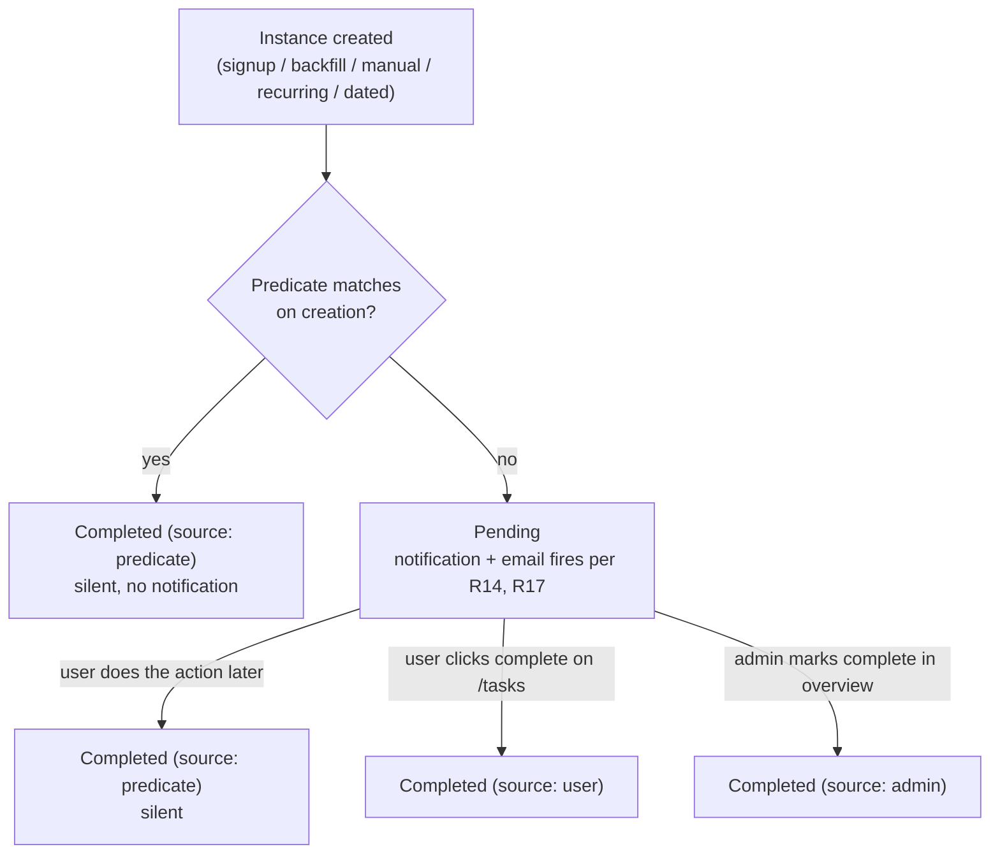
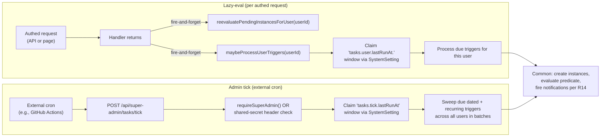
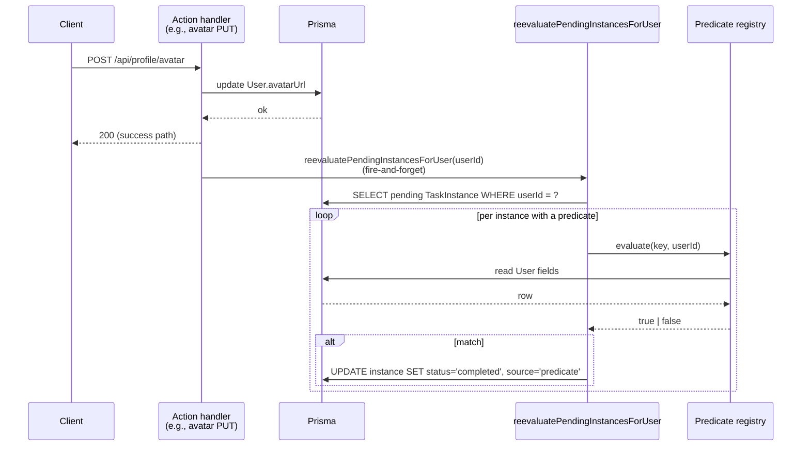

# feat: Add tasks and in-app notifications system

## Summary

Build the configurable task system defined in the origin brainstorm — admin-managed `Task` definitions keyed to an engineering-maintained predicate catalog, per-user `TaskInstance` records driven by five trigger paths (signup, manual admin assign, backfill-on-enable, recurring, specific-date), and a separate `Notification` entity with read/unread state and per-language email delivery. Ships a `/tasks` page in a new `(dashboard)` layout, a header notification bell, super-admin CRUD plus a global instance overview, and a hybrid scheduler (lazy-eval mirroring `src/lib/log.prune.ts` plus an external-cron-callable admin tick) for the recurring and dated triggers.

---

## Problem Frame

The product currently has no in-product surface for the business to ask end users to do something — finish onboarding, confirm details, check in on a cadence. Out-of-band email is the only channel. The brainstorm's primary v1 use case is onboarding completion (e.g., "upload a profile picture") but the engine is deliberately general so recurring check-ins and one-off admin asks fit the same model. See origin's Problem Frame for the forward-looking-driver framing.

The codebase ships the building blocks the plan reuses heavily — Survey/SurveyStep/SurveyResponse is the canonical "global admin-managed resource + per-user instance" pattern (`src/app/super-admin/surveys/page.tsx`, `prisma/schema.prisma:55-140`); the per-language EmailTemplate flow with `KNOWN_TEMPLATES` fallback already handles transactional email (`src/lib/templates.ts`, `src/lib/templates.server.ts`, `src/lib/email.ts`); `src/lib/log.prune.ts` is the only existing scheduled-work precedent and uses a `SystemSetting`-claimed last-run window. There is no existing in-app notification model, no `(dashboard)` shared layout, and no scheduler beyond the one lazy-eval pattern.

---

## Key Technical Decisions

- **KTD1. Scheduler is hybrid — lazy-eval per authed request plus an admin tick endpoint for external cron.** Lazy-eval mirrors `src/lib/log.prune.ts` (claim a `SystemSetting` window, process due triggers, release; fire-and-forget from authed handlers). The tick endpoint (`POST /api/super-admin/tasks/tick`) is callable by an external cron (GitHub Actions scheduled workflow, cron-job.org, or any equivalent) so recurring and dated triggers fire even for dormant users. **Tick authentication: shared-secret header `X-Tick-Secret` matched against the SystemSetting key `tasks.tick.secret` (`isSecret: true`).** The endpoint accepts the header in lieu of an admin session cookie — required because external cron services cannot hold a NextAuth JWT. The secret is generated on first boot (or via `pnpm tasks:rotate-secret`) and rotated through `/super-admin/system-settings`. Rejected: `requireSuperAdmin()` only (incompatible with stateless external cron); Vercel Cron (would force a Vercel deploy target and Postgres migration — codebase ships SQLite default with no `vercel.json`). Pure lazy-eval was also rejected because dormant-user recurring never fires.

- **KTD2. Predicate catalog is a pure registry module, mirroring `KNOWN_TRANSLATIONS`.** `src/lib/predicates.ts` exports `KNOWN_PREDICATES` as a typed const tuple with `{ key, name, description, deepLinkPath?, evaluate }`. Adding a predicate is an engineering change. v1 floor: `avatar_present`, `email_verified`, `language_set` — three predicates. `name_set` was dropped from the floor because `signupSchema` already requires non-empty `name` (Zod `min(1)`), so the predicate is structurally always-true and adds no value as a task-completion check. The catalog's intended v2 growth shape is time-windowed / event-in-window predicates (e.g., `avatar_updated_in_last_30_days`) rather than additional state-current ones. Reasoning grounded in the `db-backed-ui-translation-registry.md` solution doc — devs own the keys, admins wire them to tasks via the editor dropdown.

- **KTD3. Triggers are a child table (`TaskTrigger`), not a JSON column.** Mirrors `SurveyStep`'s pattern of one row per discrete piece with `type` as a string discriminator. Keeps the admin editor's per-trigger form clean and Zod validation per trigger shape simple. **Indexability caveat:** recurring triggers query by `kind` (indexed); specific-date triggers store dates as newline-joined `dateList` and the scheduler full-scans those rows per tick (acceptable at v1 scale; the row count is bounded by definition count, not user count). Rejected: separate boolean columns (doesn't scale to per-trigger config like interval / date list); JSON blob (worse than `dateList` for the per-tick scan because every read also pays JSON parse cost).

- **KTD4. `Notification` is a separate entity with `unread Boolean`, independent of `TaskInstance.status`.** Carries `type` (v1: only `task_created`) and `taskInstanceId` FK. Read/unread is bookmark-state for the user; pending/completed is workflow state for the instance. Lets the bell badge count unread independently of task progress and leaves room for non-task notification types without schema churn.

- **KTD5. `User.taskEmailsOptOut` defaults to `false` (emails enabled by default).** Surfaces in `/profile` as an opt-out toggle. Threaded through the JWT session callback per the `per-user-theme-server-side-class-stamping.md` solution pattern so the dispatch check is server-side without a query. Rejected: opt-in default (would mute the channel before users discovered it existed; conflicts with the brainstorm's "tell users about their tasks" framing).

- **KTD6. R8 contradiction resolved by silent-auto-complete consistency.** When manual admin assignment creates an instance whose predicate immediately matches, the instance is created completed with `source: predicate` and no notification fires — same as every other auto-complete path (R7, R11). The Requirements section below replaces R8's "always notifies" wording. AE5 is updated accordingly and AE5b is added to cover the matching-on-assign case.

- **KTD7. R9 contradiction resolved by pending-blocks-recurring.** A recurring trigger does not create the next instance for a user while their previous instance of the same definition is still pending. Matches AE7. The scheduler's recurring dispatch queries for an existing pending instance per (definition, user) and skips creation when one exists.

- **KTD8. SystemSetting carries operational knobs; no new env vars.** Grounded in `db-backed-config-with-env-fallback.md`. New keys:
  - `tasks.tick.lastRunAt` — claim-window timestamp for the global tick (no default; written by the scheduler)
  - `tasks.tick.windowMs` — minimum gap between successful global ticks (default `300000` / 5 min)
  - `tasks.tick.secret` — shared-secret for the tick endpoint (`isSecret: true`, generated on first boot, rotatable in `/super-admin/system-settings`)
  - `tasks.backfill.batchSize` — per-batch user count during backfill (default `500`)
  - `tasks.backfill.maxEmailsPerEnable` — hard cap on email dispatch per enable event; `runBackfillForDefinition` refuses with a 4xx and a clear message if `count > cap` and `notify === true` (default `1000`; admin can raise temporarily)
  - `tasks.scheduler.enabled` — runtime kill switch (default `true`). Threaded as the FIRST short-circuit in every dispatch entry point: `maybeProcessUserTriggers`, `runGlobalTick`, `dispatchTaskCreatedFor`, `runBackfillForDefinition`, `manuallyAssignInstance`, `createInstancesForSignup`. When `false`, every dispatch path returns silently without creating instances or firing notifications/emails. Admin flips the setting from `/super-admin/system-settings` for instant ops-level rollback without a redeploy.

  All keys are resolved at point of use, not cached at module load (matches the SMTP/translate-provider pattern in `src/lib/system-settings.ts`).

- **KTD9. Backfill processes users in batches outside a single transaction, with per-user atomicity.** SQLite's single-writer model means a 10k-row transaction blocks the app. Backfill loops in chunks of `tasks.backfill.batchSize`; each user's "create-instance + evaluate-predicate + maybe-fire-notification" is one transaction; concurrent user activity is handled idempotently (instance-create is `Prisma.upsert` on the `(taskId, userId, signature)` unique key — see KTD10).

- **KTD10. TaskInstance uniqueness uses an explicit `signature` column.** Most instances need uniqueness on `(taskId, userId)` — one open instance per user per definition. Specific-date triggers need `(taskId, userId, ymd)` — one per date per user. Recurring instances are gated by KTD7 so they don't collide. A single nullable `signature` column gives a uniform unique key across all triggers and avoids partial indexes. **Canonical signature format table** (shared knowledge across U4/U5/U6; sentinels are stable strings, not regenerated per call):

  | Trigger | Signature format | Notes |
  |---|---|---|
  | `signup` | `"signup"` (literal) | One per (taskId, userId); created at signup time. Wins precedence over `backfill:*` for the same user/task to prevent collision when both fire concurrently. |
  | `manual_assign` | `"manual:<assignedAtIso>"` where `assignedAtIso = new Date().toISOString()` at the time the admin clicks Assign | A re-assignment after the previous instance completes is allowed because each assign produces a distinct ISO timestamp. |
  | `backfill` (on enable) | `"backfill:<enabledAtIso>"` where `enabledAtIso` is the timestamp the admin toggled `enabled: true` | Used for the entire backfill batch from that enable event; one per (taskId, userId, enabledAt). |
  | `recurring` | `"recurring:<cycleStartIso>"` where `cycleStartIso` is the ISO timestamp the scheduler started this cycle | Combined with KTD7 (pending-blocks-recurring), one instance per cycle per (taskId, userId). |
  | `specific_date` | `"specific-date:<YYYY-MM-DD>"` using the trigger's stored date string | One per (taskId, userId, date). |

  All sentinels are case-sensitive ASCII; the DB-write normalizer trims but does not lowercase or otherwise mutate them.

---

## Requirements

Requirements carried forward from the origin brainstorm with their original R-IDs. R8 and R9 are revised per KTD6 and KTD7; all other wording matches the origin. Origin section reference: `docs/brainstorms/2026-05-31-tasks-and-notifications-requirements.md` → Requirements.

### Task definitions (admin)

- R1. Super admin can create, edit, enable/disable, and delete task definitions in `/super-admin/tasks`. (origin R1)
- R2. A task definition has: title, description, optional auto-complete predicate (drawn from the engineering catalog), one or more triggers, and an `enabled` boolean. (origin R2)
- R3. Triggers come in four shapes: `signup`, `manual_assign`, `recurring` (interval in days/weeks/months), `specific_date` (one or more calendar dates). A definition may carry any combination. (origin R3)
- R4. Enabling a previously-disabled definition triggers a backfill: pending instances are created for every existing user without an open instance. The admin chooses per event whether to notify (in-app + email) or backfill silently. Default in the dialog: silent. (origin R4)
- R5. The predicate catalog is maintained in code. The admin editor renders the catalog as a dropdown plus a "manual / trust user" option. (origin R5)

### Task instances (per user)

- R6. A task instance belongs to a single user and references a task definition. Status is `pending` or `completed`. Completed instances record the source (`predicate`, `user`, `admin`) and a timestamp. (origin R6)
- R7. On user signup, the system creates a pending instance for every enabled definition whose triggers include `signup`. For each, the auto-complete predicate is evaluated immediately; matches are marked completed silently with `source: predicate` and produce no notification. (origin R7)
- **R8 [revised per KTD6].** Super admin can manually create an instance of any definition for any user from the admin instance overview. The predicate is evaluated on creation: if it matches, the instance is created completed silently with `source: predicate` and produces no notification (same rule as every other auto-complete path); if it does not match, the instance is pending and a `task_created` notification + email fires. (origin R8 said "always notifies"; revised so manual-assign honors the silent auto-complete rule consistent with R7 and R11.)
- **R9 [revised per KTD7].** Recurring triggers create the next pending instance for a user after the previous one completes, spaced by the configured interval. If the previous instance is still pending when the next interval is due, no new instance is created — the cycle remains blocked until the previous instance completes. Specific-date triggers create at most one instance per `(definition, user, date)`. In v1 both apply to all users. (origin R9 spoke only to the "after the previous one completes" path; revised to spell out the still-pending blocking model that AE7 already encoded.)
- R10. A user can mark any pending instance complete on `/tasks` with a single click. No confirmation dialog. (origin R10)
- R11. When a user performs an action that satisfies a pending instance's auto-complete predicate, the system marks that instance completed and records `predicate` as the source. No notification is sent for the auto-completion. (origin R11)
- R12. Super admin can mark any instance complete on behalf of the user from the admin overview; the instance records `admin` as the source. (origin R12)

### Notifications

- R13. A notification belongs to a single user, carries a `type` (v1: only `task_created`), a `taskInstanceId` FK, and an `unread` boolean. Read/unread is independent of task `pending`/`completed`. (origin R13)
- R14. A `task_created` notification fires when an instance is created and stays pending after predicate evaluation, via any trigger path. Auto-completed-on-creation instances never produce a notification. (origin R14, reworded to use the unified "stays pending after evaluation" rule that R8's revision now also follows.)
- R15. Notifications surface in two places: a header bell with an unread-count badge visible app-wide for authenticated users, and a dropdown on the bell listing recent notifications, each linking to its task. The dropdown also links to `/tasks` for the full task list. (origin R15)
- R16. Notifications are marked read when the user opens the bell dropdown or visits `/tasks`. Read notifications remain visible in the dropdown list (not deleted on read). (origin R16)
- R17. When a `task_created` notification fires AND the user has not opted out of task emails, the system sends an email using the per-language `EmailTemplate` resolver. Template key is `task_created`; resolution falls through `(task_created, user.language) → (task_created, default) → hardcoded fallback`. The hardcoded fallback is registered in `KNOWN_TEMPLATES`. (origin R17)
- R18. Users opt out of task notification emails from `/profile`. In-app notifications cannot be disabled. The opt-out is global (no per-task-type granularity in v1). (origin R18)

### User-facing UI

- R19. `/tasks` is a top-level page in the main nav for authenticated users. Pending instances list at top; completed in a collapsed section below. Each pending row shows title, description, and a "mark complete" control. (origin R19)
- R20. Where a predicate has a natural deep-link target (e.g., `avatar_present → /profile`), the task row exposes that link. The mapping lives on the predicate registry entry. (origin R20)
- R21. The bell dropdown renders in the app header on every authenticated page. Clicking a notification navigates to its task (`/tasks` or the predicate's deep-link target). (origin R21)

### Super admin views

- R22. `/super-admin/tasks` lists task definitions with create / edit / enable-toggle / delete controls. (origin R22)
- R23. A global instance overview lists every instance across users. Required filters: user (typeahead search), task definition (dropdown), status (`pending` / `completed`). Default ordering: most recently created first. (origin R23)
- R24. From the instance overview, super admin can mark any pending instance complete on behalf of its user (R12) and can manually assign new instances (R8). (origin R24)

---

## Acceptance Examples

Carried forward from the origin with two updates per KTD6 and KTD7. AE5 is rewritten and AE5b is added; AE7 is unchanged (the origin's AE7 already encoded the model R9 now spells out).

- **AE1. Backfill silent.** *Covers R4, R7, R11.* Given 200 existing users, "Upload avatar" definition currently disabled, predicate `avatar_present`, 50 users already have an avatar. When admin enables the definition and chooses silent backfill. Then 200 pending instances created; the 50 with avatars are marked completed silently with `source: predicate`; the remaining 150 stay pending; 0 notifications fire; 0 emails sent.

- **AE2. Backfill notify.** *Covers R4, R11, R14, R17.* Same population as AE1. When admin enables the definition and chooses notify. Then 200 instances created; the 50 with avatars are auto-completed silently (no notification); the remaining 150 fire `task_created` notifications; ~150 emails dispatched (minus opt-outs).

- **AE3. Signup-triggered with pre-matching predicate.** *Covers R7, R14.* Given 5 enabled signup-triggered tasks; one is "Pick your language" with predicate `language_set`; user picks a language during signup. When the new user is created. Then 5 pending instances are created; the language task is immediately marked completed (source: predicate, silent); the other 4 stay pending; 4 `task_created` notifications fire; 4 emails dispatched (modulo opt-out).

- **AE4. Auto-complete on later user action.** *Covers R11, R13, R16.* Given the user has a pending "Upload avatar" instance and a corresponding unread `task_created` notification. When the user uploads an avatar from `/profile`. Then the instance is marked completed (source: predicate); no new notification; bell badge unchanged (existing unread notification still counts); on the next render of `/tasks` the task has moved from the pending section to the completed section.

- **AE5 [revised per KTD6 — manual-assign + non-matching predicate].** *Covers R8, R14, R17.* Given admin picks user `U` and definition `"Confirm your billing address"` from the admin instance overview; the predicate is either absent (manual-only definition) or does not match `U`'s current state. When admin submits the assignment. Then a pending instance is created for `U`; a `task_created` notification fires; an email is dispatched to `U` unless `U` has opted out.

- **AE5b [new per KTD6 — manual-assign + immediately-matching predicate].** *Covers R8 revised, R11, R14.* Given admin picks user `U` and definition `"Set a profile picture"` with predicate `avatar_present`; `U` already has an avatar. When admin submits the assignment. Then the instance is created completed silently with `source: predicate`; no notification fires; no email is dispatched. The admin overview reflects the instance as `completed` (source: predicate) immediately.

- **AE6. User opts out of task emails mid-flight.** *Covers R17, R18.* Given user `U` has opted out of task notification emails on `/profile`. When a new `task_created` event fires for `U`. Then the in-app notification fires for `U` (badge increments); no email is sent.

- **AE7. Recurring fires while previous still pending.** *Covers R9 revised.* Given a definition has a 30-day recurring trigger; user `U`'s last instance is still pending after 30 days. When the scheduler reaches the next due time. Then no new instance is created — the cycle remains blocked until the previous instance completes or is admin-marked complete.

- **AE8 [new — scheduler lazy-eval picks up dormant work].** *Covers R9, KTD1.* Given a definition has a specific-date trigger for 2026-06-15 covering all users; the scheduler's lazy-eval did not run for user `U` because `U` was inactive on 2026-06-15; the admin tick endpoint is hit by the external cron at 09:00 UTC on 2026-06-15. Then the tick claims the `tasks.tick.lastRunAt` window, iterates due specific-date triggers, creates one pending instance for every user (including `U`), evaluates predicates, fires notifications + emails for the pending subset (modulo opt-outs).

---

## High-Level Technical Design

The plan introduces three pieces of shape worth showing before per-unit detail: the task-instance lifecycle (carries forward from the brainstorm with R8/R9 resolutions applied), the trigger-to-instance dispatch architecture (lazy-eval + admin tick), and the predicate re-evaluation hook flow.

### Task instance lifecycle



### Trigger dispatch architecture

Lazy-eval covers active users on every authenticated request. The admin tick covers dormant users and global dated/recurring sweeps. Both paths claim the same SystemSetting window for idempotency.



### Predicate re-evaluation hook

Action handlers call `reevaluatePendingInstancesForUser(userId)` after the state change persists. The hook iterates pending instances for that user, evaluates each instance's predicate, and silently completes matches.



---

## Output Structure

The plan creates one new route group layout, a `/tasks` page, a super-admin `/super-admin/tasks` area, and a notifications component cluster. The tree below is a scope declaration of the new directories — per-unit `**Files:**` sections are authoritative.

```
src/
  app/
    (dashboard)/
      layout.tsx                              # NEW — header + bell
      tasks/
        page.tsx                              # NEW — /tasks user view
    api/
      tasks/
        route.ts                              # NEW — list user's instances
        [id]/
          complete/route.ts                   # NEW — user marks complete
      notifications/
        route.ts                              # NEW — list user's notifications
        mark-read/route.ts                    # NEW — bulk mark read
      super-admin/
        tasks/
          route.ts                            # NEW — list/create definitions
          [id]/
            route.ts                          # NEW — get/update/delete
            enable/route.ts                   # NEW — backfill-on-enable
            assign/route.ts                   # NEW — manual-assign
          instances/
            route.ts                          # NEW — global instance overview
            [id]/
              complete/route.ts               # NEW — admin mark complete
          tick/route.ts                       # NEW — external cron entry
    super-admin/
      tasks/
        page.tsx                              # NEW — definition list
        [id]/page.tsx                         # NEW — editor
        instances/page.tsx                    # NEW — global instance overview
  components/
    notifications/
      NotificationBell.tsx                    # NEW — header bell + inlined dropdown content (single consumer)
    super-admin/
      TasksList.tsx                           # NEW — admin definition list (per U7)
    tasks/
      TaskList.tsx                            # NEW — /tasks list
      AdminTaskEditor.tsx                     # NEW — definition editor
      AdminInstanceTable.tsx                  # NEW — instance overview table
      BackfillDialog.tsx                      # NEW — enable confirm
  lib/
    predicates.ts                             # NEW — KNOWN_PREDICATES + evaluator
    tasks.ts                                  # NEW — instance lifecycle + creation
    notifications.ts                          # NEW — fire + read-state helpers
    scheduler.ts                              # NEW — lazy-eval + tick dispatch
    openapi/routes/
      admin-tasks.ts                          # NEW
      admin-task-instances.ts                 # NEW
      tasks.ts                                # NEW
      notifications.ts                        # NEW

tests/unit/
  predicates.test.ts                          # NEW
  tasks.test.ts                               # NEW
  notifications.test.ts                       # NEW
  scheduler.test.ts                           # NEW
  validators-tasks.test.ts                    # NEW (or appended to validators.test.ts)
```

---

## Implementation Units

**Eleven units organized into four phases.** Phases are sequenced (A → B → C → D); within a phase, dependencies are explicit per unit. **Phase order refined per the P1 resolutions (2026-05-31):** U9 (user-facing surface) was split into U9 (layout + `/tasks` + complete API) and U11 (notification bell + APIs), and both were moved before the admin CRUD units (U7/U8) so end users have the surface before admins can create tasks for them. The U-ID values are stable from original assignment per `ce-plan` U-ID rules — U10 keeps its number (OpenAPI registration, still last); U11 is the next unused number assigned to the split-out half of the original U9.

Execution order:
- **Phase A — Foundation:** U1 → U2 → U3
- **Phase B — Trigger mechanics:** U4 (signup + manual-assign) → U5 (backfill) → U6 (scheduler + tick)
- **Phase C — User-facing surfaces:** U9 (dashboard layout + `/tasks` + user complete API + middleware) → U11 (NotificationBell + notification APIs + admin-layout bell)
- **Phase D — Admin CRUD + cross-cutting:** U7 (task definitions CRUD) → U8 (admin instance overview) → U10 (OpenAPI registration; runs last because it consumes every other unit's route surface)

### Phase A — Foundation

#### U1. Data model and schema migration

- **Goal:** Establish the persistence layer for tasks, triggers, instances, notifications, and the user opt-out preference.
- **Requirements:** R2, R3, R6, R13, R18 (data shape); KTD3, KTD4, KTD5, KTD10.
- **Dependencies:** none.
- **Files:**
  - `prisma/schema.prisma` — add `Task`, `TaskTrigger`, `TaskInstance`, `Notification` models; add `taskEmailsOptOut Boolean @default(false)` to `User`.
  - `prisma/migrations/` — generated migration directory.
  - `tests/unit/db-normalize.test.ts` — extend if any new field needs normalization treatment.
- **Approach:**
  - `Task { id, title, description, predicateKey String?, enabled Boolean @default(false), createdAt, updatedAt; triggers TaskTrigger[]; instances TaskInstance[] }`. Indexed on `enabled`.
  - `TaskTrigger { id, taskId, kind String (signup|manual_assign|recurring|specific_date), intervalDays Int?, dateList String? (newline-joined YYYY-MM-DD), createdAt }`. Cascade-deleted with `Task`. `kind` discriminator follows the SurveyStep pattern of string keys per `src/lib/step-types.ts`.
  - `TaskInstance { id, taskId, userId, status String (pending|completed), source String? (predicate|user|admin), signature String, completedAt DateTime?, assignedByAdminId String?, completedByAdminId String?, createdAt, updatedAt }`. Unique `(taskId, userId, signature)` per KTD10. Indexed on `(userId, status)`. **`Task.onDelete: Restrict`** (keep instances even if admin tries to delete a Task with completed history — admin must zero out instances first; matches Language deletion behavior with EmailTemplate FKs per `src/lib/languages.ts`). **`User.onDelete: Cascade`** for the `user` relation (deleting a user removes their task instances — matches `SurveyResponse`'s cascade pattern for per-user records). **`User.onDelete: SetNull`** for `assignedByAdminId` and `completedByAdminId` (deleting an admin user nulls the audit reference but preserves the instance row — matches `Email.user` onDelete behavior). **Admin audit columns** are populated when a manual-assign happens (U4 sets `assignedByAdminId`) or when an admin marks complete on behalf (U8 sets `completedByAdminId`); both null for self-completions and predicate-driven completions. The v1 admin UI does not surface the columns; they exist at U1 so future compliance/forensics work doesn't require a breaking migration.
  - `Notification { id, userId, type String (v1: 'task_created'), taskInstanceId String?, unread Boolean @default(true), createdAt }`. Indexed on `(userId, unread)`. `TaskInstance.onDelete: SetNull` (the notification row outlives instance cleanup). **`User.onDelete: Cascade`** (same rationale as TaskInstance — per-user notification records cascade with the user row).
  - **User-side back-relations** (mechanically required so the Prisma queries in U5's `countBackfillTargets` and U9's notification list compile): add `taskInstances TaskInstance[]` and `notifications Notification[]` to the `User` model alongside the existing `resetTokens`/`verificationTokens`/`usageSessions`/`emails`/`logEntries` relations.
  - `User.taskEmailsOptOut` follows the existing `themePreference` shape (nullable Boolean default false). No `NEVER_NORMALIZE` or `LOWERCASE_FIELDS` additions needed per the repo-research analysis.
- **Patterns to follow:** `Survey` / `SurveyStep` shape in `prisma/schema.prisma:55-140`; `Language.onDelete: Restrict` plus the 409 guard in `src/app/api/super-admin/languages/[id]/route.ts`.
- **Test scenarios:** Test expectation: none — pure schema migration. Manual verification: `pnpm db:push` succeeds; new tables exist with correct indexes; `pnpm prisma studio` shows the shape.
- **Verification:** `pnpm db:push && pnpm typecheck && pnpm test` all pass; generated `node_modules/.prisma/client` types compile against new models.

#### U2. Predicate registry, evaluator, and re-evaluation hook

- **Goal:** Ship the engineering-maintained predicate catalog and the function action handlers call to mark matching pending instances complete.
- **Requirements:** R5, R7, R11; KTD2.
- **Dependencies:** U1.
- **Files:**
  - `src/lib/predicates.ts` — new module.
  - `tests/unit/predicates.test.ts` — new.
  - `src/app/api/profile/avatar/route.ts` — modify both `POST` (after `prisma.user.update`) and `DELETE` to invoke the re-evaluation hook (DELETE is a no-op when there are no pending instances satisfying `avatar_present`, which is the desired silent behavior — predicates only fire on transition to satisfied; the hook is safe to call regardless).
  - `src/app/api/profile/route.ts` — modify the profile update path after `prisma.user.update`.
  - `src/app/api/auth/verify-email/route.ts` — modify both `signup` and `change` purposes after the verification commit.
- **Approach:**
  - `KNOWN_PREDICATES` is a typed const tuple of `{ key, name, description, deepLinkPath?, evaluate: (userId: string) => Promise<boolean> }`. v1 entries: `avatar_present` (`User.avatarUrl !== null`, deep link `/profile`), `email_verified` (`User.emailVerifiedAt !== null`), `language_set` (`User.languageId !== null`, deep link `/profile`), `name_set` (`User.name.trim().length > 0`, deep link `/profile`). Module is Prisma-free at the registry layer; the `evaluate` closures hold their own Prisma calls.
  - `evaluatePredicate(key: PredicateKey, userId: string): Promise<boolean>` dispatches to the entry's `evaluate`.
  - `reevaluatePendingInstancesForUser(userId: string): Promise<void>` queries pending `TaskInstance` rows for the user where the linked `Task.predicateKey` is non-null, evaluates each, and in one transaction marks matches `completed` with `source: 'predicate'`, `completedAt: new Date()`. Wrapped in try/catch + logged via `logError` — fire-and-forget contract per the `log.prune.ts` precedent.
  - Action handlers invoke `void reevaluatePendingInstancesForUser(session.user.id)` after the successful write (similar to `void maybePruneLogEntries()` at the end of `writeLogEntry()` in `src/lib/log.server.ts:111`).
- **Patterns to follow:** `src/lib/translations.ts` (`KNOWN_TRANSLATIONS` shape), `src/lib/log.prune.ts` (fire-and-forget hook pattern), `src/lib/templates.ts` (registry-as-typed-tuple, fallback chain).
- **Test scenarios:**
  - `KNOWN_PREDICATES` has exactly the four v1 entries; keys are unique; each entry has the required fields.
  - `evaluatePredicate('avatar_present', userId)` returns `true` when the user has `avatarUrl`, `false` when null. Same shape for the other three predicates against fixture User rows.
  - `evaluatePredicate('unknown_key', ...)` throws (compile-time + runtime safety).
  - `reevaluatePendingInstancesForUser(userId)` with: zero pending instances → no DB writes. One pending instance whose predicate matches → instance flips to `completed` with `source: 'predicate'`, `completedAt` set. Multiple pending instances, mixed match/non-match → matching ones flip, non-matching stay pending.
  - Re-running `reevaluatePendingInstancesForUser` on an already-completed instance is idempotent (no double-write, no error).
  - The hook never fires notifications (covered by R11 — verify in the test that no `Notification` row is created during reevaluation).
- **Verification:** `pnpm test predicates` green; `pnpm typecheck` green; `KnownPredicateKey` type narrows in callers.

#### U3. Notification entity, email helper, opt-out preference, and profile toggle

- **Goal:** Wire the `Notification` data shape, the `sendTaskCreatedEmail` helper, the per-language template registration, and the user-facing opt-out toggle on `/profile`.
- **Requirements:** R13, R14, R17, R18; KTD4, KTD5.
- **Dependencies:** U1.
- **Files:**
  - `src/lib/notifications.ts` — new module.
  - `tests/unit/notifications.test.ts` — new.
  - `src/lib/templates.ts` — append `task_created` entry to `KNOWN_TEMPLATES`.
  - `src/lib/email.ts` — extend `EmailType` union with `'task_created'`; add `sendTaskCreatedEmail` helper that calls `sendWithTemplateOrFallback`.
  - `src/lib/validators.ts` — extend `updateProfileSchema` to accept `taskEmailsOptOut: z.boolean().optional()`, **and extend the existing `.refine()` predicate so that providing only `taskEmailsOptOut` satisfies the "provide at least one field to update" check (currently the refine only counts `name`/`email`/`languageId`).**
  - `src/app/api/profile/route.ts` — accept the new field on update **by adding a third `directUpdate` branch parallel to the existing `name` and `languageId` write branches.**
  - `src/lib/auth.ts` — extend the `declare module 'next-auth'` Session shape to include `taskEmailsOptOut: boolean` so server consumers (notification dispatcher, header bell, profile editor) see the field on `session.user`. Update the `authorize` return in the credentials provider to include the field too.
  - `src/components/profile/ProfileEditor.tsx` — add toggle UI.
  - `src/lib/translations.ts` — add keys: `profile.task_emails_optout.label`, `profile.task_emails_optout.description`, `tasks.empty.title`, `tasks.empty.body`, `tasks.mark_complete`, `tasks.section.pending`, `tasks.section.completed`, `notifications.bell.aria_label`, `notifications.empty`, `notifications.mark_all_read`, `super_admin.emails.type.task_created` (mirrors the per-EmailType entries in `KNOWN_TRANSLATIONS` so the audit log table at `/super-admin/emails` renders the new type with a label, not the raw key).
  - `src/auth.config.ts` — thread `taskEmailsOptOut` through `jwt` and `session` callbacks following the `themePreference` precedent.
- **Approach:**
  - `createTaskCreatedNotification(userId, taskInstanceId)` writes a `Notification` row and returns it. Wrapped in try/catch; logged on failure.
  - `dispatchTaskCreatedFor(taskInstance)` reads the user's `taskEmailsOptOut` from the session (preferred when called from a handler with session in scope) or queries `User` (when called from the scheduler with no session). **Instance-idempotent:** before creating a notification, queries `Notification` for an existing row with the same `taskInstanceId` and type `task_created` — short-circuits if found. Prevents the concurrent-tick race surfaced in adversarial review where two scheduler claims both reach dispatch and produce duplicate notifications/emails. Calls `createTaskCreatedNotification`; if not opted out, also calls `sendTaskCreatedEmail`.
  - `markNotificationsReadForUser(userId)` bulk-sets `unread: false` on every notification belonging to the user. Used both when the bell dropdown opens and when `/tasks` is visited (R16). Idempotent.
  - `KNOWN_TEMPLATES` `task_created` entry: variables `taskTitle`, `taskDescription`, `taskUrl` (deep link to `/tasks` for now; predicate-specific deep link is a Phase D enhancement); hardcoded fallback subject `"You have a new task: {{taskTitle}}"`, plain-text body `"Hi,\n\n{{taskTitle}} — {{taskDescription}}\n\nMark it complete here: {{taskUrl}}\n"`, HTML body with the title escaped.
  - `sendTaskCreatedEmail(to, vars, ctx)` mirrors the shape of `sendUserInvitationEmail` in `src/lib/email.ts`.
- **Patterns to follow:** `src/lib/email.ts` `sendWithTemplateOrFallback` flow; `src/lib/templates.ts` `KNOWN_TEMPLATES` entry shape; `src/auth.config.ts` `themePreference` threading; `src/components/profile/ProfileEditor.tsx` existing toggle patterns (e.g., theme preference); `db-backed-ui-translation-registry.md` solution doc for translation key naming.
- **Test scenarios:**
  - `createTaskCreatedNotification(userId, instanceId)` creates a `Notification` row with `unread: true`, correct `type`, `taskInstanceId`, `userId`. The instance-idempotency guard lives in `dispatchTaskCreatedFor` (see Approach) — `createTaskCreatedNotification` itself does not deduplicate; the dispatcher's pre-check is the single concurrency boundary.
  - `markNotificationsReadForUser(userId)` flips every unread notification for that user to read; leaves other users' notifications untouched; idempotent on already-read rows.
  - `dispatchTaskCreatedFor(instance)` when user is opted out: writes notification, no email. When opted in: writes notification AND calls email helper (mock the helper).
  - `KNOWN_TEMPLATES.task_created.fallback` renders correctly with sample vars; HTML body escapes a title containing `<script>`; plain-text body does not escape (current contract per `CLAUDE.md`).
  - Profile editor: toggling `taskEmailsOptOut` sends `PUT /api/profile` with the field; server persists it; session reflects the new value after refresh.
- **Verification:** `pnpm test notifications templates` green; `pnpm typecheck` green; manual profile-page check shows the toggle persisting; manual SMTP-on-Mailpit check shows an email landing when a notification fires.

---

### Phase B — Trigger mechanics

#### U4. Signup-trigger and manual-assign

- **Goal:** Create instances on user signup and on admin manual-assign, evaluate predicates immediately, and dispatch notifications when instances stay pending.
- **Requirements:** R7 (signup), R8 revised (manual-assign), R11, R14; KTD6.
- **Dependencies:** U1, U2, U3.
- **Files:**
  - `src/lib/tasks.ts` — new module.
  - `src/app/api/auth/signup/route.ts` — modify the post-signup path.
  - `src/app/api/super-admin/tasks/[id]/assign/route.ts` — new endpoint.
  - `src/lib/validators.ts` — add `assignTaskInstanceSchema = z.object({ userId: z.string() })`.
  - `tests/unit/tasks.test.ts` — new.
- **Approach:**
  - `createInstancesForSignup(userId)` queries enabled definitions with a `signup` trigger, creates one pending instance per definition (signature `"signup"`), evaluates each predicate via `evaluatePredicate`. On match: flip to completed silently (R7). On non-match: call `dispatchTaskCreatedFor(instance)` (R14 + R17).
  - `manuallyAssignInstance(taskId, userId, assignedByAdminId)`: creates one pending instance (signature `"manual:${Date.now()}"` so a re-assignment after completion is allowed — uniqueness only prevents two open manual instances of the same task for the same user in the same moment). **Persists `assignedByAdminId` on the instance row** so admin attribution is captured at create time. Evaluates predicate. On match: created completed with `source: 'predicate'` silently (R8 revised, AE5b) — note that `assignedByAdminId` is still set even when source becomes `predicate`, preserving the audit trail for the admin action. On non-match: dispatch notification (AE5).
  - Signup-handler integration: after `prisma.user.create` and before returning the response, `void createInstancesForSignup(user.id)` fire-and-forget so signup latency is unchanged.
  - Assign endpoint: `requireSuperAdmin()` guard; validates `assignTaskInstanceSchema`; calls `manuallyAssignInstance`; returns 201 with the created instance.
- **Patterns to follow:** `src/app/api/super-admin/surveys/route.ts` for handler shape; `src/lib/log.prune.ts` for fire-and-forget; existing signup flow in `src/app/api/auth/signup/route.ts` for the post-create return.
- **Test scenarios:**
  - `createInstancesForSignup` with: zero enabled signup-triggered definitions → no instances. Three definitions, predicates `[match, no-match, no predicate]` → three instances; one completed silently, two pending with notifications dispatched.
  - `manuallyAssignInstance` with non-matching predicate → instance pending, notification dispatched.
  - `manuallyAssignInstance` with immediately-matching predicate → instance completed silently, no notification (covers AE5b).
  - `manuallyAssignInstance` for a task with no predicate at all → instance pending, notification dispatched.
  - Validator: `assignTaskInstanceSchema` rejects missing or non-string `userId`.
  - **Covers AE3.** Five signup-triggered tasks; one with matching predicate. After signup → 5 instances, 1 silent-complete, 4 notifications fired.
  - **Covers AE5.** Manual-assign with non-matching predicate fires notification + email (modulo opt-out — opt-out path tested in U3).
  - **Covers AE5b.** Manual-assign with matching predicate is silent.
- **Verification:** `pnpm test tasks` green; signing up a new user via the dev UI triggers expected instances; manual-assign from the (yet-to-build) admin overview produces the expected behavior.

#### U5. Backfill-on-enable

- **Goal:** When admin enables a previously-disabled definition, create pending instances for every existing user without one, evaluate predicates, and conditionally dispatch notifications.
- **Requirements:** R4, R7, R11, R14, R17; KTD9.
- **Dependencies:** U1, U2, U3, U4.
- **Files:**
  - `src/app/api/super-admin/tasks/[id]/enable/route.ts` — new endpoint.
  - `src/app/api/super-admin/tasks/[id]/enable/count/route.ts` — new endpoint (returns the count of users who would receive an instance, used by the BackfillDialog to render N).
  - `src/lib/tasks.ts` — add `runBackfillForDefinition` and `countBackfillTargets` helpers.
  - `src/lib/validators.ts` — add `enableTaskSchema = z.object({ notify: z.boolean() })`.
  - `src/components/tasks/BackfillDialog.tsx` — new component (used by the admin task editor in U7).
- **Approach:**
  - `countBackfillTargets(taskId)`: counts users without an open instance for this task. Run via `prisma.user.count` with a `where: { taskInstances: { none: { taskId, status: 'pending' } } }` filter.
  - `runBackfillForDefinition(taskId, { notify })`: reads `tasks.backfill.batchSize` (default 500) and `tasks.backfill.maxEmailsPerEnable` (default 1000) from `SystemSetting`. **Email cap pre-check:** if `notify === true` AND the eligible-pending count would exceed `maxEmailsPerEnable`, the endpoint refuses with a 4xx and a structured message (`{ code: 'EMAIL_CAP_EXCEEDED', eligible: N, cap: M, action: 'raise tasks.backfill.maxEmailsPerEnable or run silent then notify selectively' }`); the silent path is unaffected. Iterates affected users in batches; for each user, one transaction: create instance with `signature: "backfill:${enabledAt.toISOString()}"`, evaluate predicate, flip to completed-silently if matched, otherwise dispatch notification when `notify === true`. Returns `{ totalCreated, totalAutoCompleted, totalNotified }`. **Abort path:** the batch loop re-reads `Task.enabled` between batches and exits cleanly when an admin has disabled the task mid-run; instances already created in earlier batches are retained per the "kept on disable" resolved decision. Per-user transactions in the current batch complete (no mid-transaction abort).
  - Enable endpoint: `requireSuperAdmin()`; reads current `enabled`; if already `true`, returns 409. Validates `enableTaskSchema`. In one transaction, flips `enabled: true`. Then `void runBackfillForDefinition(taskId, { notify })` fire-and-forget; returns 202 Accepted with `{ status: 'backfill_started', estimatedTargets }`.
  - BackfillDialog: on open, fetches the count via `enable/count`. Renders `"Enable this task. N users will get an instance. Notify them (in-app + email) or backfill silently?"` with two buttons. Default selection: silent. Notify variant shows a secondary confirmation `"Send N emails immediately?"` per the doc-review email-blast-throttle finding — keeps the dialog the throttle point.
- **Patterns to follow:** `src/lib/log.prune.ts` window-claim pattern for the backfill last-run idempotency (use SystemSetting key `tasks.backfill.lastRunAt.<taskId>` to prevent double-backfill if an admin clicks Enable twice while the first run is in-flight); `src/app/api/super-admin/system-settings/log-retention/prune/route.ts` for the admin-trigger-bulk-work pattern; existing 409 mapping in surveys API routes.
- **Test scenarios:**
  - `countBackfillTargets` with: zero users → 0. 200 users, none with an open instance → 200. 200 users, 50 with an open instance → 150.
  - `runBackfillForDefinition` silent mode: 200 users, 50 with avatars (predicate `avatar_present`) → 200 instances created, 50 completed-silently, 150 pending, 0 notifications, 0 emails. **Covers AE1.**
  - `runBackfillForDefinition` notify mode: same population → 200 instances, 50 silent-completed (no notification), 150 notifications fired, ~150 emails dispatched modulo opt-out. **Covers AE2.**
  - Batching: with `tasks.backfill.batchSize = 50` and 175 users → four batches processed, no missed users, no double-create.
  - Race: user uploads avatar between batch start and the per-user transaction → upsert prevents duplicate instance; predicate re-evaluated at the point of transaction (post-write) marks it complete silently (acknowledged in Open Questions; deterministic outcome under the upsert + post-write evaluation contract).
  - Validator: `enableTaskSchema` rejects missing `notify`.
  - Re-enabling an already-enabled definition returns 409 with `code: 'ALREADY_ENABLED'`.
- **Verification:** `pnpm test tasks` green; manual run: enable a fresh task definition against a seeded 10-user fixture — both silent and notify variants produce expected DB state in `pnpm prisma studio`.

#### U6. Scheduler — lazy-eval and admin tick endpoint

- **Goal:** Process due recurring and specific-date triggers without per-request user latency, with dormant-user coverage via an external-cron-callable tick endpoint.
- **Requirements:** R9 revised, R14; KTD1, KTD7, KTD8.
- **Dependencies:** U1, U2, U3, U4.
- **Files:**
  - `src/lib/scheduler.ts` — new module.
  - `src/app/api/super-admin/tasks/tick/route.ts` — new endpoint. **Authenticates via `X-Tick-Secret` header matched against `tasks.tick.secret` SystemSetting (constant-time compare); rejects with 401 otherwise. No `requireSuperAdmin()` — the endpoint accepts the header in lieu of a session cookie so external cron services can call it.**
  - `src/lib/log.prune.ts` — modify to also kick `maybeProcessUserTriggers` (one shared opportunistic hook per request).
  - `src/lib/log.server.ts` — modify the `writeLogEntry` tail to invoke the unified opportunistic hook (the existing `void maybePruneLogEntries()` call is the model).
  - `src/lib/validators.ts` — add `tickRequestSchema = z.object({}).strict()`.
  - `tests/unit/scheduler.test.ts` — new.
- **Approach:**
  - **Time anchor:** all dates and recurring math operate in **UTC** for v1. Specific-date trigger strings (`YYYY-MM-DD`) are interpreted as "the day in UTC"; recurring `intervalDays` uses UTC midnight boundaries. This matches the Node default runtime and avoids per-admin timezone state. Per-user / per-admin timezone interpretation is a v2 candidate flagged in Open Questions.
  - **Recurring first-cycle baseline:** when no completed instance for a (user, recurring-definition) pair exists yet, the scheduler uses `TaskTrigger.createdAt` as the cycle start. The first cycle becomes due after `intervalDays` UTC days have elapsed from trigger creation, so admins enabling a fresh recurring task have a predictable first-fire window rather than firing-on-create.
  - **Signature precedence (signup vs backfill race):** if `createInstancesForSignup` is mid-run for a new user while a backfill loop also reaches that user, the signup signature (`"signup"`) wins — the backfill per-user transaction first checks for a `"signup"`-signature instance for the same `(taskId, userId)` and skips creating a `"backfill:*"` row if one exists. Prevents the double-instance race documented in adversarial review.
  - `maybeProcessUserTriggers(userId)`: claim window via `SystemSetting` key `tasks.user.lastRunAt.${userId}` with the same lazy-claim pattern as `maybePruneLogEntries`. Skip if last run < 5 min ago (`tasks.scheduler.userWindowMs` SystemSetting, default 300_000). Process due recurring + specific-date triggers for this user only.
  - `processDueTriggersForUser(userId)`:
    - For each enabled definition with a `recurring` trigger: check if a pending instance exists for `(taskId, userId)` — if yes, skip (R9 blocks). Otherwise check the most recent completed instance's `completedAt` against `intervalDays` to decide if the next cycle is due; if so, create instance with `signature: "recurring:${cycleStartIso}"`, evaluate predicate, dispatch per the unified rule.
    - For each enabled definition with a `specific_date` trigger: parse the date list, for each date ≤ today, check if an instance with `signature: "specific-date:${YYYY-MM-DD}"` already exists for the user → skip if so. Otherwise create, evaluate, dispatch.
  - `runGlobalTick()` (called by the tick endpoint): claim window via `SystemSetting` key `tasks.tick.lastRunAt` with default 5-min window (`tasks.tick.windowMs`). Iterate enabled definitions with recurring or specific-date triggers; for each, iterate active users in batches (`tasks.backfill.batchSize`); call `processDueTriggersForUser` per user. The tick is intentionally re-entrant safe via the window claim — overlapping ticks no-op.
  - Tick endpoint: validates the `X-Tick-Secret` header against the `tasks.tick.secret` SystemSetting (constant-time compare via `crypto.timingSafeEqual`). On mismatch or missing header → 401 with `{ code: 'INVALID_TICK_SECRET' }`. On success: checks `tasks.scheduler.enabled` — if `false`, returns 200 with `{ status: 'scheduler_disabled' }`. Otherwise claims the window via `SystemSetting` key `tasks.tick.lastRunAt` (skip if last run < `tasks.tick.windowMs` ago), calls `runGlobalTick`, returns 200 with `{ usersProcessed, instancesCreated, notificationsFired }` or 202 with `{ status: 'tick_skipped', reason: 'window_active' }`.
  - **Kill-switch threading:** every dispatch entry point checks `await isSchedulerEnabled()` (reads `tasks.scheduler.enabled`, default `true`) as its first short-circuit and returns silently when disabled: `maybeProcessUserTriggers`, `runGlobalTick`, `dispatchTaskCreatedFor`, `runBackfillForDefinition` (in U5), `manuallyAssignInstance` (in U4), `createInstancesForSignup` (in U4). Single helper `isSchedulerEnabled()` lives in `src/lib/scheduler.ts` and is awaited cheaply (SystemSetting read; no caching).
- **Patterns to follow:** `src/lib/log.prune.ts` end-to-end (window claim, last-writer-wins, try/catch, swallow-and-log); `src/app/api/super-admin/system-settings/log-retention/prune/route.ts` for the admin manual-trigger shape.
- **Test scenarios:**
  - `maybeProcessUserTriggers` skips when window is fresh (set lastRunAt to 10 seconds ago → no DB writes).
  - `maybeProcessUserTriggers` claims the window before processing (the claim happens before the predicate evaluation, so a concurrent second call no-ops cleanly).
  - `processDueTriggersForUser` recurring + still-pending: definition has 30-day recurring trigger; previous instance still pending → no new instance created. **Covers AE7.**
  - `processDueTriggersForUser` recurring + previous completed > intervalDays ago: new instance created with correct `signature`, predicate evaluated.
  - `processDueTriggersForUser` specific-date: date is today → instance created. Date is in the future → no instance. Same date processed twice → second call no-ops (signature uniqueness).
  - `runGlobalTick`: 10 users with 2 specific-date triggers all due today → 20 instances created (10 × 2). Re-running immediately → 0 new instances (signature uniqueness across all users). **Covers AE8.**
  - Tick endpoint: unauthenticated request → 401; non-admin → 403; admin in fresh window → 200 with stats; admin in claimed window → 202 with `window_active`.
- **Verification:** `pnpm test scheduler` green; manual: hit `POST /api/super-admin/tasks/tick` with admin session; observe instance + notification creation in `pnpm prisma studio`. Document the external-cron contract in `docs/solutions/` as a follow-up.

---

### Phase D — Admin CRUD + cross-cutting (executes after user-facing surfaces)

#### U7. Admin task definition CRUD

- **Goal:** Ship the admin pages and API for creating, editing, enabling, disabling, and deleting task definitions.
- **Requirements:** R1, R2, R3, R4, R5, R22; KTD2, KTD3.
- **Dependencies:** U1, U5, U6.
- **Files:**
  - `src/app/super-admin/tasks/page.tsx` — definition list (server component).
  - `src/app/super-admin/tasks/[id]/page.tsx` — editor (server + client editor).
  - `src/app/api/super-admin/tasks/route.ts` — `GET` (list), `POST` (create).
  - `src/app/api/super-admin/tasks/[id]/route.ts` — `GET` / `PATCH` / `DELETE`.
  - `src/components/tasks/AdminTaskEditor.tsx` — client component for the editor.
  - `src/components/super-admin/TasksList.tsx` — client component for the list.
  - `src/app/super-admin/layout.tsx` — add `/super-admin/tasks` to the nav `links` array.
  - `src/lib/validators.ts` — add `createTaskSchema`, `updateTaskSchema`, `taskTriggerSchema` (discriminated union on `kind`).
  - `tests/unit/validators-tasks.test.ts` — new file, dedicated to the task / trigger / enable / assign / instance-list schemas added in U5/U7/U8. Kept as its own file rather than appended to `tests/unit/validators.test.ts` because the surface (~6 schemas) is large enough to warrant focused organization.
- **Approach:**
  - List page: mirrors `src/app/super-admin/surveys/page.tsx`. Server fetch via `prisma.task.findMany` with `orderBy: { updatedAt: 'desc' }` and `_count: { instances: true, triggers: true }` for the table. Pass to `TasksList` client.
  - Editor: server fetches Task with `triggers` include, hands to `AdminTaskEditor`. Editor fields: title, description, predicate dropdown (from `KNOWN_PREDICATES`; includes "manual / trust user" sentinel), trigger combinator (each trigger is a row with kind-specific sub-fields — `recurring` shows interval input; `specific_date` shows multi-date picker; `signup` and `manual_assign` are just checkboxes). Save submits the whole task in one `PATCH`.
  - Enable toggle: clicks open `BackfillDialog` (from U5) if going `false → true` AND there are existing users to backfill (count via the count endpoint); otherwise flips inline.
  - Delete: confirm dialog ala surveys; refuses (409) if the task has any instances (mirrors language-delete behavior — admin must zero instances first; flagged in Open Questions as an alternative UX).
  - DTO + validator: `taskTriggerSchema = z.discriminatedUnion('kind', [signup, manual_assign, recurring, specific_date])`. `recurring` requires `intervalDays >= 1`. `specific_date` requires `dates: z.array(z.string().regex(/^\d{4}-\d{2}-\d{2}$/)).min(1)`.
  - **Validator-array to DB-string serialization:** the validator's `dates: string[]` is converted to the DB's `dateList String?` (newline-joined `YYYY-MM-DD`) at the boundary inside the `POST` / `PATCH` handler — `dateList = parsed.dates.join('\n')` on write; readers split on `'\n'`. Keeps the API surface array-shaped (clean for clients) while the schema stays simple. This is the canonical resolution for the U1/U7 shape mismatch flagged in doc review.
- **Patterns to follow:** `src/app/super-admin/surveys/[id]/page.tsx` and `src/components/super-admin/SurveysList.tsx` end-to-end; `src/app/api/super-admin/surveys/route.ts` for handler shape (`SUMMARY_SELECT` constant, `safeParse`, 400/404/409 mapping); `@dnd-kit/sortable` is available if trigger ordering becomes a feature (not required for v1).
- **Test scenarios:**
  - `createTaskSchema` validates: title required, predicateKey is one of `KNOWN_PREDICATES` keys or null, triggers is a non-empty array, each trigger is valid per its discriminated shape.
  - `taskTriggerSchema` rejects: `recurring` with `intervalDays = 0`; `specific_date` with empty `dates`; `recurring` with extra `dates` field (`.strict()`); unknown `kind`.
  - `updateTaskSchema` allows partial updates (all fields optional except discriminator constraints within trigger array).
  - Manual: admin can create a task definition with all four trigger shapes; the editor renders the predicate dropdown with descriptions from `KNOWN_PREDICATES`.
- **Verification:** `pnpm test validators` green; pnpm typecheck green; manual end-to-end in the dev UI — create, edit, enable, disable, delete.

#### U8. Admin global instance overview

- **Goal:** Ship the cross-user instance table with filters, manual-assign action, and admin mark-complete-on-behalf.
- **Requirements:** R8 revised, R12, R23, R24; KTD6.
- **Dependencies:** U1, U4, U7.
- **Files:**
  - `src/app/super-admin/tasks/instances/page.tsx` — server component.
  - `src/app/api/super-admin/tasks/instances/route.ts` — `GET` (list with filters).
  - `src/app/api/super-admin/tasks/instances/[id]/complete/route.ts` — `POST`.
  - `src/components/tasks/AdminInstanceTable.tsx` — client component with filters + actions.
  - `src/lib/validators.ts` — add `instanceListQuerySchema = z.object({ userId: z.string().optional(), taskId: z.string().optional(), status: z.enum(['pending', 'completed']).optional(), cursor: z.string().optional(), limit: z.coerce.number().min(1).max(100).default(50) })`.
- **Approach:**
  - List query: server fetches first page of instances with filters from search params; supports cursor pagination (cursor on `(createdAt, id)` for stability). Includes `user.email`, `user.name`, `task.title` for the table.
  - User typeahead: separate endpoint or reuse `/api/super-admin/users` if it exists; UI debounces input and queries on >= 2 chars.
  - Task filter: dropdown reads all task definitions (small list expected).
  - Status filter: simple select.
  - Mark-complete action: confirm dialog (per the doc-review finding that admin writes should confirm), then `POST` to the complete endpoint. Endpoint validates the instance is pending; flips to completed with `source: 'admin'`, `completedAt: new Date()`, **`completedByAdminId: session.user.id`** (admin attribution per the resolved P1 decision); returns the updated instance.
  - Manual-assign action: button per row's user (or a "+" header button) opens a dialog that picks a task definition, then calls the U4 assign endpoint.
- **Patterns to follow:** `src/app/super-admin/usage/page.tsx` and `src/app/super-admin/errors/page.tsx` for the "admin view of per-user rows with filters" pattern; `src/app/super-admin/users/page.tsx` for typeahead conventions if they exist.
- **Test scenarios:**
  - `instanceListQuerySchema` validates and coerces; rejects unknown status values; clamps limit to [1, 100].
  - Mark-complete endpoint: pending instance → 200, instance becomes `completed` with `source: 'admin'`. Already-completed instance → 409. Unknown id → 404. Non-admin → 403.
  - Filter combinations: `?status=pending&taskId=...` returns the intersection; `?userId=...` scopes to that user; no filters returns all (paginated).
  - Manual-assign dialog calls U4 endpoint; the new instance appears in the list on refresh.
- **Verification:** `pnpm test validators` green; manual end-to-end — assign, filter, mark complete on behalf.

---

### Phase C — User-facing surfaces (new order per P1 resolutions)

#### U9. Dashboard layout, `/tasks` page, user complete API, middleware

- **Goal:** Ship the user-facing task surface — the new `(dashboard)` shared layout, the `/tasks` list page, the user's mark-complete API, and the middleware update. The notification bell + notification APIs split out to U11 so each piece is independently reviewable.
- **Requirements:** R10, R19, R20, R21 (layout-strip portion).
- **Dependencies:** U2, U3 (for opt-out + predicate deep-links from U2). Does NOT depend on U11 — the dashboard layout renders with a placeholder bell slot that U11 fills in.
- **Files:**
  - `src/app/(dashboard)/layout.tsx` — new shared layout with header strip containing app-name link, `/profile` link, `/tasks` link, and a placeholder `<NotificationBellSlot />` (replaced with real bell in U11).
  - `src/app/(dashboard)/tasks/page.tsx` — server component renders the task list.
  - `src/components/tasks/TaskList.tsx` — client component (open + completed sections, mark-complete action).
  - `src/app/api/tasks/route.ts` — `GET` (list user's instances).
  - `src/app/api/tasks/[id]/complete/route.ts` — `POST` (user mark complete).
  - `src/middleware.ts` — add `/tasks` to `PROTECTED`.
- **Approach:**
  - `(dashboard)` layout: server component, calls `auth()` and `getServerT()` for chrome strings, renders header strip with app-name link, `/profile`, `/tasks`, and the bell slot. `/profile` is already under `(dashboard)/profile/` so it inherits the header free.
  - `TaskList`: server-fetched list grouped into `pending` (expanded) and `completed` (collapsed `<details>` with row count in summary). Each pending row shows title, description, optional deep-link (from predicate's `deepLinkPath`), and a "Mark complete" button. Visiting `/tasks` triggers `markNotificationsReadForUser(session.user.id)` via a server-action-style call when U11 ships (no-op until then).
  - API routes start with `await auth()`; `GET /api/tasks` filters `WHERE userId = session.user.id`; `POST /api/tasks/[id]/complete` reads instance, verifies `instance.userId === session.user.id` (returns 404 otherwise per the IDOR-boundary rule), flips to completed with `source: 'user'`.
- **Patterns to follow:** `src/app/(dashboard)/profile/page.tsx` for the existing dashboard page shape; `src/app/super-admin/layout.tsx` for the nav links pattern.
- **Test scenarios:**
  - `GET /api/tasks` scopes to authenticated user; returns 401 unauthenticated; returns instances grouped by status.
  - `POST /api/tasks/[id]/complete` for own pending instance → 200, source becomes `user`. For another user's instance → 404 (IDOR boundary).
  - `POST /api/tasks/[id]/complete` for already-completed instance → 409.
  - Middleware redirects unauthenticated `/tasks` request to `/login?from=/tasks`.
  - **Covers R10 + R19.** User on `/tasks` sees pending row, clicks Mark complete, row moves to completed section on next render.
- **Verification:** `pnpm test` green; manual end-to-end — log in as a non-admin, see `/tasks` with seeded data, mark a task complete, refresh shows it in the completed section.

#### U11. NotificationBell + notification APIs + admin-layout bell

- **Goal:** Ship the notification surface — the header bell with unread badge, the notification list + mark-read APIs, and the admin-layout bell so admins also see notifications.
- **Requirements:** R13–R18, R21 (bell-on-every-authed-page).
- **Dependencies:** U3 (Notification entity + `markNotificationsReadForUser` helper), U9 (the `(dashboard)` layout's bell slot it fills in).
- **Files:**
  - `src/components/notifications/NotificationBell.tsx` — header bell with unread badge AND inlined dropdown content (single consumer, no separate `NotificationsList.tsx`).
  - `src/app/api/notifications/route.ts` — `GET` (list user's notifications).
  - `src/app/api/notifications/mark-read/route.ts` — `POST` (bulk mark read; called from bell-open and `/tasks`-visit).
  - `src/lib/validators.ts` — add `markNotificationsReadSchema = z.object({}).strict()` (no body needed; explicit for OpenAPI).
  - `src/app/(dashboard)/layout.tsx` — replace the placeholder bell slot from U9 with `<NotificationBell />`.
  - `src/app/super-admin/layout.tsx` — render `<NotificationBell />` in the admin header so admins see the bell too.
  - `src/app/(dashboard)/tasks/page.tsx` — wire the `markNotificationsReadForUser` call (no-op stub in U9, real in U11).
- **Approach:**
  - `NotificationBell`: client component, polls `/api/notifications` every 30s while open, renders unread count via `Notification.unread` aggregate. Click opens dropdown → calls `mark-read` endpoint → updates UI optimistically.
  - Both API routes start with `await auth()`. `GET /api/notifications` filters `WHERE userId = session.user.id`. `POST /api/notifications/mark-read` UPDATEs `Notification` rows with `WHERE userId = session.user.id` (bulk mark-read is user-scoped, not global). Both return 401 for unauthenticated requests and never accept `id` / `userId` query params from the client.
  - Layout integration: `(dashboard)/layout.tsx`'s placeholder slot is replaced by the real bell import; `/super-admin/layout.tsx` adds a parallel bell render in its header (one component, two render sites).
- **Patterns to follow:** `per-user-theme-server-side-class-stamping.md` for SSR + JWT discipline (badge count: query fresh in the layout, do NOT thread through JWT).
- **Test scenarios:**
  - `POST /api/notifications/mark-read` flips all unread for the user; second call is idempotent. Cross-user mark-read attempt returns 401 (no user id in body — session is the only authority).
  - `GET /api/notifications` returns the user's notifications, most recent first; unauthenticated → 401; cross-user enumeration impossible (no `userId` param accepted).
  - **Covers AE4.** Pending instance with unread notification → user uploads avatar via profile → instance silently completes → bell badge unchanged (existing notification still unread); on next `/tasks` visit, badge clears and the task is in the completed section.
- **Verification:** `pnpm test` green; manual end-to-end — bell shows correct unread count, clicking marks read, count drops on next render. Admin sees the bell from `/super-admin` pages too.

#### U10. OpenAPI registration

- **Goal:** Document every new `/api/**` endpoint via `registerPath` so `tests/unit/openapi-coverage.test.ts` passes.
- **Requirements:** Every endpoint in U4–U9, U11; KTD2/4/5 inform DTO shapes.
- **Dependencies:** U4, U5, U6, U7, U8, U9, U11 (any route added must be registered before that PR can merge). Runs last because it consumes every other unit's route surface.
- **Files:**
  - `src/lib/openapi/schemas.ts` — add `TaskDTO`, `TaskTriggerDTO`, `TaskInstanceDTO`, `NotificationDTO`, `TaskInstanceWithUserAndTaskDTO`.
  - `src/lib/openapi/register-validators.ts` — register `createTaskSchema`, `updateTaskSchema`, `taskTriggerSchema`, `enableTaskSchema`, `assignTaskInstanceSchema`, `instanceListQuerySchema`, `markNotificationsReadSchema`.
  - `src/lib/openapi/routes/admin-tasks.ts` — new (definitions + enable + assign + tick).
  - `src/lib/openapi/routes/admin-task-instances.ts` — new (instance list + admin complete).
  - `src/lib/openapi/routes/tasks.ts` — new (user list + user complete).
  - `src/lib/openapi/routes/notifications.ts` — new (list + mark-read).
  - `src/lib/openapi/registry.ts` — add `Tasks (admin)`, `Task instances (admin)`, `Tasks`, `Notifications` to the `TAGS` map.
  - `src/lib/openapi/spec.ts` — import and invoke the four new `registerXxxRoutes()` functions; add the four tags to the `tags` array.
- **Approach:** Mirrors `src/lib/openapi/routes/surveys.ts` (or whichever existing routes file is closest in shape) end-to-end. Each `registerPath` includes: method, path (curly-brace params), tags, security where applicable (`sessionCookie` for everything except `tick` which is admin-gated and uses the same scheme), request body referencing the Zod schema, 200/201/202/400/401/403/404/409 responses as relevant.
- **Patterns to follow:** `openapi-spec-from-zod-validators.md` solution doc, all existing files under `src/lib/openapi/routes/`.
- **Test scenarios:** `tests/unit/openapi-coverage.test.ts` passes — it asserts every `route.ts` file's HTTP exports are documented and there are no orphans. No new test required.
- **Verification:** `pnpm test openapi` green; manually hit `/super-admin/api-docs` and confirm all new endpoints render with correct schemas and "Try it out" works for at least one endpoint per area.

---

## Scope Boundaries

### Carried from origin

- **Deferred for later (origin's deferred list, restated):**
  - Dependencies between tasks, priorities, and reminders / overdue escalation.
  - Per-task-type email opt-out and notification batching/digest.
  - Per-cohort or per-segment task targeting.
  - Push notifications (web push, mobile, OS-level).
  - User-created tasks — `/tasks` is read-and-complete only in v1.
  - Audit log of admin task assignments — `source: admin` marker on a completed instance is the only trace in v1.
  - Localization of task titles/descriptions on `/tasks` — single canonical string in v1; only chrome (button labels, empty state) is translated.

### Deferred to Follow-Up Work

Plan-time scope that the agent decided not to include in v1 but that should be tracked for follow-up. These are not non-goals — they are real work the team is likely to want, just not in this PR.

- **API-handler and React-component test coverage.** The codebase has no convention for either (only pure-function unit tests under `tests/unit/`). v1 adds extensive route handlers and components; coverage gap should be addressed in a follow-up that sets the testing convention first (Vitest + Next.js `next-test-api-route-handler`? Playwright wired up properly?), then backfills.
- **External cron documentation.** U6 ships the tick endpoint but does not include a `docs/solutions/` entry on the recurring-trigger pattern or example GitHub Actions / external cron snippets. Capture after v1 ships.
- **Email blast secondary confirmation.** U5's BackfillDialog includes a notify-mode secondary confirmation in the UI, but no server-side rate limit on the dispatch endpoint. A bulk-send abuse defense (max-emails-per-window per admin, configurable via SystemSetting) is a worthwhile P1 follow-up — flagged by the doc-review security finding.

---

## Risk Analysis & Mitigation

- **R1 — Backfill blocks SQLite writes.** A 10k-row backfill that does not batch will lock the single-writer SQLite for the whole run. *Mitigation:* per-user transactions in batches of `tasks.backfill.batchSize` (default 500), with the scheduler claim-window so concurrent admin clicks no-op. Validation in U5 tests covers the batch boundary.
- **R2 — Notification spam on signup.** Signing up with 5+ enabled signup-triggered tasks fires 5 separate notifications + 5 emails (R14 + R17). *Mitigation:* deferred in v1 per origin's Outstanding Questions; flagged in Scope Boundaries → Deferred for later. If user complaints surface during the rollout, batching is a v1.1 patch (additional `Notification.bundleId` column + dispatcher change, no schema migration risk).
- **R3 — Predicate-handler drift over time.** A new auto-completable action handler that forgets to call `reevaluatePendingInstancesForUser(userId)` will produce silently-stuck tasks. *Mitigation v1:* the four predicate hook points are all wired in U2. *Mitigation v2 (follow-up):* a test that asserts every predicate in `KNOWN_PREDICATES` has at least one corresponding handler call site (via grep or AST). Flagged in Open Questions.
- **R4 — Recurring + state-current predicate creates silent loop.** Admin creates "Monthly: confirm avatar" with predicate `avatar_present`; user already has an avatar; every cycle auto-completes silently. *Mitigation v1:* document the misconfiguration risk in the admin task editor (UI hint when both `recurring` and a state-current predicate are selected). Stronger guardrail (refuse to save the combination) is a v2 call once we know whether time-window predicates land.
- **R5 — Scheduler window claim drift.** The lazy-eval window claim uses `SystemSetting` last-writer-wins; under bursty load, two concurrent claims could both proceed (the precedent in `log.prune.ts` has the same property). *Mitigation:* the per-user signature uniqueness in `TaskInstance` (KTD10) makes double-create idempotent — the second claim's instance-create fails on the unique constraint and is silently swallowed. Verified in U5/U6 tests.

---

## Dependencies / Prerequisites

- **Prisma migrations.** `pnpm db:push` must run cleanly against current schema. No data migration required (all new tables; `User.taskEmailsOptOut` defaults to false).
- **EmailTemplate row for `task_created`.** Not required at deploy time — the hardcoded fallback in `KNOWN_TEMPLATES` ships the default copy. Admins can override per-language in `/super-admin/email-templates` post-deploy.
- **External cron for dormant-user dispatch.** Required for the scheduler's "recurring fires for inactive users" guarantee. Not blocking for v1 ship — lazy-eval covers active users; recurring for dormant users is a degraded mode until the cron is wired. Recommend a GitHub Actions scheduled workflow hitting the tick endpoint hourly as the default.
- **SMTP configuration.** Already required by the existing email pipeline; no new dependency.

---

## Open Questions

### Deferred to Implementation (knowable when code runs)

- **Exact tick endpoint authentication.** v1 plan uses `requireSuperAdmin()` (external cron must use an admin session cookie, e.g., a service-account user). An alternative is a shared-secret header (`X-Tick-Secret` matched against a `SystemSetting`). Pick during U6 implementation; document whichever ships.
- **`/super-admin/system-settings` page rendering for new keys.** New SystemSetting keys (`tasks.tick.windowMs`, etc.) need editor UI surfacing. The existing settings page (`src/app/super-admin/system-settings/page.tsx`) is convention-extended by adding the new keys; verify the editor handles the new key shape during U5/U6.
- **Predicate-handler safeguard test.** R3 mitigation v2 (grep / AST test asserting every predicate has a handler call site) — decide test shape during U10 or as a follow-up PR.

### Resolved during planning, recorded here for traceability

- **Scheduler choice → hybrid lazy-eval + admin tick (KTD1).** Picked over pure lazy-eval and Vercel Cron per Phase 5.1.5 synthesis.
- **`taskEmailsOptOut` default → false (KTD5).**
- **R8 contradiction → silent auto-complete on manual-assign + matching predicate (KTD6, AE5b).**
- **R9 contradiction → pending blocks next recurring cycle (KTD7, AE7 unchanged).**
- **Trigger storage → child table `TaskTrigger` (KTD3).**
- **Initial predicate catalog → `avatar_present`, `email_verified`, `language_set`, `name_set` (KTD2).**
- **Disabling a definition with open instances → instances stay visible (the brainstorm's "current assumption"); admin must zero them out before deleting the definition (matches Language deletion behavior).**

---

## Sources & Research

- **Origin brainstorm:** `docs/brainstorms/2026-05-31-tasks-and-notifications-requirements.md` — full requirements, decisions, scope boundaries, deferred questions.
- **ce-doc-review findings (round 1, 2026-05-31):** 41 actionable + 7 FYI. User chose Report-only routing. Plan addresses contradictions inline (KTD6, KTD7) and design gaps via Implementation Unit detail (header layout in U9, predicate dropdown UX in U7, /tasks empty state in U9, admin mark-complete confirmation in U8, email-blast UI throttle in U5). Scope-vs-goal tension noted but not re-litigated (user kept the broader v1).
- **Codebase patterns (from ce-repo-research-analyst):**
  - `src/app/super-admin/surveys/page.tsx`, `src/app/super-admin/surveys/[id]/page.tsx`, `src/app/api/super-admin/surveys/**`, `prisma/schema.prisma:55-140` — admin CRUD + per-user instance pattern.
  - `src/lib/templates.ts`, `src/lib/templates.server.ts`, `src/lib/email.ts`, `prisma/schema.prisma:233-251` — email pipeline.
  - `src/middleware.ts`, `src/app/super-admin/layout.tsx`, `src/lib/super-admin.ts` — two-layer admin gate.
  - `src/lib/openapi/**`, `tests/unit/openapi-coverage.test.ts` — OpenAPI registration contract.
  - `src/lib/log.prune.ts`, `src/lib/log.server.ts:111`, `src/app/api/super-admin/system-settings/log-retention/prune/route.ts` — lazy-eval scheduler precedent.
  - `src/app/layout.tsx`, `src/app/(dashboard)/profile/page.tsx` — existing layout; no `(dashboard)/layout.tsx` exists yet (the new shared layout in U9 is genuinely new chrome).
  - `src/lib/translations.ts`, `src/lib/translations.server.ts`, `instrumentation.ts` — translation registry + boot sync.
  - `src/lib/db.ts` — write normalization (auto-trim; no changes needed for tasks).
  - `src/app/api/profile/avatar/route.ts`, `src/app/api/profile/route.ts`, `src/app/api/auth/verify-email/route.ts`, `src/app/api/auth/signup/route.ts` — predicate hook sites for U2.
- **Institutional learnings (from ce-learnings-researcher):**
  - `docs/solutions/architecture-patterns/db-backed-ui-translation-registry.md` — KNOWN_PREDICATES shape and boot-sync pattern.
  - `docs/solutions/architecture-patterns/per-user-theme-server-side-class-stamping.md` — JWT threading for `taskEmailsOptOut`; SSR vs JWT split for the unread badge count (SSR fresh, prefs via JWT).
  - `docs/solutions/architecture-patterns/db-backed-config-with-env-fallback.md` — SystemSetting for operational knobs.
  - `docs/solutions/architecture-patterns/openapi-spec-from-zod-validators.md` — OpenAPI registration contract.
  - `docs/solutions/runtime-errors/nextjs-app-router-dot-suffixed-route-folder-404.md` — pitfall: avoid dot-suffixed route folder names in any new routes.
- **External research:** Not run for this plan. Local patterns were strong enough (the scheduler decision was anchored on the `log.prune.ts` precedent + the absence of `vercel.json` / `Dockerfile` in the repo). No prior-art landscape gap was load-bearing.

---

## Deferred / Open Questions

### From 2026-05-31 review

Findings that ce-doc-review surfaced and the user routed via auto-resolve-with-best-judgment → Defer. Each is a real product, security, or design decision that the v1 implementer should resolve before or during the relevant Implementation Unit. Bucketed by topic.

#### Resolved 2026-05-31 (second pass — P1 questions answered before ce-work dispatch)

The following P1 items from the original review have been resolved and folded into the plan body. Listed here briefly for traceability; the authoritative resolutions live in the KTDs and Implementation Units above.

- **Trigger scope.** Recurring + specific-date stay in v1 as planned (no descope).
- **Tick endpoint auth → shared-secret header `X-Tick-Secret`** matched against `tasks.tick.secret` SystemSetting. See KTD1 + U6.
- **`tasks.scheduler.enabled` kill switch → wired into all 4 dispatch paths** as the first short-circuit. See KTD8 + U6.
- **Phase D ordering → reordered.** User-facing surfaces (U9 + U11) execute before admin CRUD (U7/U8). See the Implementation Units header summary.
- **U9 unit bundling → split.** U9 = dashboard layout + `/tasks` + user complete API + middleware. U11 = bell + notification APIs + admin-layout bell. See U9 and U11 above.
- **Bulk-email server-side rate limit → hard cap.** `tasks.backfill.maxEmailsPerEnable` (default 1000) refuses notify-backfill if eligible-pending exceeds the cap. See KTD8 + U5.
- **Admin attribution audit → added.** `assignedByAdminId` and `completedByAdminId` nullable FKs on TaskInstance at U1 schema time. UI surfacing deferred but data captured. See U1 + U4 + U8.

#### Remaining: security and operational hardening (decide before or during U6 / U5)

- **Predicate field-access boundary.** Predicate `evaluate` closures run arbitrary Prisma queries against User. v1 catalog reads only non-sensitive fields. Decide whether to add a `PREDICATE_SAFE_USER_FIELDS` allowlist and a unit test that stubs Prisma and asserts no other field names appear in the SELECT — or accept "engineering review" as the boundary.

#### Remaining: architecture and sequencing

- **External cron framing.** Dependencies still frames the external cron as "not blocking for v1 ship" but the trigger-scope question stayed at "keep in v1". A v1 ship without the cron means recurring/dated triggers degrade for dormant users. Decide whether ops will wire the cron before ship or accept the degradation.
- **U6 modifies `src/lib/log.prune.ts` to invoke unrelated tasks hook.** Coupling two subsystems. Decide between the current shape or extracting a shared opportunistic-hook helper (called from log.prune and elsewhere) so the tasks scheduler does not modify the log pruner directly.
- **Per-user `SystemSetting` keys grow unbounded.** `tasks.user.lastRunAt.${userId}` produces one row per active user. Decide between switching to a `User.tasksLastRunAt DateTime?` column, periodic cleanup of stale per-user rows, or accepting the growth.
- **SystemSetting page is hand-coded.** `/super-admin/system-settings` is three dedicated form components with no generic key editor. Decide whether U5/U6 ships a dedicated `TasksSchedulerForm` component or generalizes the page to handle arbitrary keys first (the latter is bigger scope but pays dividends).
- **KTD5 first-email discovery for opt-out.** Default-on emails mean a new user's first notification arrives before they've discovered the `/profile` toggle. Decide between adding signup-page copy ("we'll email you about tasks — manage in /profile") or a footer link in the `task_created` hardcoded fallback template.
- **KTD6 silent assign UX feedback.** When an admin manually assigns a task whose predicate immediately matches, the instance is created completed silently and the admin has no immediate UI confirmation that the assign was a no-op. Decide between an assign-endpoint response shape + UI toast ("already satisfied — instance created and marked complete") and surfacing source=predicate-with-manual:* signature distinctly in the admin overview filters.
- **R4 recurring + state-current predicate guardrail.** v1 mitigation is a "UI hint" with no specified copy or trigger. Decide between (a) the editor refusing to save a recurring trigger paired with any predicate flagged as state-current in `KNOWN_PREDICATES`, (b) a non-blocking warning with explicit copy, or (c) accepting silent loops as admin's responsibility.
- **Deferred testing + no rollback story.** v1 ships 24 requirements with no API-handler or React-component tests AND no rollback story. Decide whether to add Playwright smoke tests for the four highest-volume dispatch paths (signup, backfill notify, manual-assign, tick) or ship Phase A+B behind a feature flag and dogfood before exposing the admin UI.

#### Notification and dispatch design (decide during U3 / U5 / U9)

- **BackfillDialog count staleness.** The dialog shows N at fetch time; admin clicks Notify and the actual sent count differs if new users signed up between fetch and confirm. Decide between re-fetch on confirm, a max-N token bounding the dispatch ceiling, or accepting eventual consistency.
- **Mark-read race in the bell / `/tasks` gap.** A notification arriving in the half-second between bell-open and `/tasks`-visit may be marked read by the second call before the user sees it. Decide whether `markNotificationsReadForUser` accepts a `before: createdAt` cap so only notifications older than the call timestamp are marked read.

#### User-facing UI (decide during U7 / U8 / U9)

- **Bell unread-count badge display.** Decide on hidden-at-zero vs always-show, 10+ threshold ("9+"), 100+ threshold ("99+"), and badge position relative to the bell icon.
- **Bell dropdown zero-notification state.** Decide on copy, layout, and whether the dropdown opens at all when no notifications exist (translation key `notifications.empty` is registered but the usage site is undefined).
- **Bell dropdown max items and overflow.** Decide on max items shown, scroll behavior, and where "See all" links to (a dedicated `/notifications` page is out of scope, so `/tasks` is the current target).
- **Trigger combinator UI layout.** Decide between row-based (each trigger a row with kind-specific sub-fields), tabs (one tab per kind), or checkbox-with-conditional-reveal. Also: how the user adds or removes trigger rows; whether two recurring triggers with different intervals on the same definition are allowed.
- **Predicate dropdown "manual / trust user" sentinel visual treatment.** Decide between a divider above, a separate group label, a distinct radio, or a sentinel option styled differently from catalog entries.
- **/tasks completed section state.** Decide on default open/closed on first visit vs return visit; what renders when the user has zero completed instances (hide the `<details>`? show "no completed tasks yet"?).
- **BackfillDialog loading and error states.** Decide on copy and layout while N is being fetched, and on the failure path (dismiss the dialog? show an error and disable Notify?).
- **Mobile and responsive behavior** across the bell, `/tasks`, admin task editor, and admin instance overview. The codebase consistently uses `sm:` breakpoints; the plan currently does not specify which surfaces stack, collapse, or scroll on narrow viewports.
- **Keyboard navigation, ARIA roles, and focus management** for the bell dropdown (role=`menu` vs `dialog` vs `listbox`; arrow-key nav; Escape-to-close; focus return on close) and for the mark-complete control (button semantics, accessible label, keyboard activation).
- **Admin mark-complete confirm dialog content.** Decide on title, body, and button labels — specifically whether the dialog names the affected user and task ("Mark 'Confirm billing address' complete for jane@example.com?") or stays generic ("Are you sure?").
- **/tasks deep-link control form.** Decide between text link, icon button, or CTA button for the predicate's deep-link target on each pending row, and visual hierarchy relative to the "Mark complete" button.
- **/tasks loading and error states.** Decide on Suspense boundary, `loading.tsx`, and `error.tsx` for the `(dashboard)/tasks` route segment; whether the same applies to admin editor and admin instance overview.

### Skipped this round

- **Cursor pagination precedent.** U8 introduces `(createdAt, id)`-cursor pagination as the first instance of the pattern in the codebase. Defensible as-is given the existing list pages use `take: N` and a precedent has to start somewhere. No action.
