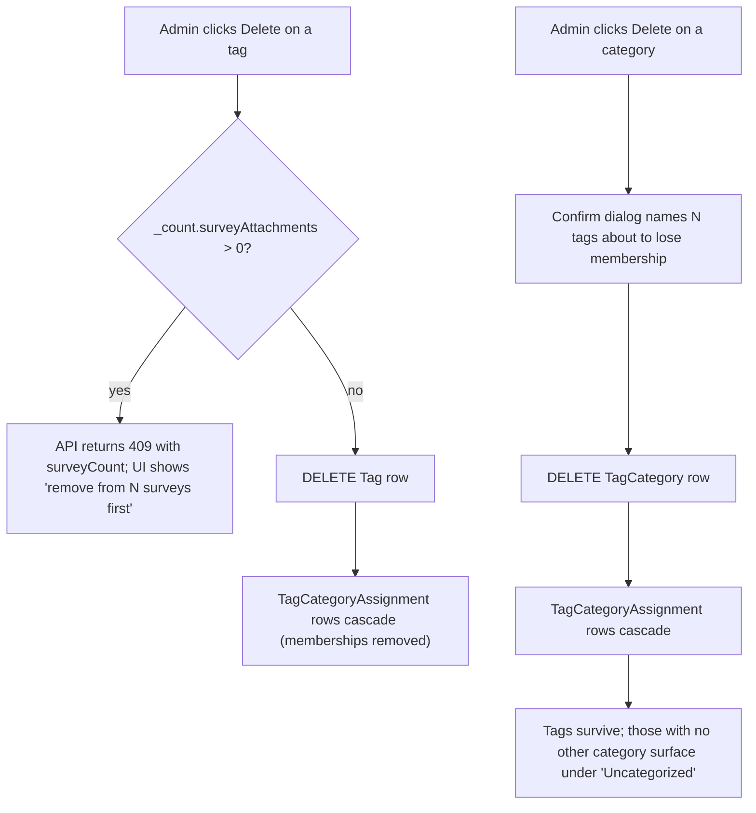

# feat: Tag catalog for super-admin with survey integration

## Summary

Add a reusable admin tag catalog at `/super-admin/tags` — categories (name + description) and tags (M:N with categories) on one screen with a categories sidebar, a paginated/searchable/sortable tag list, and asymmetric delete (categories orphan their tags; in-use tags refuse delete). Integrate with the existing survey editor via a tag picker grouped by category, persisted with a bulk-replace endpoint. Establish a reusable server-side pagination shape (query schema + envelope) that future admin lists can adopt.

---

## Problem Frame

The brainstorm at `docs/brainstorms/2026-05-31-tag-catalog-requirements.md` (origin) establishes the why, who, and what. In short: nothing in the app can be tagged today, surveys in particular need admin-side labelling, and other entities are expected to want the same vocabulary later — so the catalog is built reusable from the start. This plan translates the brainstorm's product decisions into implementation units without re-litigating shape; readers wanting product rationale should read origin.

---

## Key Technical Decisions

- **Reusable server-side pagination shape, defined once.** A `listTagsQuerySchema` and a `{ items, total, page, pageSize }` envelope land in `src/lib/validators.ts` and the tags route. The validator extracts a shared `paginationQuerySchema` (page + pageSize bounds) so the next admin list to need pagination composes it instead of re-inventing the shape. This is the first server-paginated endpoint in the repo; per SOL-2026-004 the query params must be in the Zod schema so they appear in the OpenAPI spec.

- **Asymmetric M:N delete via FK constraints.** The tag↔category junction (`TagCategoryAssignment`) cascades from both sides — deleting a category or a tag removes the membership rows automatically. The survey↔tag junction (`SurveyTag`) cascades from `Survey` (delete a survey → memberships vanish) but **restricts** from `Tag` (delete a tag while it's on any survey → Prisma raises). The DELETE handler does a `_count.surveyAttachments` pre-check and returns 409 with the survey count before the restrict ever fires; the FK is the safety net, not the primary mechanism. Mis-setting this FK as Cascade would silently un-tag surveys and is the highest-impact failure mode in this plan (see Risks).

- **Bulk-replace endpoint for survey-side tag attachment.** `PUT /api/super-admin/surveys/[id]/tags` accepts `{ tagIds }` — the full intended set — and runs a transactional `deleteMany + createMany` against `SurveyTag`. Per-tag attach/detach was the alternative; bulk-replace matches the picker UX (admin checks/unchecks then clicks save) as a single round-trip and avoids per-checkbox network calls. Picked at synthesis-time, confirmed by user.

- **Read-time usage count via Prisma `_count`.** The tag list selects `_count: { select: { surveyAttachments: true } }` and exposes it as `usageCount`. The same count powers the sort-by-usage orderBy (`{ surveyAttachments: { _count: order } }`) and the deletion 409. No denormalised counter to maintain. Mirrors the existing `_count.emailTemplates` check in the language DELETE handler.

- **Helpers extract pure logic from Prisma calls; tests target helpers, not handlers.** Per CLAUDE.md the repo has no route-handler test infrastructure today — existing unit tests target pure modules (`validators.test.ts`, `db-normalize.test.ts`, etc.). To keep meaningful coverage on the new feature, each unit factors the query-building, filter-derivation, and grouping logic into pure helpers (`src/lib/tags.ts`, `src/lib/categories.ts`) that are unit-tested in isolation. Handlers stay thin (parse → call helper → execute prisma → map errors).

- **Render-time fan-out mitigation via `react.cache`.** Any tags-for-picker lookup on a server-rendered survey page is wrapped in `react.cache` (per SOL-2026-003) so future surfaces that render many surveys don't issue N identical catalog fetches.

- **Field shapes pinned.** Tag name 1–50 characters; category name 1–50; category description optional, max 280. Names normalised to trim by the DB write layer (already in place via `src/lib/db.ts`); uniqueness within kind is case-insensitive (enforced by the schema's `@@unique` on lower-cased shadow column OR by a Prisma uniqueness check during create — see U1 Approach for the chosen mechanism). Pinned now rather than deferred so validators land with the right bounds.

- **Catalog establishes a reusable pattern; docs/solutions/ entry deferred to follow-up PR.** After this lands and the pattern proves out, capture it as a `docs/solutions/architecture-patterns/server-side-paginated-admin-list.md` write-up so subsequent paginated lists copy the established shape. Not in scope for this plan.

---

## High-Level Technical Design

### Schema relationships

```mermaid
erDiagram
    TagCategory ||--o{ TagCategoryAssignment : "categorizes"
    Tag ||--o{ TagCategoryAssignment : "belongs to"
    Tag ||--o{ SurveyTag : "applied to"
    Survey ||--o{ SurveyTag : "has"

    TagCategory {
        string id PK
        string name "unique CI"
        string description "nullable"
    }
    Tag {
        string id PK
        string name "unique CI"
    }
    TagCategoryAssignment {
        string tagId PK_FK "cascade both sides"
        string categoryId PK_FK "cascade both sides"
    }
    SurveyTag {
        string surveyId PK_FK "cascade from Survey"
        string tagId PK_FK "restrict from Tag"
    }
```

The asymmetric cascade behaviour is the load-bearing schema decision: `TagCategoryAssignment` cascades both ways (categories owning a tag is admin-only metadata; deletion is non-destructive to the catalog), while `SurveyTag` restricts on the `Tag` side so the API can refuse the delete cleanly before the FK fires.

### Delete decision flow



Directional guidance — not implementation specification. The handlers' exact error shapes and the confirm-dialog wording are settled in U3 and U4.

### Server-side pagination query envelope

The list endpoint accepts `?q=&sort=name|usage&order=asc|desc&page=1&pageSize=25&categoryId=...&scope=all|uncategorized` and responds with:

```json
{ "items": [...], "total": 123, "page": 1, "pageSize": 25 }
```

The same query shape is parsed by both the API route and the server page component — the page parses `searchParams` via the same `listTagsQuerySchema` and either calls the API (fetch round-trip) or calls the underlying helper directly (preferred — avoids a same-server fetch). See U6 Approach.

---

## Requirements

Carried from origin (`docs/brainstorms/2026-05-31-tag-catalog-requirements.md`). The R-IDs below match origin and are referenced by U-IDs below.

### Catalog model (R1–R2)
- R1. Tags and categories with M:N (zero or more on either side; no maximum).
- R2. Names trimmed and case-preserved; unique-within-kind case-insensitively; lengths pinned in KTDs above.

### Browse and discover (R3–R7)
- R3. Single entry point at `/super-admin/tags` (sidebar + list on one screen).
- R4. Sidebar lists categories with tag counts plus "All tags" and "Uncategorized" synthetic entries; alpha sort by default; category CRUD lives here.
- R5. Tag list text search by name, composes with active sidebar scope.
- R6. Tag list sortable by name and by usage count; composes with search and scope.
- R7. Tag list paginated server-side via query params; total count visible.

### Edit and delete (R8–R11)
- R8. Tag creation only from the tags page; form takes name + zero or more categories.
- R9. Tag name and category memberships editable via per-row action on the tag list.
- R10. Deleting a category removes tag↔category links, leaving tags in the catalog.
- R11. Deleting a tag is refused with 409 while it's applied to any survey; otherwise plain confirm + delete.

### Survey integration (R12–R14)
- R12. Survey editor exposes a tag section + picker grouped by category (with "Uncategorized" group); tag-in-two-categories shows in both groups, single underlying state.
- R13. Attachment persists with the survey editor's existing save flow (no separate save round-trip from the user's POV); shape is bulk-replace per KTD.
- R14. Usage count = number of surveys currently attached, computed at read time; powers R6 sort and R11 refusal.

### Auth and surface (R15–R16)
- R15. Every new page and API endpoint is admin-gated. The `/super-admin/tags` page is covered by the existing edge-middleware `SUPER_ADMIN_ONLY` prefix check (`src/middleware.ts`) and the layout-level `auth()` re-check; every `/api/super-admin/**` handler calls `requireSuperAdmin()` as its first line, because the middleware's prefix check matches `/super-admin`, not `/api/super-admin`. The per-handler guard is therefore the sole auth check for the API routes — middleware is not a backstop here.
- R16. Writes flow through the existing DB write normaliser in `src/lib/db.ts` without exemption; no new entries needed in `LOWERCASE_FIELDS` or `NEVER_NORMALIZE`.

---

## Implementation Units

### U1. Schema additions and DB push

- **Goal:** Define `TagCategory`, `Tag`, `TagCategoryAssignment`, `SurveyTag` in Prisma; apply via `pnpm db:push`.
- **Requirements:** R1, R2 (foundation for everything)
- **Dependencies:** none
- **Files:**
  - `prisma/schema.prisma`
- **Approach:**
  - `TagCategory(id cuid, name string @unique, description string?, createdAt, updatedAt)` — mirror `Language` shape for the admin-managed global resource pattern.
  - `Tag(id cuid, name string @unique, createdAt, updatedAt)`.
  - `TagCategoryAssignment(tagId, categoryId, @@id([tagId, categoryId]))` — both FKs `onDelete: Cascade`. Indexes on `categoryId` and `tagId` to make the "tags in category" and "categories of tag" lookups fast.
  - `SurveyTag(surveyId, tagId, @@id([surveyId, tagId]))` — `Survey` FK `onDelete: Cascade`, `Tag` FK `onDelete: Restrict`. Index on `tagId` for the usage-count `_count`.
  - Case-insensitive name uniqueness: SQLite's default collation is case-sensitive, and the repo uses SQLite by default (Postgres optional per README). Settle the mechanism in this unit — either store a `nameLower` shadow column with the unique index, or rely on the API checking case-insensitively before insert (P2002 is still the safety net for the case-sensitive `@unique`). The shadow-column approach is more correct under concurrent writes; pick it unless it conflicts with DB normaliser semantics. Document the choice in this unit's commit message.
- **Patterns to follow:**
  - `Language` model in `prisma/schema.prisma` (admin-managed global resource shape).
  - `SurveyStep` relation to `Survey` for the cascade-on-parent shape.
  - `EmailTemplate.language` relation for the `onDelete: Restrict` shape used by `SurveyTag.tag`.
- **Test scenarios:** Test expectation: none — pure schema unit; behavioural verification lands in U2 (validator inputs) and U3–U5 (handler behaviour).
- **Verification:**
  - `pnpm db:push` runs clean against a fresh SQLite file.
  - `pnpm db:generate` produces a Prisma client exposing `prisma.tag`, `prisma.tagCategory`, `prisma.tagCategoryAssignment`, `prisma.surveyTag`.
  - `pnpm test` still green (no test should reference the new models yet).

---

### U2. Validators and reusable pagination query schema

- **Goal:** Zod schemas for category/tag CRUD inputs and the paginated-list query; extract a reusable `paginationQuerySchema` other admin lists can compose.
- **Requirements:** R1, R2 (input validation), R5, R6, R7 (query shape)
- **Dependencies:** U1
- **Files:**
  - `src/lib/validators.ts` (add new schemas alongside existing ones)
  - `tests/unit/tag-validators.test.ts` (new)
- **Approach:**
  - `paginationQuerySchema = z.object({ page: z.coerce.number().int().min(1).default(1), pageSize: z.coerce.number().int().min(1).max(100).default(25) })` — exported separately for reuse.
  - `createCategorySchema = { name: z.string().trim().min(1).max(50), description: z.string().trim().max(280).optional() }`.
  - `updateCategorySchema = createCategorySchema.partial()`.
  - `createTagSchema = { name: z.string().trim().min(1).max(50), categoryIds: z.array(z.string().cuid()).default([]) }`.
  - `updateTagSchema = createTagSchema.partial()` — `categoryIds` is treated as a full replacement when supplied.
  - `listTagsQuerySchema = paginationQuerySchema.extend({ q: z.string().trim().default(""), sort: z.enum(["name", "usage"]).default("name"), order: z.enum(["asc", "desc"]).default("asc"), categoryId: z.string().cuid().optional(), scope: z.enum(["all", "uncategorized"]).default("all") }).superRefine((v, ctx) => { if (v.scope === "uncategorized" && v.categoryId) ctx.addIssue({...}); })`.
  - `replaceSurveyTagsSchema = { tagIds: z.array(z.string().cuid()).refine(arr => new Set(arr).size === arr.length, { message: "duplicate tag IDs" }) }`.
  - Per CLAUDE.md, the DB normaliser also trims at write — `.trim()` here is belt-and-braces.
- **Patterns to follow:**
  - `createLanguageSchema` in `src/lib/validators.ts` for the trimmed-name + Zod-coercion shape.
  - `tests/unit/surveys.test.ts` for the validator test layout (one `describe` per schema, named test cases).
- **Test scenarios:**
  - `createCategorySchema` rejects empty name; accepts surrounding whitespace and returns trimmed; rejects name >50 chars; description omitted yields no description key (not `null`); description >280 rejected.
  - `createTagSchema` defaults `categoryIds` to `[]` when omitted; rejects non-cuid entries.
  - `updateTagSchema.parse({})` returns an empty object (all fields optional).
  - `listTagsQuerySchema.parse({})` returns `{ q: "", sort: "name", order: "asc", page: 1, pageSize: 25, scope: "all" }`.
  - `listTagsQuerySchema` rejects `pageSize: 0`, `pageSize: 101`, `page: 0`, `sort: "createdAt"`, `order: "ASC"`.
  - `listTagsQuerySchema` coerces string `"3"` to number `3` for page/pageSize (URL params arrive as strings).
  - `listTagsQuerySchema` rejects `{ scope: "uncategorized", categoryId: "ckxxx" }` (mutually exclusive).
  - `replaceSurveyTagsSchema` rejects `{ tagIds: ["a", "a"] }`; accepts `{ tagIds: [] }` (the "remove all tags" case).
- **Verification:** `pnpm test tests/unit/tag-validators.test.ts` green; running the full suite stays green.

---

### U3. Categories helper module and CRUD API

- **Goal:** Helper module for category operations plus the four REST endpoints (list, create, update, delete).
- **Requirements:** R4, R10
- **Dependencies:** U1, U2
- **Files:**
  - `src/lib/categories.ts` (new)
  - `src/app/api/super-admin/categories/route.ts` (new — GET, POST)
  - `src/app/api/super-admin/categories/[id]/route.ts` (new — PATCH, DELETE)
  - `tests/unit/categories.test.ts` (new — covers pure helpers)
- **Approach:**
  - `listCategoriesWithCount()` — returns categories sorted alphabetically with `_count.assignments`; the handler maps each row to `{ ...category, tagCount: _count.assignments }` before serialising, so the API response uses `tagCount` (matching the verification example below) while internal Prisma terminology stays inside the helper. Wrap the helper in `react.cache` for the page reuse (per SOL-2026-003).
  - Pure helper `categoriesEqualByNameCi(a, b)` — case-insensitive equality used by the in-process pre-check before insert (defence against SQLite case-sensitive `@unique`).
  - Each route handler: `const guard = await requireSuperAdmin(); if (!guard.ok) return guard.response;` first, parse body via the appropriate schema, call prisma, map `P2002 → 409` and `P2025 → 404`.
  - DELETE just calls `prisma.tagCategory.delete({ where: { id } })`; the cascade on `TagCategoryAssignment` removes membership rows automatically — no extra cleanup needed.
- **Patterns to follow:**
  - `src/app/api/super-admin/languages/route.ts` (collection shape, `LANGUAGE_SELECT` constant at top, P2002 mapping).
  - `src/app/api/super-admin/languages/[id]/route.ts` (item shape, FK pre-check).
  - `src/lib/languages.ts` (small helper module per feature).
- **Test scenarios:**
  - `categoriesEqualByNameCi("Compliance", "compliance")` returns true; with surrounding whitespace returns true; with different names returns false.
  - `listCategoriesWithCount` (covered manually since it hits Prisma — no helper-level test).
- **Verification:**
  - With dev server running, `curl -b <admin-session-cookie> http://localhost:3000/api/super-admin/categories` returns a JSON array including any seeded category with its `tagCount`.
  - POST with `{ name: "Audience" }` creates; POST same name returns 409.
  - PATCH `[id]` with `{ description: "..." }` updates the description and returns the row.
  - DELETE `[id]` succeeds when the category has tags; subsequent GET on the catalog shows those tags under "Uncategorized" (verified via U6).
  - Non-admin session returns 401/403 on every route.

---

### U4. Tags helper module and paginated CRUD API

- **Goal:** Helper module covering pagination filter/sort, in-use-refusal, and CRUD; plus the API routes.
- **Requirements:** R5, R6, R7, R8, R9, R11
- **Dependencies:** U1, U2, U3
- **Files:**
  - `src/lib/tags.ts` (new)
  - `src/app/api/super-admin/tags/route.ts` (new — GET paginated, POST)
  - `src/app/api/super-admin/tags/[id]/route.ts` (new — PATCH, DELETE)
  - `tests/unit/tags.test.ts` (new — covers pure helpers)
- **Approach:**
  - Pure helper `buildTagsListWhere(query)` → `Prisma.TagWhereInput`. Handles the four cases: empty query (no filter), `q` non-empty (`name: { contains, mode: insensitive }`), `categoryId` set (`assignments: { some: { categoryId } }`), `scope === "uncategorized"` (`assignments: { none: {} }`). Composes when multiple apply.
  - Pure helper `buildTagsListOrderBy(query)` → `Prisma.TagOrderByWithRelationInput`. `sort === "name"` → `{ name: order }`; `sort === "usage"` → `{ surveyAttachments: { _count: order } }` (relation count sort, Prisma 5.7+).
  - `listTagsPage(query)` — orchestrator: takes the validated query, runs `prisma.$transaction([findMany(where, orderBy, skip, take, include: assignments + _count.surveyAttachments), count(where)])`, returns the `{ items, total, page, pageSize }` envelope.
  - `createTag(input)` — transactional insert: `tag.create` then `tagCategoryAssignment.createMany` for the provided categoryIds; unknown categoryIds cause a Prisma FK error → map to 400.
  - `updateTag(id, input)` — transactional: when `categoryIds` supplied, `deleteMany` all assignments then `createMany` new ones; update name when supplied.
  - `deleteTagIfUnused(id)` — read `_count.surveyAttachments`; if > 0 throw a typed `TagInUseError` carrying the count; else `prisma.tag.delete` (cascade handles assignment rows).
  - Handlers: parse query via `listTagsQuerySchema.parse(Object.fromEntries(url.searchParams))`, call helpers, map `TagInUseError → 409 with { error: "tag_in_use", surveyCount }`.
- **Patterns to follow:**
  - SOL-2026-004 — pagination params in the Zod schema so they appear in OpenAPI (U8).
  - `src/app/api/super-admin/languages/[id]/route.ts` `_count` pre-check before delete.
  - `src/components/super-admin/SurveyEditor.tsx`'s transaction shape for the editor's reorder-all pattern (analogous to `deleteMany + createMany`).
- **Test scenarios:**
  - `buildTagsListWhere({ q: "", scope: "all" })` returns `{}`.
  - `buildTagsListWhere({ q: "comp" })` returns `{ name: { contains: "comp", mode: "insensitive" } }`.
  - `buildTagsListWhere({ scope: "uncategorized" })` returns `{ assignments: { none: {} } }`.
  - `buildTagsListWhere({ categoryId: "ckxxx" })` returns `{ assignments: { some: { categoryId: "ckxxx" } } }`.
  - `buildTagsListWhere({ q: "comp", categoryId: "ckxxx" })` composes both (AND).
  - `buildTagsListOrderBy({ sort: "name", order: "asc" })` returns `{ name: "asc" }`.
  - `buildTagsListOrderBy({ sort: "usage", order: "desc" })` returns `{ surveyAttachments: { _count: "desc" } }`.
  - `TagInUseError` carries `surveyCount` and is recognised by an `instanceof` check.
- **Verification:**
  - **Covers AE2.** Manual: attach "Compliance" to 4 surveys, DELETE `/api/super-admin/tags/[id]` → 409 with `{ error: "tag_in_use", surveyCount: 4 }`; tag remains.
  - **Covers AE3.** Manual: tag with no surveys → DELETE returns 200 and the tag disappears from subsequent GETs.
  - **Covers AE5.** Manual: GET `/api/super-admin/tags?categoryId=<topic>&q=comp` returns only tags whose name contains "comp" AND are in the Topic category; `total` matches the filtered count.
  - Sort by usage descending puts the most-attached tag first.
  - Page 2 with pageSize=2 returns items 3–4 when there are >4 results.

---

### U5. Survey-side tag attachment (bulk replace) and picker data helper

- **Goal:** Endpoint that replaces a survey's tag set in one shot, plus a helper that returns tags grouped by category for the editor picker.
- **Requirements:** R12, R13, R14
- **Dependencies:** U1, U2, U4
- **Files:**
  - `src/app/api/super-admin/surveys/[id]/tags/route.ts` (new — GET, PUT)
  - `src/lib/tags.ts` (extend: `getSurveyTagIds`, `listTagsForPicker`, `replaceSurveyTags`, `partitionReplaceTagIds`)
  - `tests/unit/tags.test.ts` (extend with picker + partition tests)
- **Approach:**
  - Pure helper `partitionReplaceTagIds(requested: string[], knownIds: Set<string>) → { toApply: string[], unknown: string[] }` — the unknown-ID rejection logic without touching Prisma.
  - `replaceSurveyTags(surveyId, requestedTagIds)` — orchestrator: load known tag IDs (`tag.findMany({ where: { id: { in: requestedTagIds } }, select: { id: true } })`), partition, throw `UnknownTagIdsError` if any unknown, otherwise `prisma.$transaction([deleteMany(SurveyTag where surveyId), createMany(SurveyTag from toApply)])`.
  - `listTagsForPicker()` — wrapped in `react.cache`. Returns `Array<{ category: { id, name } | null, tags: Array<{ id, name }> }>` with one entry per category (alpha) plus a final entry where `category === null` for uncategorized. A tag in two categories appears in both entries — duplication on the read side is intentional, the picker UI keeps a single underlying state per tag ID (U7).
  - `getSurveyTagIds(surveyId)` — `prisma.surveyTag.findMany({ where, select: { tagId: true } })` mapped to a string array.
  - GET handler returns `{ tagIds: [...] }` for the survey (used by the editor page-level fetch in U7).
  - PUT handler parses `replaceSurveyTagsSchema`, calls `replaceSurveyTags`, maps `UnknownTagIdsError → 400` with the unknown IDs in the body.
  - Both handlers gated by `requireSuperAdmin()`.
- **Patterns to follow:**
  - SOL-2026-003 — `react.cache` on `listTagsForPicker` so a future "list of surveys, each showing tags" page doesn't fan out.
  - Survey-steps reorder route's `deleteMany + createMany` transaction (mentioned in CLAUDE.md as the existing pattern for "rewrite all rows in a transaction").
- **Test scenarios:**
  - `partitionReplaceTagIds(["a", "b"], new Set(["a", "b", "c"]))` returns `{ toApply: ["a", "b"], unknown: [] }`.
  - `partitionReplaceTagIds(["a", "x"], new Set(["a"]))` returns `{ toApply: ["a"], unknown: ["x"] }`.
  - `partitionReplaceTagIds([], new Set(["a"]))` returns `{ toApply: [], unknown: [] }` (empty is the "detach all tags" case).
- **Verification:**
  - GET `/api/super-admin/surveys/[id]/tags` on a survey with two tags returns `{ tagIds: [..., ...] }`.
  - PUT with the same body is a no-op (idempotent).
  - PUT with `{ tagIds: [] }` removes all tag attachments; subsequent GET returns `{ tagIds: [] }`.
  - PUT with `{ tagIds: ["bogus"] }` returns 400 with `{ error: "unknown_tag_ids", unknown: ["bogus"] }`; no rows are inserted.
  - PUT requires admin auth; non-admin session returns 401/403.

---

### U6. Catalog page UI (server page + combined-screen client component)

- **Goal:** `/super-admin/tags` page rendering categories sidebar (CRUD-capable) plus paginated/searchable/sortable tag list, with URL-driven state.
- **Requirements:** R3, R4, R5, R6, R7, R8, R9, R10, R11
- **Dependencies:** U2, U3, U4
- **Files:**
  - `src/app/super-admin/tags/page.tsx` (new — server component)
  - `src/components/super-admin/TagsCatalog.tsx` (new — top-level client component)
  - `src/components/super-admin/CategorySidebar.tsx` (new)
  - `src/components/super-admin/TagListTable.tsx` (new)
  - `src/components/super-admin/TagFormDialog.tsx` (new — shared create/edit form for tags; same for categories or split if simpler)
  - `tests/unit/tags-page-url.test.ts` (new — covers URL ↔ query state helpers)
- **Approach:**
  - Server page reads `searchParams`, parses via `listTagsQuerySchema`, calls `listCategoriesWithCount()` and `listTagsPage(query)` in parallel, passes results + the resolved query to `TagsCatalog`.
  - Pure helpers `parseTagsPageSearchParams(searchParams)` and `buildTagsPageHref(query)` for URL ↔ state mapping. Tests target these.
  - URL is source of truth — `TagsCatalog` calls `router.push(buildTagsPageHref(next), { scroll: false })` to update; `router.refresh()` afterwards re-runs the server fetch. Search input is debounced ~300ms before pushing.
  - Sidebar layout: "All tags" pinned top, categories alpha by name, "Uncategorized" pinned bottom. Active scope highlighted. Per-row hover actions: edit (inline form opens), delete (`confirm()` mentioning tag count). New-category button at the top of the sidebar opens an inline form.
  - Tag list rows: name, inline category chips (each chip is the category name; clicking a chip switches scope to that category), `usageCount`, per-row edit and delete actions.
  - Sort: clickable column headers toggle `sort`+`order` URL params.
  - Pagination: prev/next + page numbers + "Showing X–Y of Z" total.
  - "New tag" button: when sidebar scope is a specific category, the form pre-checks that category (per synthesis confirmation). When scope is "All tags" or "Uncategorized", the form starts with no categories selected.
  - Delete a tag with usage > 0: API returns 409, UI surfaces the message naming the survey count.
  - All UI strings via `useTranslation` (`super_admin.tags.*` keys — added in U8).
- **Patterns to follow:**
  - `src/components/super-admin/LanguagesList.tsx` for inline create form + per-row delete + `confirm()` + error state shape.
  - `src/components/super-admin/UsersTable.tsx` for optimistic refresh-after-write.
  - `src/components/super-admin/SurveyEditor.tsx` for the multi-section save-independently shape (categories CRUD is independent of tag CRUD).
- **Test scenarios:**
  - `parseTagsPageSearchParams(new URLSearchParams("page=2&sort=usage&order=desc"))` returns `{ page: 2, pageSize: 25, sort: "usage", order: "desc", q: "", scope: "all" }`.
  - `parseTagsPageSearchParams(new URLSearchParams("scope=uncategorized"))` returns scope=uncategorized with categoryId undefined.
  - `buildTagsPageHref({ sort: "usage", order: "desc", page: 2 })` returns `/super-admin/tags?sort=usage&order=desc&page=2` (default values omitted from URL for cleanliness).
  - Round-trip: `parseTagsPageSearchParams(new URLSearchParams(buildTagsPageHref(q).split("?")[1]))` deep-equals `q` for any non-default query.
- **Verification:**
  - Seed: create categories "Audience" (with description "Who's it for"), "Topic"; create 5 tags — "Compliance" (in Audience + Topic), "Internal" (Audience), "Pilot" (none), "External" (Topic), "Partner" (Audience).
  - Sidebar shows category counts: Audience 3, Topic 2; All tags = 5; Uncategorized = 1.
  - Click "Audience" → list filters to 3 tags; search "comp" → 1 tag; clear search; sort by usage desc → 0-usage tags float as expected.
  - Set URL `?pageSize=2&page=2` → list shows tags 3-4 of the active scope.
  - **Covers AE1.** Delete "Audience" via the sidebar confirm dialog (which names 3 tags) → sidebar updates, "Internal" appears under Uncategorized, "Compliance" and "Partner" remain under their other categories.
  - **Covers AE5.** Search composes with category scope; clearing scope reveals additional matches.
  - From "Audience" scope, click "New tag", form has Audience pre-checked.
  - Try to delete a tag that's on 1+ surveys (after U7): 409 surfaces the survey count.

---

### U7. Survey editor tag picker integration

- **Goal:** Tag section on the survey editor with a category-grouped picker; persists via U5's bulk-replace endpoint on Save.
- **Requirements:** R12, R13
- **Dependencies:** U5, U6
- **Files:**
  - `src/app/super-admin/surveys/[id]/page.tsx` (extend — also fetch current tag IDs + grouped catalog)
  - `src/components/super-admin/SurveyEditor.tsx` (extend with a Tags section)
  - `src/components/super-admin/SurveyTagPicker.tsx` (new — grouped picker)
  - `tests/unit/tag-picker.test.ts` (new — covers grouping/derivation helpers)
- **Approach:**
  - Page-level fetch reads `getSurveyTagIds(surveyId)` and `listTagsForPicker()` in parallel with the existing survey fetch, passes both as new props to `SurveyEditor`.
  - Picker holds local state `selectedTagIds: Set<string>`. Render: one labelled group per category (per the `listTagsForPicker` envelope), plus an "Uncategorized" group at the bottom. Each row is a checkbox bound to `selectedTagIds.has(tag.id)`.
  - A tag in two categories renders in both groups; both checkboxes derive from the same Set entry, so toggling either updates both — single underlying state.
  - "Save tags" button calls `PUT /api/super-admin/surveys/[id]/tags` with `{ tagIds: Array.from(selectedTagIds) }`; on success, refresh local state and call `router.refresh()`.
  - Error path: PUT returns 400 unknown_tag_ids (shouldn't happen via UI but surfaces if a tag was deleted between page load and save) → inline message + suggest reloading.
  - Pure helper `groupedPickerHasTag(groups, tagId)` (used by tests) — covered by grouping-derivation tests.
- **Patterns to follow:**
  - `src/components/super-admin/SurveyEditor.tsx` sectioned-save pattern (each surface has its own button + fetch).
  - The existing `saveDetails` shape in `SurveyEditor.tsx` for optimistic + error display.
- **Test scenarios:**
  - `groupedPickerHasTag([{ category: { id: "c1", name: "A" }, tags: [{ id: "t1", name: "X" }] }, { category: null, tags: [] }], "t1")` returns true.
  - `groupedPickerHasTag(groups, "missing")` returns false.
  - Helper that counts unique tag IDs across grouped sections — returns 1 when a tag is in 2 categories (used for the "X selected" indicator).
- **Verification:**
  - **Covers AE4.** Open a draft survey, expand Tags section. The picker shows "Audience", "Topic", and "Uncategorized" groups. "Compliance" appears once under Audience and once under Topic. Check it in Audience — the Topic checkbox flips on too. Click Save — the survey now has "Compliance" attached.
  - Reload the editor → both checkboxes still on, "Compliance" appears in the attached-tags summary.
  - On `/super-admin/tags`, the "Compliance" row shows usage count = 1.
  - Uncheck the Topic checkbox → Audience checkbox flips off. Save → tag detached; usage count = 0 in the catalog.
  - With the survey saved and "Compliance" attached, try to delete "Compliance" from `/super-admin/tags` → 409 with "remove it from 1 survey first".

---

### U8. OpenAPI registration, translations, and admin nav

- **Goal:** Wire the new feature into existing scaffolding so the drift-detection test stays green, UI strings localise, and the admin nav surfaces the new page.
- **Requirements:** R15 (auth surface visible in spec), R16 (no normaliser changes)
- **Dependencies:** U3, U4, U5, U6
- **Files:**
  - `src/lib/openapi/routes/admin-tags.ts` (new — registers every new endpoint)
  - `src/lib/openapi/spec.ts` (add `registerAdminTagRoutes()` call and TAGS entry in the tag list)
  - `src/lib/openapi/registry.ts` (add `TAGS.AdminTags` constant; new tag entry)
  - `src/lib/openapi/schemas.ts` (register `Tag`, `TagCategory`, `TagListResponse`, `SurveyTagsResponse` DTOs as components)
  - `src/lib/openapi/register-validators.ts` (register `CreateCategoryInput`, `UpdateCategoryInput`, `CreateTagInput`, `UpdateTagInput`, `ListTagsQuery`, `ReplaceSurveyTagsInput` by name)
  - `src/lib/translations.ts` (add `KNOWN_TRANSLATIONS` entries for every `super_admin.tags.*` and `super_admin.tags.picker.*` key used in U6/U7)
  - `src/app/super-admin/layout.tsx` (add `<Link href="/super-admin/tags">Tags</Link>` next to existing admin nav entries)
- **Approach:**
  - Mirror `src/lib/openapi/routes/admin-languages.ts` exactly: one `registry.registerPath` per (method, path), `security: [{ sessionCookie: [] }]`, request body referencing the same Zod schema the handler uses, responses including 409 for the new in-use-tag-delete and duplicate-name-create cases, 400 for unknown_tag_ids on the PUT.
  - Use `{id}` not `[id]` in registered paths (matches the coverage test's transform).
  - Translations namespace: `super_admin.tags.title`, `super_admin.tags.new_tag`, `super_admin.tags.new_category`, `super_admin.tags.delete_tag_in_use`, `super_admin.tags.delete_category_confirm`, `super_admin.tags.picker.uncategorized_group`, etc. Each entry: `{ key, name, defaultValue }`.
  - Translations sync: per CLAUDE.md, the boot-time hook syncs `KNOWN_TRANSLATIONS` into the DB; `pnpm sync-translations` is the fallback when dev hot-reload skips it.
- **Patterns to follow:**
  - `src/lib/openapi/routes/admin-languages.ts` as the canonical template (per repo research).
  - SOL-2026-004 — OpenAPI drift detection from Zod validators.
  - `src/lib/translations.ts` existing entries for the `super_admin.users.*` and `super_admin.languages.*` namespaces.
- **Test scenarios:**
  - `tests/unit/openapi-coverage.test.ts` (existing — no edits needed) walks `src/app/api/**/route.ts` and asserts every method/path is registered. After this unit, the test stays green automatically; before this unit, it fails listing the new endpoints as orphans.
- **Verification:**
  - `pnpm test tests/unit/openapi-coverage.test.ts` green.
  - Boot the dev server, navigate to `/super-admin/api-docs`, confirm the new endpoints render under an "Admin · Tags" group with their request/response schemas, 200/400/409/401/403 responses, and "Try it out" works against the live server.
  - Confirm the "Tags" nav link is visible to admins and not to non-admins.
  - Switch user language to a non-default and confirm UI strings either localise (if translations exist) or fall back to the default — both paths exercise the translations chain.

---

## Scope Boundaries

Carried verbatim from origin (`docs/brainstorms/2026-05-31-tag-catalog-requirements.md`).

### Deferred for later

- Joining tags to entities other than surveys (the catalog accommodates this; future consumers add their own join in their own iteration).
- Inline tag creation from the survey editor.
- Bulk operations on tags or categories (multi-select delete, merge two tags, rename-and-cascade).
- Per-tag detail page (list of surveys it's on, trend, etc.).
- Tag colors, icons, slugs, or visual differentiation beyond name + category grouping.

### Outside this product's identity

- Localising tag or category names (admin-managed identifiers, not user-facing content).
- Public-facing tag pages or any surface exposing tags to non-admin users.
- Tag hierarchies (nested categories, parent-child tag relationships).

### Deferred to Follow-Up Work

- Capture a `docs/solutions/architecture-patterns/server-side-paginated-admin-list.md` write-up once the pattern lands, so the next admin list to need pagination copies the established shape (SOL-2026-011-style).
- Introduce route-handler and/or component test infrastructure as a separate initiative — covered today by validators + OpenAPI drift + manual smoke (see Risks). Not gating this plan.

---

## System-Wide Impact

- **Admin navigation surface** changes — `src/app/super-admin/layout.tsx` gains a "Tags" link. Visible to super-admins only; no auth-surface implications.
- **Schema** gains 4 new tables (`Tag`, `TagCategory`, `TagCategoryAssignment`, `SurveyTag`). Applied via `pnpm db:push`; no migrations directory to commit. SQLite default; the case-insensitive uniqueness mechanism chosen in U1 needs to behave the same on Postgres (verify in U1 commit message).
- **OpenAPI spec** grows by ~8 endpoints. The drift-detection test in `tests/unit/openapi-coverage.test.ts` enforces parity automatically; failures land at PR-test time, not in production.
- **Translations registry** gains a `super_admin.tags.*` namespace. Boot-time sync writes the new rows into `Translation`/`TranslationKey`; `pnpm sync-translations` is the manual fallback (dev hot-reload occasionally skips the hook per CLAUDE.md).
- **Survey editor page-level fetch** grows by two reads (`getSurveyTagIds`, `listTagsForPicker`). Both are wrapped or wrap-able in `react.cache` per SOL-2026-003; per-request fan-out is bounded.
- **DB write normaliser** (`src/lib/db.ts`) is unchanged — names trim through the existing extension; no entries added to `LOWERCASE_FIELDS` or `NEVER_NORMALIZE`.
- **Existing admin pages** are untouched. Users, Languages, Surveys, Email Templates all stay on their in-memory filter pattern.

---

## Risks & Dependencies

### Risks

- **Mis-setting the `SurveyTag.tag` FK as Cascade silently un-tags surveys.** This is the highest-impact failure mode. The DELETE handler's `_count` pre-check is the primary defence; the `onDelete: Restrict` FK is the safety net. Mitigation: U1 schema commit explicitly notes the FK posture; reviewers should double-check; the verification step in U4 (AE2 coverage) catches it manually.

- **Server-side pagination as a new pattern — establishes precedent.** Future paginated admin lists will copy whatever shape this plan ships. Mitigation: the query shape is conventional (`page`, `pageSize`, `q`, `sort`, `order`, `scope`), the envelope is conventional (`{ items, total, page, pageSize }`), and the validator + helper layering is reusable. Capture the pattern in `docs/solutions/` after shipping (deferred to follow-up).

- **No route-handler or component test infrastructure.** Per CLAUDE.md and the research scan, validators + OpenAPI drift are the only automated guards on the API; UI is verified manually. This is a pre-existing gap in the repo, not introduced by this plan. Mitigation today: each unit factors pure helpers (`buildTagsListWhere`, `partitionReplaceTagIds`, `parseTagsPageSearchParams`, etc.) that ARE testable, and writes those tests. Tracking the broader gap as Deferred to Follow-Up Work.

- **Case-insensitive uniqueness on SQLite.** SQLite's default collation is case-sensitive. If the U1 mechanism (shadow column vs in-process pre-check) drifts between SQLite and Postgres, a duplicate could slip in under one DB and not the other. Mitigation: pick a mechanism in U1 that's portable (the shadow-column approach works on both); document the choice in the commit message.

- **Relation-count sort requires Prisma 5.7+ — already satisfied.** `orderBy: { surveyAttachments: { _count: order } }` is gated on the Prisma version. The repo pins `@prisma/client ^5.22.0` and `prisma ^5.22.0` in `package.json`, so the feature is available. No prerequisite work; flagged here for future readers of this plan in case the version pin shifts.

### Dependencies

- `pnpm db:push` must run before the API or UI units boot (U1 ships first).
- `pnpm sync-translations` (or admin "Sync from code" button) after U8 lands, when boot-time sync doesn't fire under dev hot-reload.
- No new npm packages.
- No external services or secrets.

---

## Sources & Research

- **Origin requirements doc:** `docs/brainstorms/2026-05-31-tag-catalog-requirements.md` — product decisions, user flows F1–F4, acceptance examples AE1–AE5, scope boundaries.
- **Closest CRUD analogue:** `src/app/super-admin/languages/page.tsx`, `src/components/super-admin/LanguagesList.tsx`, `src/app/api/super-admin/languages/route.ts`, `src/app/api/super-admin/languages/[id]/route.ts`, `src/lib/languages.ts`, `prisma/schema.prisma` (model `Language`). Five-layer pattern (server page → client list → collection route → item route → helpers); copy shape exactly.
- **Survey editor pattern (sectioned saves):** `src/components/super-admin/SurveyEditor.tsx` and the route at `src/app/api/super-admin/surveys/[id]/route.ts`. Confirms the per-section-save approach U7 uses for the tag section.
- **OpenAPI registration template:** `src/lib/openapi/routes/admin-languages.ts` (mirror exactly for `admin-tags.ts`); `tests/unit/openapi-coverage.test.ts` enforces parity.
- **Translations registry:** `src/lib/translations.ts` (`KNOWN_TRANSLATIONS` array); server reads via `getServerT()`; client via `useTranslation()`. `pnpm sync-translations` is the manual fallback.
- **Confirm/dialog convention:** native `window.confirm()` everywhere (`src/components/super-admin/LanguagesList.tsx` line 110, `UsersTable.tsx` line 59, `SurveyEditor.tsx` lines 114 and 401). No shared modal component.
- **Migration approach:** `pnpm db:push`. No `prisma/migrations/` directory.
- **SOL-2026-011 — Drift-tested code-owned catalog stack** (`docs/solutions/architecture-patterns/code-owned-drift-tested-catalog-stack.md`): mirror existing precedents in the OpenAPI registration shape so future authors copy the pattern; bidirectional drift checks.
- **SOL-2026-003 — DB-backed UI translation registry with cached server reads** (`docs/solutions/architecture-patterns/db-backed-ui-translation-registry.md`): wrap `listTagsForPicker` and any per-request tags-by-survey lookup in `react.cache` so future "list of surveys, each showing tags" surfaces don't fan out.
- **SOL-2026-004 — Generate the OpenAPI spec from Zod validators with a drift-detection test** (`docs/solutions/architecture-patterns/openapi-spec-from-zod-validators.md`): pagination params belong in the Zod schema so they appear in the OpenAPI spec; the new `paginationQuerySchema` is shared so the OpenAPI rendering is consistent across future lists.
- **SOL-2026-007 — Next.js App Router silently 404s on dot-suffixed route folders** (`docs/solutions/runtime-errors/nextjs-app-router-dot-suffixed-route-folder-404.md`): avoid any dotted folder names in `src/app/super-admin/tags/` and `src/app/api/super-admin/tags/`.
